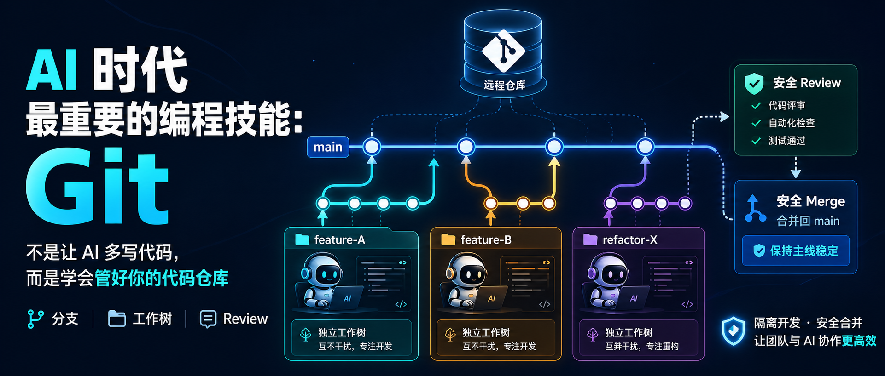

AI 写代码越来越强，但你有没有遇到这种情况：它在改文件 A，你手头功能 B 的开发还没做完，不敢切分支，只能等。或者它改完一堆代码，你不敢直接合并。

问题的本质不是 AI 不靠谱，而是你缺少一套版本控制策略。在 AI Coding 时代，我觉得最重要的技能是 **学会用 Git 管好你的代码仓库**。


### 为什么 Git 现在比任何时候都重要

AI 编码有三个典型场景，都直接指向 Git 的核心能力：

**1. 隔离版本，避免互相污染**

你在开发功能 A，AI 在帮你修的功能 B 涉及同一批文件。如果不做隔离，两边改完合并时会是一场灾难。分支和工作树让你把“自己的战场”和“AI 的战场”物理隔开，互不干扰。

**2. 出问题随时回退**

AI 有时候会“过度自信”，连改十几个文件。如果你没有提交记录、不会 revert，出了问题只能人肉排查。Git 让你任何时候都有一个可以回退的安全基线。main 分支永远保持干净可发布状态，所有实验都在隔离环境中完成。

**3. 多线程并行开发**

这是 AI Coding 时代 Git 最能发挥威力的地方——同时启动多个 AI 工作线程，各干各的，互不阻塞。不用等一个改完再改下一个，开发节奏完全由你掌控。


### 分支 vs 工作树：切分支其实行不通

很多人的 Git 使用停留在 `git checkout -b feature-x`，以为切分支就能并行开发，但在 AI 场景下这根本行不通。

#### 分支的致命局限

`git switch` 的本质是改变当前工作目录里的所有文件。你一执行切换，AI 正在修改的那些文件就会瞬间变成另一个分支的版本，造成：

- AI 上下文崩溃或报错
- 未保存的修改被覆盖或需要 stash
- 多个任务根本无法同时推进

所以**切分支 = 切 AI 正在操作的仓库，并行只是假象。**

#### 工作树：真正的并行

工作树让你把不同分支**同时检出到不同的物理目录**。每个目录里的文件互不影响，AI 可以安心待在自己那个目录里修改，而你可以在另一个目录里进行别的开发。

```bash
# 为新功能创建独立的工作树
git worktree add ../feature-A feature-A

# 为紧急修复创建独立的工作树
git worktree add ../hotfix hotfix

# 查看所有工作树
git worktree list

# 使用完毕后移除
git worktree remove ../feature-A
```

核心区别：

|                 | 分支切换                 | 工作树                        |
| --------------- | ------------------------ | ----------------------------- |
| 文件层面        | 同一目录，文件瞬间被替换 | 不同目录，文件完全隔离        |
| AI 能否持续工作 | 不能，一切就断           | 能，不受其他目录影响          |
| 多任务并行      | 假并行，只能排队         | 真并行，各开一个 IDE/终端即可 |

Git 官方的 `git worktree` 设计初衷就是“同时工作在多个分支上”，AI 时代这一点直接被放大成了刚需。


### 我的工作流：主线不动，多线并行，反复 Review

这套方法的核心原则只有一句话：

> **main 永远保持干净可发布。所有开发都在独立工作树中进行，review 通过后才合并。**

#### Step 1：从 main 开出多个工作树

```bash
git worktree add ../feature-A -b feature-A
git worktree add ../feature-B -b feature-B
git worktree add ../refactor-X -b refactor-X
```

三个独立目录，三个终端（或三个 IDE 窗口），每个里面跑一个 AI 任务。它们看到的文件互不干扰，并行推进。


#### Step 2：在工作树中开发和 Review

在某个工作树中完成开发后，进入 review 环节。这里的关键是**反复 review，直到质量过关**：P1（阻断性问题）和 P2（重要问题）必须清零，P3/P4 可以酌情放行。

Review 可以找同事，也可以用 AI，但要注意，AI 在长对话中会退化（上下文污染），所以最好每次都开**全新上下文**来做 review。


#### Step 3：Review 通过后合并到 main

```bash
# 保证 main 最新
cd /path/to/main-repo
git pull origin main

# 合并功能分支
git merge feature-A
git push origin main

# 清理工作树
git worktree remove ../feature-A
git branch -d feature-A
```


#### Step 4：重复 Step 2-3，直到所有工作树都处理完

这个流程的核心优势是**不间断连贯开发**。功能 A review 的时候，功能 B 的其他工作树仍然在 AI 的修改下继续推进，互不阻塞。main 始终干净，什么时候都能发布。


**让 AI 帮你干这些事**

不用死记命令，直接对 AI 说人话：

- “帮我在新工作树中创建一个 feature-payment 分支”
- “把当前工作树的改动提交并合并到 main”
- “列出我当前所有的工作树”
- “清理掉已经合并的 feature-payment 工作树”

AI 会替你执行对应的 Git 操作，你只需要确认结果。


### 反复 Review 的自动化利器

上面的工作流里，review 是最耗时但最关键的一环。我写了一个 Codex Skill 来让这个环节自动化：**[self-iterating-review](https://github.com/nanzhi84/codex-self-iterating-review-skill)**。

它能做什么：

- **全新上下文 Review**：每一轮 review 都用 `codex exec --ephemeral` 启动全新会话，避免长对话中的上下文污染。
- **分级修复**：把发现的问题分为 P1（阻断）到 P4（建议），自动修复 P1/P2，标记需要你来确认的业务语义问题。
- **工作树模式**：支持 detached worktree 模式，自动在干净的工作树中 review，不影响你当前工作目录。
- **结构化报告**：每次 review 输出归档到 `~/.codex/tmp/self-iterating-review/...`，包含发现、修复和最终结论。
- **自动循环**：修复 → 重验 → 修复 → 重验，直到范围内没有新的 P1/P2 问题，或到达你设定的最大轮次上限。

安装和使用，直接复制仓库链接对ai说：“帮助我安装一下这个SKILL”。

以后对 Codex 说自然语言即可：

- “自己review这个分支未commit的改动，直到没有P1、P2问题。”
- “多轮review这个分支相比于main分支的改动，直到完全没有问题。”

它就做一件事：**让 AI 在每次 review 中都像一个刚醒的审查员，不受之前对话的干扰。** 

相当于把“反复 review → 修复 → 再 review”这个最磨人的循环自动化了。


### 总结

AI Coding 时代，代码写得快已经不是核心竞争力。真正拉开差距的是三件事：

1. **你的 main 能不能随时发布**——这靠分支和工作树的分层隔离。
2. **你能不能让多个开发线真正并行推进**——这靠工作树多目录的物理隔离，而不是在同一个目录里切分支。
3. **你能不能高效地反复 review 直到质量达标**——这靠自动化 review 工具。

Git 不是你学完就扔掉的入门技能，它是你在 AI 时代最重要的工程基础设施。

用好了，AI 是你的加速器。用不好，AI 是你的障碍物。

