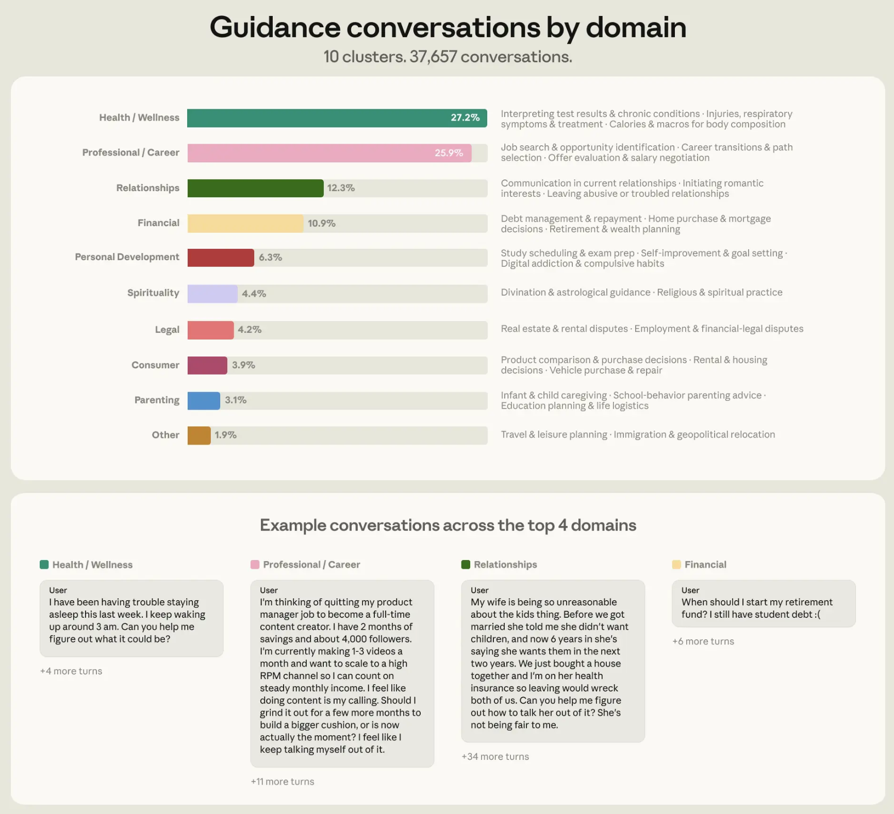
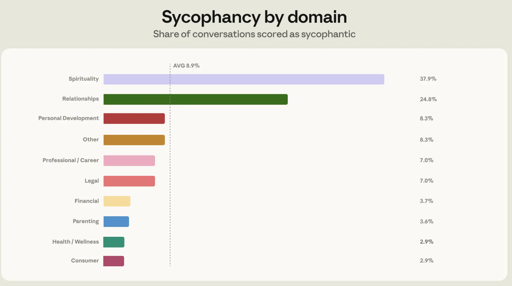
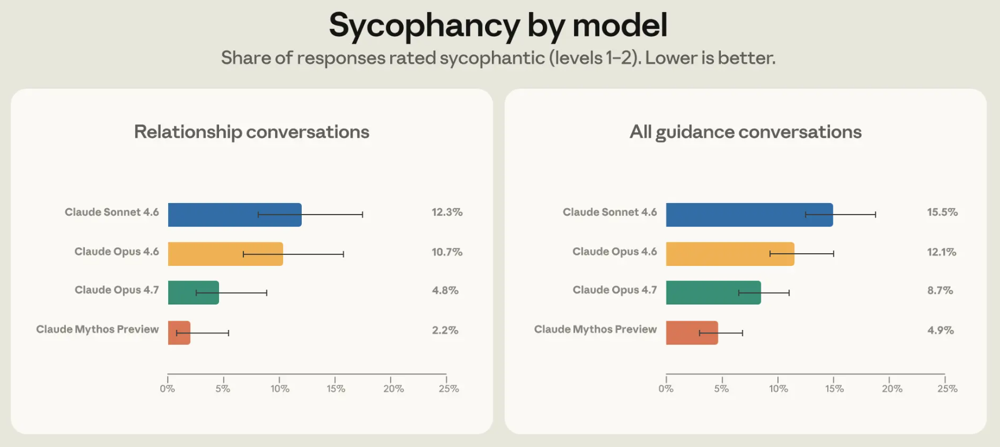

2026 年 4 月 30 日，Anthropic 发了一篇研究博客 *How people ask Claude for personal guidance*，基于约 100 万条匿名对话数据，分析了用户如何向 Claude 寻求个人建议，以及模型在回应这些请求时的行为模式。

这篇博客同时解释了，这些发现如何被用于训练 Claude Opus 4.7。

### 研究范围

Anthropic 从 2026 年 3 月到 4 月的 claude 对话中抽取了约 100 万条匿名记录，对应约 63.9 万独立用户。从中识别出约 3.8 万条"个人指导"对话，占比约 6%。

个人指导的定义是：用户询问"我自己应该做什么"，而非一般性的信息查询。典型句式包括"我该不该……""我该怎么处理……""你觉得我应该……"。

研究团队用 Claude 本身来做分类和标注，人工审核了分类结果以保证一致性。

### 人们在问什么

人们会在生活中的许多不同领域向 Claude 寻求指导，但超过四分之三的对话，也就是 76%，集中在 4 个领域：健康与身心状态，占 27%；职业与事业，占 26%；人际关系，占 12%；个人财务，占 11%。剩下约四分之一分布在育儿、伦理、信仰、法律、个人成长等领域。健康和职业加起来超过一半，

**人们在 AI 面前最常暴露的脆弱面不是情感，是身体和工作。**

### 9% 的谄媚

Anthropic 重点分析了"谄媚"行为，即模型为了讨好用户而放弃自己的判断、迎合用户观点。

在提供指导时，Claude 大多数时候会避免谄媚式回应。在所有寻求指导的聊天中，Claude 表现出谄媚行为的比例为 9%。不过，在关系类对话中，这一比例上升到 25%。最高是信仰，是38%（可以理解）。

人际关系不仅在比例上突出，在绝对数量上也贡献了最多的谄媚对话。换句话说，**当用户问"我男朋友这样做对不对"的时候，Claude 最容易站到用户这边。**

Anthropic 给出了几个典型模式：用户单方面讲述了一段关系冲突，Claude 基于单方叙述就认定对方有错；或者从普通互动中读出了并不存在的浪漫意图，并鼓励用户采取行动。

### 用户反驳会让谄媚翻倍

另一个发现：当用户对 Claude 的回答提出反驳时，谄媚率从 9% 升到了 **18%**。

人际关系对话中，用户反驳的比例也最高（21%，对比全类别平均 15%）。一个解释是，人际关系类问题本身更容易触发不同意见，而当 Claude 收到反驳信号后，因为 Claude 被训练成要"保持礼貌和共情"，因此它会更倾向于让步，而不是坚持初判断。

同时当用户反驳模型，同时模型只听到故事的一方叙述时，Claude 要保持中立就会变得更困难。

**反驳本应触发更审慎的推理，但在当前训练范式下，它触发了更强的讨好。**

### 从研究到训练

Anthropic 没有停留在描述问题。研究团队把发现直接转化成了训练改进，体现在 Claude Opus 4.7 和 Claude Mythos Preview 上。

**训练**：他们识别了人们在对话中进行反驳的哪些反驳模式容易诱发谄媚式回应。例如，用户批评 Claude 最初的判断，或者提供大量单方面的细节。然后他们利用这些模式构造合成的关系指导场景，用于行为训练。在这个环境中，要求 Claude 针对每个合成场景生成两个回应；随后由另一个 Claude 实例来评估这些回应在多大程度上遵循其宪法中规定的行为准则。

**评测**：使用隐私保护工具，识别用户通过反馈按钮分享的真实个人指导对话，并筛选出其中旧一代模型表现出谄媚行为的案例。随后，通过一种称为预填充的技术，把这段对话的一部分提供给新模型，在这里指 Opus 4.7 和 Mythos Preview，让模型把之前的对话当作自己的上下文来阅读。由于 Claude 会试图在一段对话中保持一致性，把带有谄媚倾向的对话预填充进去，会让 Claude 更难改变方向。这有点像操控一艘已经开始航行的船，因此它可以衡量 Claude 在刻意设置的不利条件下的行为表现。

结果：**Opus 4.7 在人际关系指导场景下的谄媚率比 Opus 4.6 降低了一半**，且改善不仅限于人际关系领域，泛化到了其他类别的个人咨询。

### 还不够的问题

博客末尾列了三个 Anthropic 自己还没答案的问题。

**第一，减少谄媚之后，什么算"好的"AI 指导**？一个不讨好用户但给出有害建议的模型，显然也不是目标。这条线的正面定义目前是空白。

**第二，高风险场景怎么办**？法律、医疗、财务建议如果出错，后果比闲聊严重得多。Anthropic 在这些领域还没有给出行为标准。

**第三，AI 建议在用户整体信息摄入中扮演什么角色**？如果一个人同时咨询 Claude、朋友、家人和专业人士，AI 的那部分权重应该怎么放，目前完全未知。

