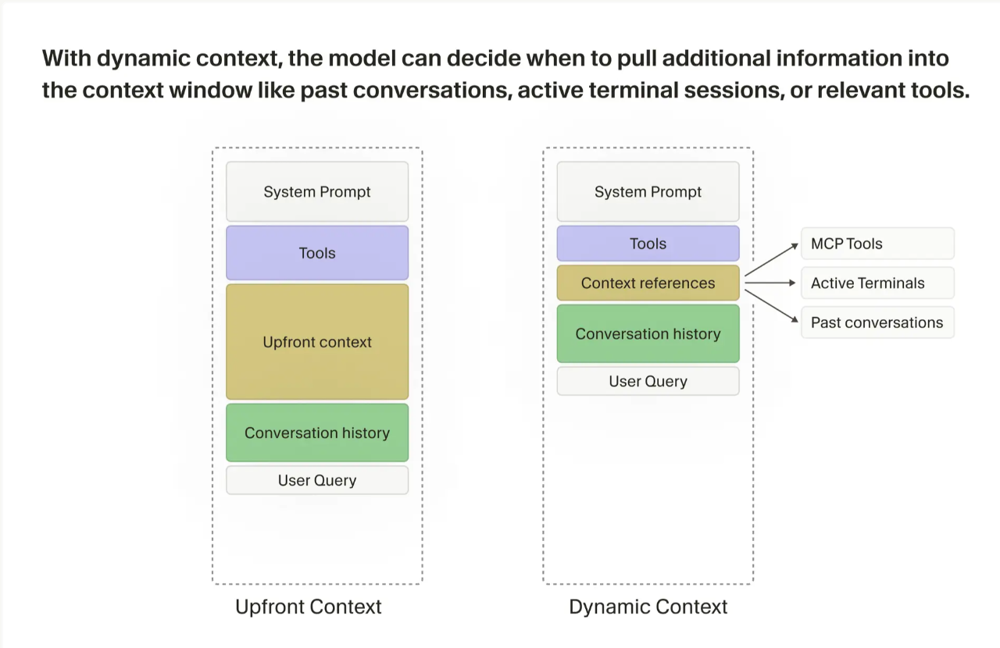
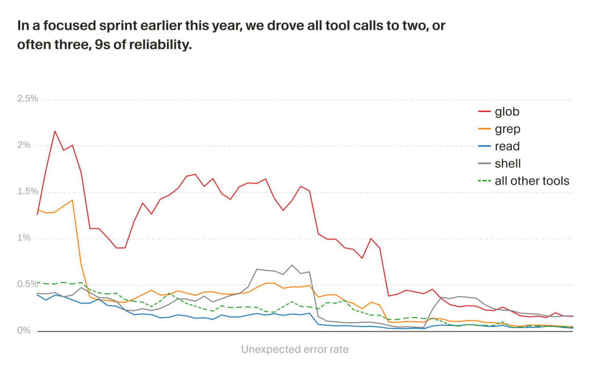
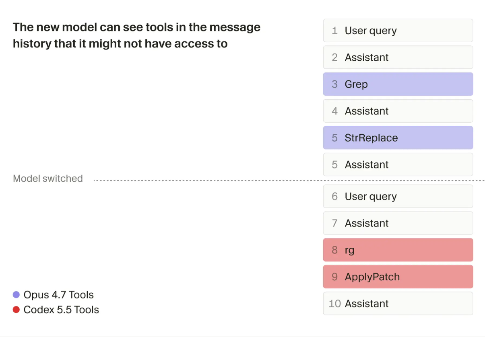

2026 年 4 月 30 日，Cursor 工程团队发了一篇博客 *Continually improving our agent harness*，介绍他们如何迭代 agent harness。

Harness 指模型和用户之间的中间层：系统提示词、工具描述、上下文管理、错误处理、模型适配、多模型切换。

这篇博客相当于对cursor的这套工程系统做了一次技术拆解。

### 上下文窗口：从静态预装到动态拉取

2024 年初的 Cursor agent，会话启动时会在上下文里预装大量静态信息：目录结构、语义匹配的代码片段、压缩后的手动附件。当时的模型在自主选择上下文方面表现较差，需要工程侧替它做选择。

现在的方案是清掉大部分静态上下文，只保留 OS 类型、git 状态、当前/最近查看的文件。其他信息全部改为 agent 运行时按需拉取，比如读文件、查历史对话、读终端输出。

这个改动的直接收益是上下文窗口利用率大幅提高。系统不再预判 agent 可能需要什么，而是确保 agent 有足够的工具自己去拿。

### 在线评测：Keep Rate 和回复情感分析

Cursor 用两套体系评估 harness 改动。

离线侧是公开 benchmark 加自研的 CursorBench，提供标准化对比和趋势监控。但 benchmark 只是真实使用的近似，不单独作为决策依据。

在线侧做 A/B 实验，两个或多个 harness 变体同时部署到真实流量。过程指标包括延迟、token 效率、工具调用次数、缓存命中率，但这些指标的局限是它们只能反映效率，不反映 agent 到底做好没有。

衡量真实质量用了两个方法：

**Keep Rate**。统计 agent 生成的代码在经过固定时间窗口后，有多少还留在用户代码库中。用户手动修改或反复让 agent 修正的部分，意味着初始质量偏低。

**LLM 情感分析**。用一个语言模型读取用户对 agent 输出的回复。用户直接转向下一个任务是正向信号，用户贴出报错堆栈是负向信号。

有时候通过这些线上测试他们发现，应该暂时搁置某个看起来很有前景的想法。在一次实验中，他们尝试使用一个成本更高的模型来做上下文摘要，结果发现这对智能体质量的提升微乎其微，并不值得为此承担更高的成本。

### 上下文腐烂和工具调用可靠性

随着 Cursor agent 支持更多模型和能力，底层运行框架，也就是 harness，会像普通软件一样变得越来越复杂，状态越来越多，潜在 bug 面也会扩大。很多问题只有在大规模真实使用中才会暴露出来。

其中，工具调用是最容易出问题的地方之一。一次失败的 tool call 可能严重影响整个会话。虽然 agent 有时能自我修正，但错误信息会留在上下文里，占用 token，并造成所谓的 **context rot**，也就是错误越积越多，后续判断质量被拖低。严重时，agent 会因为一次工具失败而卡住，甚至完全跑偏。

对于错误，Cursor 的处理方式是分类管理：

- **未知错误** → 统一按 harness bug 处理
- **已知错误** → 按原因分五类：`InvalidArguments`（模型错误）、`UnexpectedEnvironment`（上下文信息矛盾）、`ProviderError`（供应商故障）、`UserAborted`、`Timeout`

监控侧，任何工具的错误率超过固定阈值就触发报警。同时对已知错误也做了异常检测，一旦某个工具、某个模型的已知错误显著超出基线就报警。基线是按工具+模型粒度计算的，因为不同模型在不同工具上的错误率差异显著。

修复侧，他们用自己产品的 Cloud Agent 做自动化。每周自动扫描日志、发现新问题或错误尖峰、在 Linear 中创建或更新工单。团队可以从 Linear 直接触发这些自动化任务。

这套流程是他们构建自动化 software factory 的一部分，也就是让 agent harness 的问题发现、归因、建票、修复尽可能自动化。在今年早些时候的一次集中 sprint 中，他们把意外工具调用错误降低了一个数量级，也就是大约减少到了原来的十分之一。

### 按模型定制 harness

harness 的抽象层是模型无关的，但具体配置按模型深度定制。

最典型的例子是文件编辑工具：

- OpenAI 的模型更擅长 **patch-based** 编辑上
- Anthropic 的模型更擅长 **string replacement** 上

理论上，两类模型都能使用任意一种工具，但让模型使用不熟悉的格式，会消耗更多 reasoning tokens，也更容易出错。所以 Cursor 会在 harness 里给每个模型配置它训练时更熟悉的工具格式。

提示词同样按模型甚至按模型版本定制。他们的经验是：OpenAI 模型在指令遵循上更字面和精确，Claude 更倾向直觉化理解。

当他们提前拿到一个新模型时，会先从最接近的已有模型 harness 开始改。然后通过离线评测找出模型在哪些地方容易困惑，再让团队成员实际使用，暴露真实问题，接着反复调整 harness。这个过程会一直持续到他们认为模型和 harness 的组合足够稳定，可以发布。

他们还观察到一个现象：某模型在上下文窗口快满时会开始拒绝工作，声称任务太复杂。他们把这种行为称为 **context anxiety**，通过调整提示词缓解了。因此 harness 调优不只是发挥模型强项，有时也是用工程手段修正模型怪癖。

### 中途换模型

用户在一个对话中切换模型，是 Cursor 工程上最复杂的问题之一。

原因是不同模型对应的 harness 不一样：提示词不同，工具形态不同，行为习惯也不同。用户切换模型时，Cursor 会自动切到新模型对应的 harness，也就是换上这个模型专门配置的 prompts 和 tools。

**第一个问题是对话历史不同**。新模型接手的对话历史，可能是另一个模型用另一套工具和行为模式生成的，这对新模型来说属于分布外输入。

Cursor 会在切换时加入额外指令，告诉新模型：你现在是在接手另一个模型进行到一半的对话。同时，这些指令还会提醒它不要去调用历史记录里出现过、但不属于自己当前工具集的工具。

**第二个问题是缓存**。缓存通常和具体 provider、具体 model 绑定，所以一旦切换模型，就会出现 cache miss，导致切换后的第一轮更慢、成本更高。

Cursor 的缓解方式是在切换时对已有对话做一次总结，给新模型一个更干净的摘要上下文，从而降低缓存损失。但如果用户已经在一个复杂任务里推进很久，摘要可能丢掉关键细节。因此他们一般建议：除非有明确理由，否则一个会话最好一直使用同一个模型。

一种替代路径是使用子代理（subagent）。从干净的上下文窗口启动，不涉及接管的分布外问题。

### 多代理是 harness 问题

博客最后讨论了多代理架构的未来方向。

这把前面的技术讨论推到一个更大的判断：**未来 AI 辅助软件开发会走向多 agent 协作，而真正决定体验上限的，是 harness 的编排能力。**

逻辑是，未来不会把所有子任务都交给一个单一 agent 处理。更合理的方式是让系统根据任务性质，把不同工作分配给不同的专门 agent。比如，一个 agent 负责规划，一个 agent 负责快速改代码，另一个 agent 负责调试。每个 agent 都只处理自己最擅长的部分。

但这里的关键问题不在于某个 agent 本身有多强，而在于系统能不能正确调度它们。系统需要判断什么时候派哪个 agent，如何用适合它的方式描述任务，以及如何把多个 agent 的输出整合成一个连贯的开发流程。这些能力都属于 harness 的职责。

