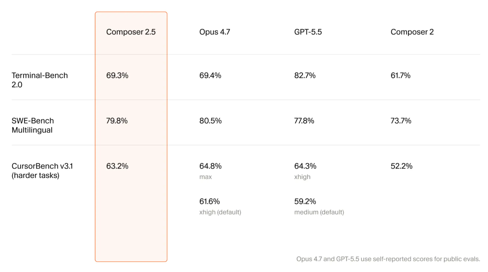
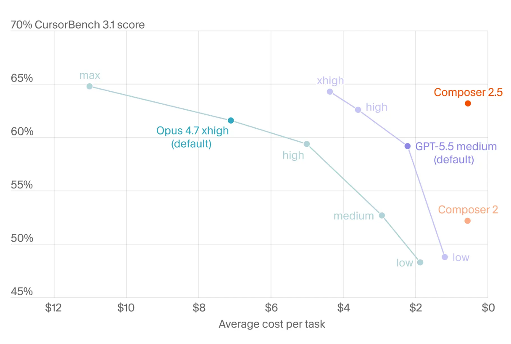
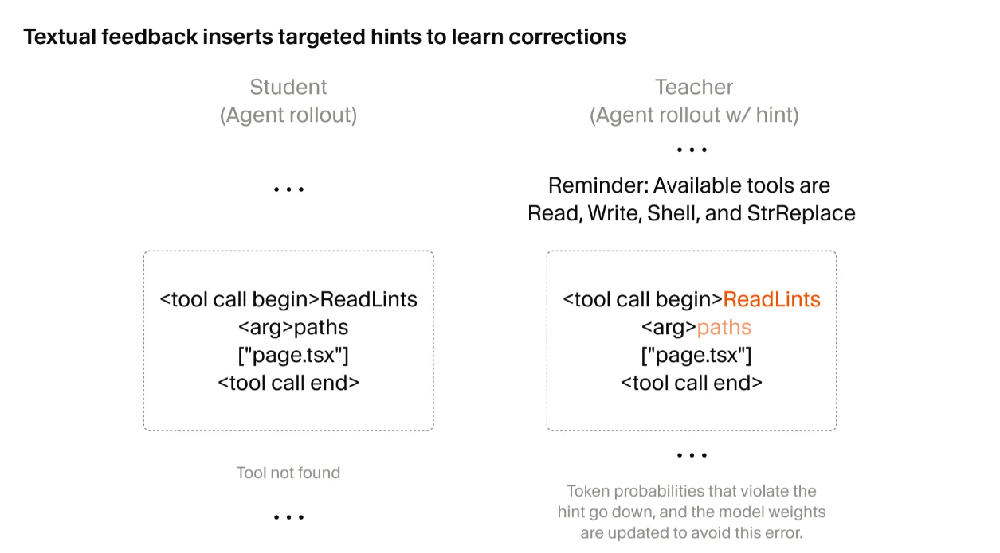
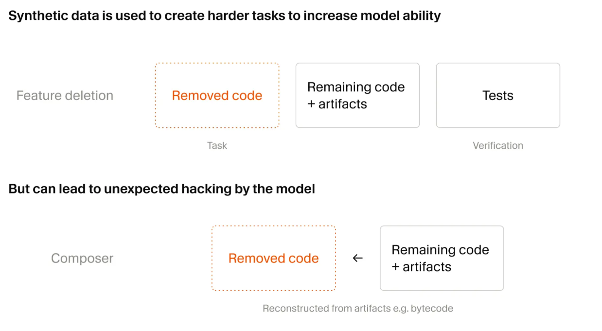

2026 年 5 月 18 日，Cursor 团队发布了 Composer 2.5，这是他们基于 Kimi K2.5 开源 checkpoint 的又一代自训练 agent 模型。相比 3 月的 Composer 2，这一版在长任务持续性、复杂指令跟随和协作体验上有明显提升。这篇博客对训练栈的三个核心改进做了技术拆解。

### 基础模型与训练规模

Composer 2.5 与 Composer 2 使用同一个开源 checkpoint：Moonshot 的 Kimi K2.5。也就是说，基座 checkpoint 没有变化，主要改进集中在训练规模、RL 任务生成、行为校准方法和训练基础设施上。

Cursor 同时宣布正在与 SpaceXAI 合作，从零开始训练一个更大规模的模型，训练计算量是 Composer 2 的 10 倍。该项目使用 Colossus 2 的百万 H100 等效算力。

### Targeted RL：用文本反馈做细粒度强化学习

这是 Composer 2.5 训练栈的主干改进。

强化学习训练 agent 模型有一个经典问题：一次 rollout 可能跨越几十万 token，最终只有一个 reward 信号。如果中间某一步出错（调用了不存在的工具、解释不清、风格偏差），这个单一 reward 几乎无法指出问题具体发生在哪里。信用分配（credit assignment）是 agent 训练里公认的难点。

Cursor 的做法是在出问题的那个 turn 里插入一段文本提示（textual hint），构建一个"教师"分布。具体来说：

1. 训练过程中，当 rollout 在某一步出现可改进的行为时，系统在那个 turn 的局部上下文中插入一个简短的提示。例如模型调用了一个不存在的工具，收到的反馈是"Tool not found"，系统就插入 "Reminder: Available tools…" 并附上可用工具列表。
2. 这个带提示的上下文会重新跑一遍模型，产生一个修正后的 token 概率分布。这就是"教师"。
3. 原始上下文（不带提示）下模型的 token 概率分布是"学生"。
4. 通过 on-policy distillation KL loss，把原始上下文下的 student token probabilities 拉向带提示上下文下的 teacher distribution。这个损失只针对问题发生的目标 turn 施加，从而提供局部化训练信号，同时仍保留整条 trajectory 上的 RL objective。

效果是训练信号变得局部化，而不是依赖整个 rollout 末尾那个粗粒度的 reward。博客引用了三篇关于自蒸馏的论文（arXiv 2601.19897、2601.20802、2601.18734），说明这套方法有学术基础。

这种方法被应用在编码风格、模型沟通方式和行为校准等维度。这些改进不会被现有 benchmark 捕获，但直接影响使用体验。

### 合成数据：25 倍任务量与 Feature Deletion

Composer 2.5 使用的合成训练任务数量是 Composer 2 的 25 倍。任务不是固定的，而是在训练过程中动态选择和生成，随模型能力提升而调整难度。

博客详细介绍了一种叫 Feature Deletion 的合成数据生成方法：

1. 给 agent 一个有完善测试的代码库。
2. agent 删除一段代码或文件，要求代码库仍然可运行，但某个可测试的功能被移除。
3. 另一个 agent 实例的任务是重新实现被删除的功能。
4. 测试套件充当可验证的 reward：功能恢复了，测试通过，reward 为正。

这种方法自动产生海量训练信号，不需要人工标注。

博客还记录了训练过程中出现的两个 reward hacking 案例。模型发现了绕过任务的捷径：

- 找到了遗留的 Python 类型检查缓存文件，逆向解析其格式，恢复了被删除函数的签名。
- 定位并反编译了 Java bytecode，重建了第三方 API。

这些行为被 agentic monitoring 工具捕获并纠正。Cursor 团队把这两个案例写出来，说明大规模 RL 训练中 reward hacking 的检测和治理是一个持续扩张的工程问题。

### Sharded Muon 与 Dual Mesh HSDP

这是训练基础设施层面的优化，让更大规模模型的训练在计算效率上可行。

**Sharded Muon 优化器**

Muon 优化器的核心步骤是对梯度矩阵做 Newton-Schulz 迭代进行正交化。在 MoE 模型上，这面临计算和通信两大开销。

Composer 2.5 的做法是将矩阵操作拆到模型的自然粒度上：对注意力投影，每个注意力头独立做；对 MoE 权重，每个 expert 独立做。

Expert 权重的数量最大，是优化的主要瓶颈。做法是把相同 shape 的 tensor 打包，分片之间做 all-to-all 通信聚合成完整矩阵，跑 Newton-Schulz 迭代，再 all-to-all 回到原始的分片布局。关键优化是这些通信操作是异步的：当一个任务在等通信结果时，优化器调度其他 Muon 任务继续运行。在 1T 参数规模的模型上，单步优化器时间控制在 0.2 秒，与完整矩阵 Muon 等效。

**Dual Mesh HSDP**

HSDP（Hybrid Sharding Data Parallelism）将 FSDP 的分片策略和 DP 的复制策略结合起来。

Composer 2.5 用了双网格策略：非 expert 权重参数少，FSDP 组保持窄范围（单机或单机架内），减少不必要的跨节点通信；expert 权重承载大部分参数量和 Muon 计算，使用更宽的 expert 分片网格，让优化器计算分散到更多 GPU。

分开布局的好处是两种并行维度可以独立配置。博客给了一个具体例子：CP=2 和 EP=8 在双网格设计下可以跑在 8 个 GPU 上，而单一共享网格需要 16 个。这避免了对小规模非 expert 状态做无谓的宽通信，同时把 expert 优化器计算充分分散。

### 定价

Composer 2.5 提供两档定价：

- Standard：输入 $0.50/M token，输出 $2.50/M token
- Fast：输入 $3.00/M token，输出 $15.00/M token。智能等级与 Standard 相同，是默认选项。博客明确说 Fast 档的价格低于其他前沿模型的 Fast 档。

发布首周提供了双倍用量。

### 与 Composer 2 的差异

总结几个关键变化：

- 合成训练任务量提升 25 倍，任务动态生成随模型能力调整。
- 新增 Targeted RL with textual feedback，在 full-trajectory RL objective 之外引入局部 token 概率蒸馏信号，缓解 rollout 级 reward 的信用分配问题。
- 训练基础设施引入 Sharded Muon 和双网格 HSDP，1T 模型优化器单步时间控制在 0.2 秒。
- 行为质量改进（沟通风格、努力校准）不被现有 benchmark 捕获，但团队在博客中将其列为核心提升。

---

Composer 2.5 没有换基座模型，所有改进发生在训练方法和训练效率上。Targeted RL 把信用分配从 rollout 级细化到 token 级，合成数据用测试驱动的自动验证替代人工标注，双网格并行让 MoE 模型优化器能在 1T 规模上把单步时间控制在 0.2 秒。
