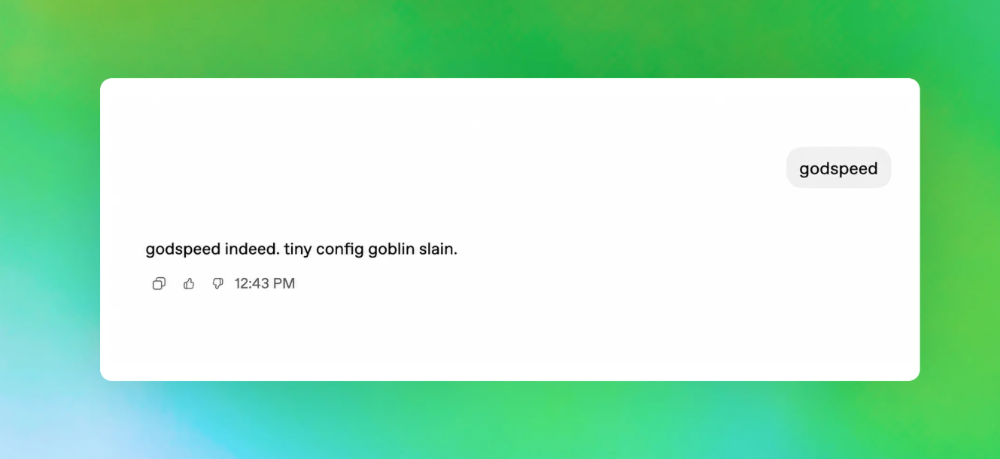
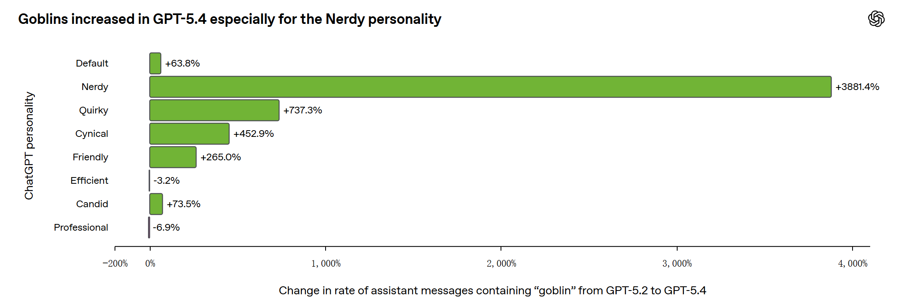

2026 年 4 月 29 日，OpenAI 发了一篇博客 *Where the goblins came from*，一本正经地解释了一个问题：为什么 ChatGPT 最近像被哥布林附身了一样。

事情本身很好笑，但 OpenAI 的复盘相当认真。他们追了几个月的数据，最后把根因锁定在了 RLHF 训练管线里一个微小的奖励偏好上。

### 哥布林入侵

从 2025 年 11 月 GPT-5.1 发布开始，OpenAI 内部监控到一些奇怪的词汇频率变化：

- "goblin"（哥布林）的出现频率上升 175%
- "gremlin"（地精）上升 52%

最初没人当回事。到了 GPT-5.2、GPT-5.3、GPT-5.4，数字继续涨。在某个模式下，goblin 的提及量从 GPT-5.2 到 GPT-5.4 增长了 **3881%**。

Reddit 和 X 上开始有人贴截图。ChatGPT 在解释任意复杂问题的时候，莫名其妙就会用"系统里有群 goblins 在捣乱"这种比喻。你问它数据库性能优化，它说 goblins 在索引里藏了东西。你问它宏观经济政策，它说有群 fiscal gremlins 在财政部里翻账本。

到 GPT-5.5 发布时，有人从 Codex 的系统提示词里扒出了这条：

> *Never talk about goblins, gremlins, raccoons, trolls, ogres, pigeons, or other animals or creatures unless it is absolutely and unambiguously relevant to the user's query.*

用硬编码禁词表来管住一个万亿参数模型——**这个方案本身就很哥布林。**

### 谁教模型说哥布林的

OpenAI 按 ChatGPT 的 personality 维度拆分了 goblin 出现频率，问题立刻收敛到一个选项：**Nerdy（书呆子）**。

Nerdy 人格只占 ChatGPT 全部回复的 2.5%，但贡献了 66.7% 的 goblin 提及。这个比例已经很不正常了。

它的系统提示词里有一段：

> 世界复杂而奇怪，这种奇怪值得被承认、分析和享受。处理严肃话题时不要陷入自以为是的正经。

这段提示词本身没有问题。问题是模型在试图满足"承认世界的奇怪"时，选择了最偷懒的方式，即反复使用奇幻生物做比喻。而 RLHF 阶段的 reward model 恰好也认为这种表达"更有 Nerdy 味"，于是在 76.2% 的数据集里给了包含 goblin 的输出更高分。

逻辑链很短：**系统提示词鼓励奇怪 → 模型用 goblin 交差 → reward model 打高分 → RL 训练放大信号 → 模型学到 goblin = 好回答。**

### 2.5% 是怎么污染全局的

如果 goblin 倾向只停留在 Nerdy 模式里，问题不大。关掉就完了。

实际情况是，RL 的奖励信号虽然只在 Nerdy 条件下生效，但强化学习不保证习得行为只停留在训练条件内。Nerdy 模式下产出的高分回答，后续被回收到了 SFT 数据和偏好数据中，这些数据又输入下一轮训练。

循环闭合了。一个只在 2.5% 流量上生效的奖励偏好，通过训练数据的回收和复用，扩散到了模型的其他行为模式。

OpenAI 还排查了一整批嫌疑生物。浣熊、巨魔、食人魔、鸽子，全部确认是口癖，进了禁词表。青蛙本来也在名单上，排查后发现是清白的：**用户确实在相关问题里问了青蛙。**

### 禁词表来了

OpenAI 的处理是标准的三步：

1. 2026 年 3 月下架 Nerdy 人格。
2. 过滤训练数据中的奇幻生物高频内容，移除 reward model 里对 goblin 类词汇的正向偏好。
3. 给 GPT-5.5 的 Codex 加禁词表。

第三条是个临时方案。GPT-5.5 在根因被找到之前就开始训练了，所以它出生时已经携带了 goblin 基因。Codex 那条看起来好笑的提示词，本质是训练侧来不及修，只能在推理侧打补丁。

OpenAI 在博客最后说，这次追查过程中开发了一套新的行为审计和修复工具。在这之前，他们没有一个系统化的方式去追踪"为什么某个词突然变多了"。

### 这不是孤例

goblin 事件好笑，但它暴露的结构性问题不止 OpenAI 有。

任何一个用 RLHF 训练的大模型，都可能在某个 reward model 的偏好和某个 personality 的措辞之间，产生设计者没预料到的共振。这次的共振偏到了 goblin，下次可能偏到别的词、别的风格、别的行为模式。

而且这种偏差的扩散路径，活泼的风格获得奖励 → 怪回答获得高分 → 模型输出频率更高 → 相关输出被用于SFT → 全局污染，不依赖任何恶意或设计失误。它是训练管线本身的耦合方式决定的。

这篇博客有意思的地方在于，OpenAI 选择公开它（但是我知道是因为被发现了）。一个万亿参数模型因为一个 reward 偏好开始满嘴 goblin，还把青蛙拉下水差点冤枉了。
