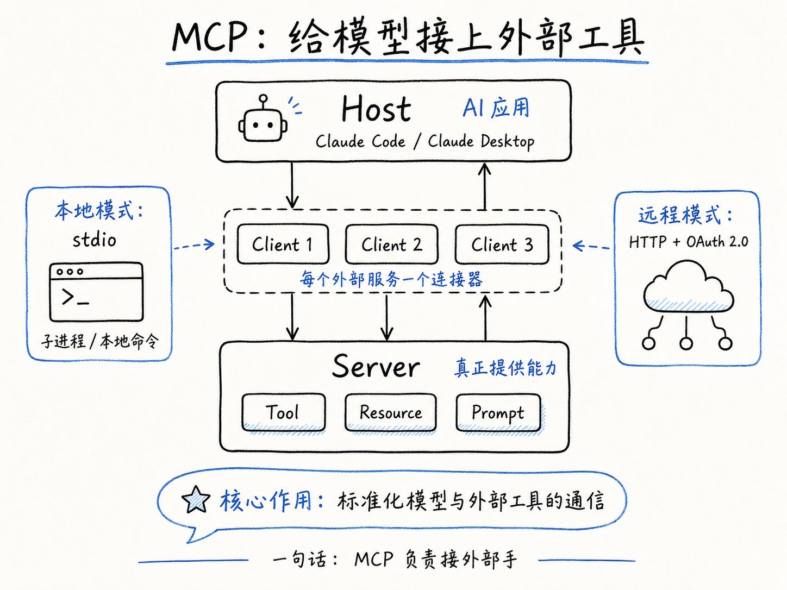
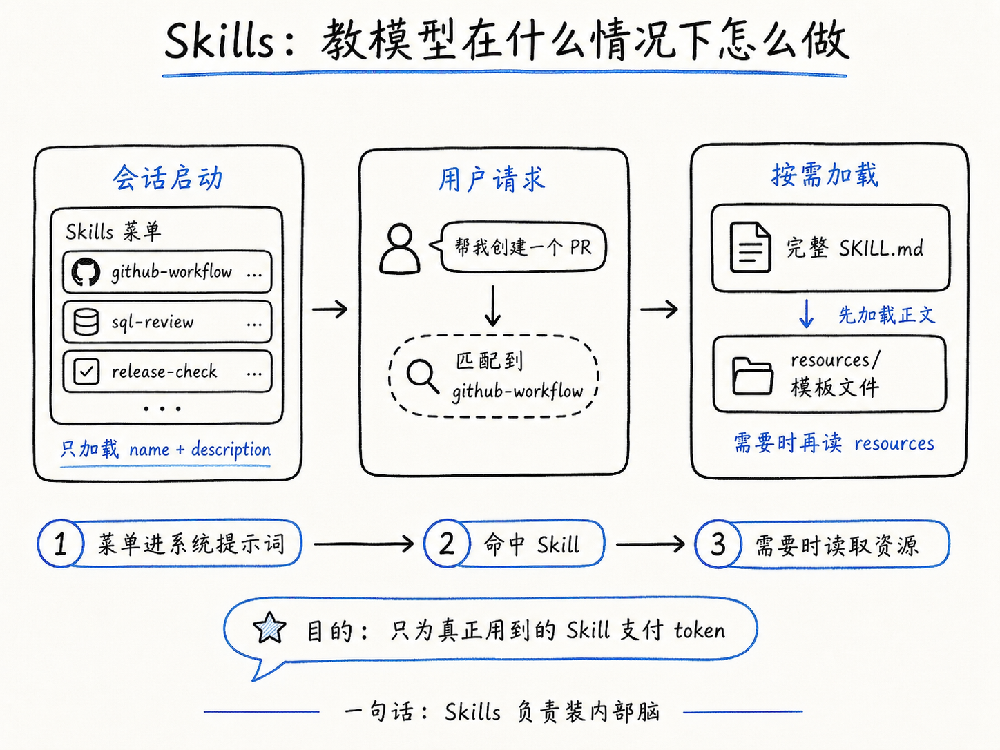
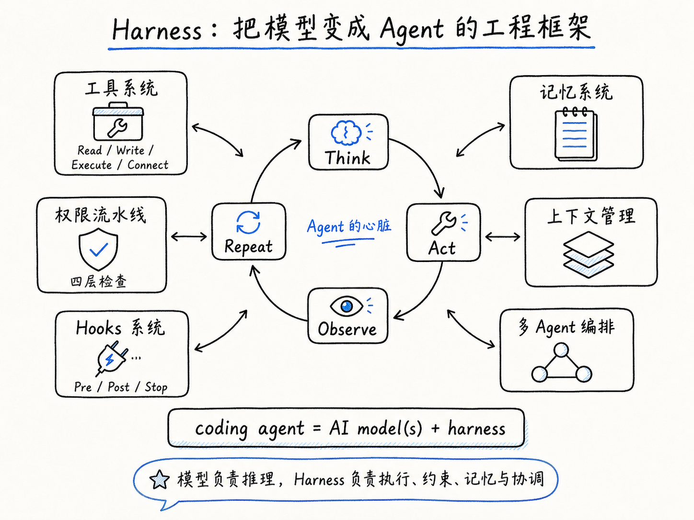
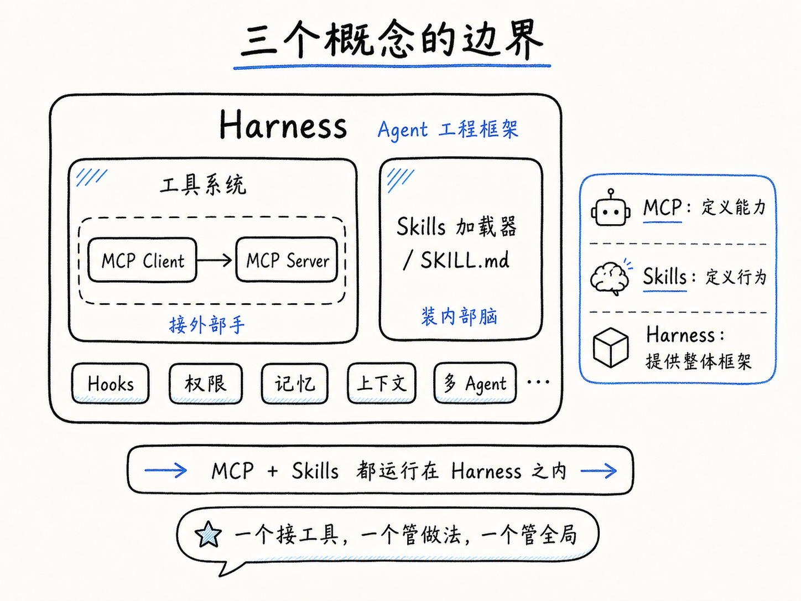

我们经常听到三个词：MCP、Skills、Harness。它们分别解决不同的问题。这篇文章用最少的背景知识，逐个拆解它们是什么、怎么用、以及怎么区分。

### MCP：给模型接上外部工具

MCP（Model Context Protocol）解决的问题很具体：让 AI 工具能调用外部服务。

在 MCP 出现之前，每个 AI 应用接外部工具都要自己定义一套接口。MCP 把这套东西标准化了，作用类似 USB 协议：以前键盘、鼠标、U 盘各要各的接口，USB 用一个口统一了所有外设。

MCP 的架构分三层。



**最上层是 Host，也就是你正在用的 AI 应用。**Claude Code 是一个 Host，Claude Desktop 也是一个 Host。Host 的职责是管理下面所有的连接，以及执行安全策略。比如某个外部服务要求写文件权限，Host 会弹出来问你"同不同意"。

**中间层是 Client，每个外部服务对应一个连接器。**你接了三个外部服务，Host 就创建三个 Client，各管各的会话。Client 负责跟服务端握手、收发消息、处理认证。

**最下层是 Server，真正提供能力的部分。**Server 跑在本地子进程或远程服务器上，暴露三种东西给模型使用：

- Tool 是模型可以主动调用的函数。比如一个天气 Server 暴露了 `get_weather`，模型判断"用户刚才问天气了"，就发出一次调用请求。定义一个 Tool 只需要三样：名称、一段描述告诉模型什么时候用它、输入参数的数据格式。

- Resource 是只读数据，模型像读文件一样读取。比如一个数据库 Server 把表结构暴露为 Resource，模型搜索到目标表，读它的 schema，然后生成正确的 SQL。整个过程模型不需要知道数据库连接字符串，只知道"这里有个 Resource 可以读"。

- Prompt 是预定义的提示词模板。用的相对少，主要帮用户快速启动特定任务。

Server 和 Client 之间怎么通信？协议基于 JSON-RPC，消息格式是普通的 JSON 对象。传输方式有两种：本地模式用 stdio，把 Server 作为子进程启动，通过标准输入输出传消息；远程模式用 HTTP，Server 暴露一个网络端点。本地模式不需要额外认证（进程是你自己启动的），远程模式走 OAuth 2.0 标准流程。

**怎么用现成的 MCP Server。**在项目根目录放一个 `.mcp.json`：

```json
{
  "mcpServers": {
    "filesystem": {
      "command": "npx",
      "args": ["-y", "@modelcontextprotocol/server-filesystem", "/path/to/data"]
    }
  }
}
```

`command` 和 `args` 告诉 Claude Code 启动什么子进程。Claude Code 启动时读取这个文件，为每个 Server 创建 Client，握完手之后把 Server 暴露的工具注册到自己的工具列表里。注册完成后，这些外部工具对模型来说跟内置工具完全一样，模型不知道也不关心一个工具是本地的还是远程的。

**怎么写一个 MCP Server。**核心是实现两个方法：`tools/list` 返回工具有哪些，`tools/call` 执行工具。Python SDK 大概长这样：

```python
from mcp import Server

server = Server("my-server")

@server.tool()
def get_current_time() -> str:
    """Return the current time."""
    return datetime.now().isoformat()

server.run()
```

工具的描述字符串（docstring）就是模型判断何时调用的依据。要写清楚具体功能，不能写"执行操作"这种废话。

**MCP 不管什么。**它不管权限（权限是 Host 的事），不管行为规则（模型自己判断何时调哪个工具），不管工作流编排（先调 A 再调 B 不属于协议层）。MCP 只做一件事：定义模型和外部工具之间怎么通信。一句话：**MCP 负责接外部手。**

---

### Skills：教模型在什么情况下怎么做

MCP 回答了"模型能调什么工具"。但还有一个问题它回答不了：模型在什么情况下、按什么标准、以什么顺序来用这些工具？

举个例子。你通过 MCP 接了 GitHub，模型现在可以创建 Issue、提交 PR 了。但你的团队有规范：PR 标题必须带 Jira 编号，描述必须包含测试步骤截图，reviewer 要按 CODEOWNERS 文件来指派。这些规则不是"能力"问题，是"行为"问题。Skills 就是干这个的。



**一个 Skill 就是一个目录，核心文件是 `SKILL.md`：**

```markdown
---
name: github-workflow
description: Follow team conventions when creating GitHub PRs and issues.
---

# GitHub Workflow

## Creating a PR

1. Check if there is an associated Jira ticket. If not, ask the user for one.
2. PR title format: `[JIRA-123] Brief description`
3. PR description must include:
   - What changed and why
   - Test steps with screenshots
   - Any breaking changes
4. Assign reviewer based on the `CODEOWNERS` file.
```

目录下还可以放 `scripts/` 放辅助脚本，`resources/` 放模板和参考文件。

Skills 放在两个位置：`~/.claude/skills/` 全局可用，`.claude/skills/` 仅当前项目可用。

**渐进式加载：Skills 最关键的工程设计。**这是理解 Skills 的核心。

第一步，会话启动时，所有 Skills 的 name 和 description 被注入系统提示词。注意：此时只注入菜单，不注入正文。模型看到的是一份"技能菜单"，每项只有名字和一句话描述。占用的 token 极少。

第二步，用户发来请求。模型在推理时判断"这个请求匹配了哪个 Skill"，发出 Skill 调用指令。这时 Host 才去读取那个 Skill 的完整 SKILL.md 正文，注入到模型的指令上下文中。正文可以有几百行，但其他 19 个没匹配到的 Skill 的正文根本不会被加载。

第三步，如果 SKILL.md 里引用了 `resources/` 中的模板文件，这些文件只在模型确实需要读取时才加载。模型不需要读的文件不占上下文。

这样设计的目的很简单：省钱。假设你装了 20 个 Skills，每个有 200 行指令。全塞进系统提示词是 4000 行，每次对话都要为这些从未使用的指令付费。渐进式加载让模型知道 20 个 Skills 的存在，但每次只为实际命中的那一个支付 token。

**SKILL.md 的几个实用字段。**除了必填的 name 和 description，还有三个可选字段值得了解：

- `context: fork`。正常情况下 Skill 指令注入主对话。如果 Skill 执行过程很长（调十几个工具、产生大量中间输出），这些输出全部涌入主对话会迅速占满上下文窗口。加了 `context: fork` 后，Skill 在独立的子 Agent 上下文中运行，所有中间推理和工具输出被隔离，主对话只收到最终结果。

- `model`。检查拼写的 Skill 不需要 Opus 的推理能力，指定 `model: haiku` 能节省大约 80% 的 token 成本。

- `user-invocable: false`。有些 Skill 设计为仅由模型自动匹配触发（比如检测到用户贴了 SQL 时自动加载 SQL review Skill），设置这个字段让它不出现在斜杠命令菜单里。

**Skills 不管什么。**Skills 本身不提供任何新的工具能力。如果你在 SKILL.md 里写"调用 get_weather 获取天气"，这个 get_weather 工具必须已经通过 MCP 注册到模型。Skill 只提供行为规则：什么情况下、按什么顺序、以什么标准来使用已有的工具。一句话：**Skills 负责装内部脑。**

---

### Harness：把模型变成 Agent 的工程框架

MCP 和 Skills 各自解决了一个具体问题。Harness 解决的问题更大：怎么把一个大语言模型变成一个能在真实环境里干活、不乱来、能记住事、能管好自己的 Agent。



用一个公式表达：

> coding agent = AI model(s) + harness

模型只做推理：看到上下文，判断下一步做什么。Harness 做剩下的所有事情：执行模型的决策、管权限、管记忆、管上下文不爆、管多个 Agent 之间的协调。

**执行循环：整个 Harness 的心脏。**只有大约 50 行代码，四个步骤不断重复：

- Think：把当前上下文发给模型，等它输出下一步行动。
- Act：执行模型决定的工具调用（读文件、写代码、跑命令）。
- Observe：把执行结果追加回上下文。
- Repeat：回到 Think，直到模型自己决定停止。

这个循环本身不包含任何业务逻辑。它不知道什么是代码、什么是文件、什么是 git。它只知道四件事：调用模型、执行工具、收集结果、再来一次。是否继续、何时停止、选哪个工具，全部由模型自己判断。

这个"笨循环"的思路跟 LangChain 等传统 Agent 框架正相反。传统框架倾向于在代码里写编排逻辑："如果用户问了 X，先调 A 工具，再调 B 工具，然后根据 B 的返回决定调 C 还是 D"。好处是确定性，代价是每个新场景都要写新代码，模型升级后编排逻辑可能就不适用了。Harness 把决策权留给模型，框架只提供可靠的执行能力。模型越强，框架越不需要"聪明"。

围绕这个核心循环，Harness 建了六个子系统。

**工具系统。**不是做上百个专项工具，而是只给模型四个基础能力：Read（文件读取和搜索）、Write（创建和编辑文件）、Execute（运行命令，Bash 是主角）、Connect（连接外部服务，实现层就是 MCP Client）。四个原语背后的判断是：与其封装 100 个工具然后维护它们之间的交互，不如给模型一个 shell 让它自己组合。模型本来就擅长写命令。

**权限流水线。**有 Bash 执行能力意味着模型可以做危险的事。权限系统在每次工具调用时逐层检查：

- 第一层，查缓存。这个操作之前被批准过且勾了"记住"，直接放行。
- 第二层，看模式。当前处于 acceptEdits 模式（用户允许自动编辑文件），文件修改自动放行，但 Bash 仍需确认。
- 第三层，无条件放行所有只读工具。Read、Grep、Glob 没有副作用，无需确认。
- 第四层，AI 分类器做最终判断。前面没放过也没拦下来的操作，发给独立分类器评估风险等级（识别 force push、远程代码执行、数据外泄等高风险操作）。

保护机制：模型连续被拒 3 次，自动降级为手动确认。连续 20 次，彻底关闭自动模式。

**Hooks 系统。**Hooks 让你在 Agent 运行的关键节点插入自定义逻辑，是用户最直接可配置的部分。

三个最实用的事件：

- `PreToolUse` 在工具执行前触发，是可以阻止操作的唯一钩子（典型用途是安全拦截）。
- `PostToolUse` 在工具执行成功后触发（典型用途是自动格式化代码、记录操作日志）。
- `Stop` 在 Agent 停止时触发（桌面通知或操作摘要）。

每个事件钩子上可以挂三种 handler：command 类型执行 shell 脚本（最直接），http 类型向外部发 POST 请求（适合调用 webhook），prompt 类型启动一个 LLM 子 Agent 做智能处理（最灵活但有 token 成本）。

**记忆系统。**Agent 需要记住事，但原则是"记忆只当索引用，能从代码库重新推导的信息不存储"。启动时六层记忆分层加载：组织策略、项目 CLAUDE.md、用户偏好、Auto-Memory（从历史交互中学到的模式）、当前会话临时信息、子 Agent 专项记忆。Auto-Memory 会主动自我编辑，去重、剪枝、标记矛盾，过时的记忆被视为"负债而非资产"。

**上下文管理。**三层防线：自动压缩（token 到一半时触发摘要，抛弃冗余保留关键决策）、子 Agent 隔离（重型任务卸载到独立子 Agent，中间过程对主 Agent 透明）、缓存经济学（追踪 cache-break 条件保持高命中率）。

**多 Agent 编排。**子 Agent 有三种内置预设：Explore（Haiku 快速搜索，成本低）、Plan（只读研究规划）、General-purpose（全套工具处理复杂任务）。子 Agent 可以前台或后台运行。Agent Teams 是实验性功能，多个 Claude Code 实例通过共享文件系统协作。

---

### 三个概念的边界

用一个嵌套结构看它们的包含关系：

```
Harness（Agent 工程框架）
├── TAOR 循环
├── 工具系统
│   ├── 内置工具（Read / Write / Execute / Connect）
│   └── MCP Client（连接外部 MCP Server）
├── Skills 加载器（渐进式注入行为指令）
├── Hooks 系统（生命周期事件响应）
├── 权限流水线（四层检查）
├── 记忆系统
├── 上下文管理
└── 多 Agent 编排
```

MCP 和 Skills 都是 Harness 的扩展机制，但方向不同。一个接外部手，一个装内部脑，两者互补而非替代。

具体的感受方式：你在写 MCP Server 的时候，关心的是"工具叫什么、收什么参数、返回什么格式"。你在写 SKILL.md 的时候，关心的是"模型什么时候该用这个工具、用之前检查什么、用之后怎么验证"。前者定义能力，后者定义行为。



三个容易搞混的点：

**MCP 不是 Skills 的替代品。**MCP 让你接 GitHub API，Skills 让你规定 PR 标题格式。有人觉得"把行为规则写进 MCP 工具的 description 里就行"，实际上不行。工具的 description 告诉模型"这个工具干什么"，不是"你什么时候该用它、以什么标准用"。行为规则需要更长的上下文，那是 Skills 的领域。

**Harness 不只是 Hooks。**Hooks 是 Harness 里最容易被感知的部分，因为它是用户直接配置的。但 Hooks 只是六个子系统中的一个。权限流水线不在 Hooks 里，记忆系统不在 Hooks 里，上下文压缩不在 Hooks 里。把 Harness 理解成 Hooks，相当于把操作系统理解成 cron job。

**MCP 不是 Claude Code 专属的。**MCP 是开放协议，Python、TypeScript、Java 等多语言 SDK 都有，Cursor、Codex、Continue 等工具都在支持。Skills 目前是 Anthropic 生态内的机制，没有独立协议规范。

MCP 是连接协议，让模型能调用外部工具和数据源。Skills 是行为指令包，让模型在特定场景下按特定方式做事。Harness 是 Agent 工程框架，包含执行循环、工具系统、权限管线、Hooks、记忆、上下文管理和多 Agent 编排。MCP 接外部手，Skills 装内部脑，两者互补，都运行在 Harness 之内。
