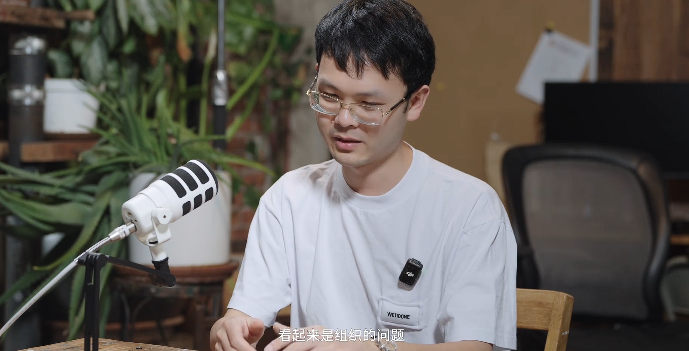

2026 年 3 月，播客主持人张小珺对谈了 Google DeepMind 研究员姚顺宇。访谈录制后不久，世界又发生了许多意料之外的变化：Meta 对 Manus 的收购被撤销、Cursor 可能被 SpaceX 收购、xAI 并入 SpaceX 并更名 SpaceXAI。在 AI 行业，两个月的滞后已经足以让任何判断显得过时。

姚顺宇是硅谷 AI 业界两个同名"姚顺宇/雨"中的一位。另一位姚顺雨 2025 年从 OpenAI 跳槽到腾讯出任首席 AI 科学家，这位姚顺宇同年从 Anthropic 跳槽到 Google DeepMind。两人都是清华同一届毕业生，前者在姚班学计算机，后者在基科班学物理，后来又分别去了普林斯顿和斯坦福，正好和外界对这两所学校的刻板印象反了过来。

姚顺宇的背景是理论物理。本科在清华做凝聚态理论，博士在斯坦福做高能物理和量子信息。博士后只在伯克利待了两个星期，就离职去了 Anthropic。在 Anthropic 待了一年，参与了 Claude 3.7 的开发，去年秋天加入 Google DeepMind。

这个背景让他的很多判断和主流叙事不太一样。他在访谈里说的话，有些可以直接拿来当标题，有些需要停下来想一想。他也不是那种滴水不漏的人。他自己说，转行 AI 之后最大的变化是变得"越来越直接，越来越不害怕得罪人"。"我在这个行业又没有什么导师，又没有什么旧友，我当然想喷谁喷谁。"

但他不是在发泄。他有一套自洽的判断框架，这套框架来自物理给他的训练，也来自他在两家顶级 AI 实验室的第一线经验。下面是他在这两小时访谈里表达的核心判断。

### 物理的教训：别把时间浪费在伺候老登身上

姚顺宇从物理转到 AI，不是出于对 AI 的热情，而是出于对物理的失望。

他博士做的是高能理论。高能理论足够难，但有一个根本性的问题：实验已经完全追不上了。当实验追不上理论，评价标准就不再是客观的。"这时候谁做得好、谁做得不好，就依赖于领域内一些老登的主观判断。"

他说这话的时候语气很平静。"我也没有被谁伤害，只是在那个领域待的时间越长，就越觉得这件事蠢。**人这一辈子也没多长，为什么要把自己的时间浪费在伺候老登身上？**"

这段经历给了他一个清晰的筛选标准：**做有客观评价标准的事，做能对世界产生影响的事。** 他在量子计算和 AI 之间做过权衡。量子计算离他的研究主线更近，但深入了解后发现，量子计算的主要瓶颈在实验上，那是他不擅长的。AI 反而更像他习惯的工作方式：有一个想法，用数值去验证。

他反复拿 AI 和 18 世纪的热力学做类比。"那个时代大家不理解什么是热的微观理论，不知道热是什么东西。就像现在，大家不能理解语言模型里哪一个矩阵元在干什么。但是不妨碍你有好的经验定律，比如热力学的各种定律，和现在的各种 Scaling Law。"

"那个时代理论和实验不分家，没有什么理论物理学家、实验物理学家，你就是搞物理的。**AI 就有点像那个时代。**"

至于"智能涌现"这个流行说法，他的评价很直接："**这个话本身就不太科学，自然也没法用科学的话来表达一个不科学的事。**"在他看来，真正的分水岭不是智能"涌现"了，而是技术上找到了 scale up 的方法，可以水平地提升所有能力。那个时刻才是有良好定义的事。

### Anthropic 为什么能 top-down

姚顺宇加入 Anthropic 的时候，公司大约七八百人，他所在的大团队只有十到十一人。这个团队后来几乎覆盖了强化学习的方方面面，最终的产品是 Claude 3.7。

他对 Anthropic 最核心的观察是关于它的组织能力。Anthropic 是一个 top-down 的公司，决定了什么事就全力去做。但 top-down 有一个隐含的前提，大多数人没有想过。

"**实行 top down 有一个很难的点，就是你做技术的决策人，必须也得是公司的决策人。** 首先你技术上得能服众，才能让下面的研究员信服你去做这个事；另一方面，你得是公司的决策人，能为公司负这个责任。"

Anthropic 恰好满足这个条件。它的技术领导人 Jared Kaplan 和 Sam McCandlish 是公司联合创始人。"人家自己做这个决定，那是人家的公司，他有权利做这个 top down 的事。"

"OpenAI 就干不了。"Ilya Sutskever 在的时候有可能可以，但后来"他好像失去了做决策的能力，就走了"。大公司也干不了。Google 的传统是 bottom up，这是大公司和大公司之间的打法差异。

还有一个更微妙的原因：Anthropic 的创始团队是一起打过仗的人。Scaling Law 论文、GPT-3 论文上都有他们的名字。"**有很多公司干着干着，连小集体都团结不住了，那你怎么能指望大公司能团结住呢？**"

Claude 在 coding 上的优势，最初可能是一次自下而上的偶然发现。"Claude 3 放了之后，Twitter 上很多人在讨论说 Claude 3 好像写 code 比 GPT-4 强。那个年代，GPT-4 是一个和大家 gap 很大的模型。能有一件重要的事比 GPT-4 强，就很厉害了。"管理层快速捕捉到信号，"一旦给它一个合理的、公司该做的事，就会铺上去。它没有大组织那种冗余。"从自下而上的发现变成了自上而下的全力投入。

但姚顺宇反复强调，不是某一个人的功劳。"所有给个人贴金的事，都有点炒作的嫌疑。**AI 在最近这几年本身是一个不可阻挡的事。它不在于你这个人去干或者不干，你不干也有别人一样能干出来。**"

### 技术的 tips 没什么用

在被问到有哪些技术诀窍时，姚顺宇说了一句很反直觉的话："**技术的 tips，是一个大家很愿意听、公司又不让你说，但实际又没啥用的事儿。**"

他的解释是：现代 AI 训练是一个大系统。很多算法设计并不独立于算法本身，"它非常强地依赖于你的基础设施"。举个简单的例子，在强化学习中，产生 token 的采样机器和用来实际训练、改变模型权重的训练器，"不同公司这两个机器的不一样程度不一样，算法设计也会不一样"。有的公司最大的算法挑战是怎么控制异步训练架构带来的不稳定性，有的公司基础设施建设得好，可以花更多精力在训练效果上。

"**很多别的 lab 里的人可能很想知道 Anthropic 怎么做这个、Gemini 怎么做那个。但我有时候不愿意回答，主要原因是觉得本质上回答这个问题也是在误导他。** 什么事是因为什么而变得有用了，而不是这个事本身有用。"

真正重要的不是某个技巧，而是"**把简单的事做得比谁都干净**"。

### "AI 本质是简单的"

这可能是整个访谈里最容易被误解的一句话。姚顺宇说"AI 本质是简单的"，他特意补充：这不是一个结论，而是一个陈述。它可对可错。

他的论证不是从智力难度的角度出发的，而是从**实验可行性**的角度。

"它和本质上难的东西，比如物理，区别在于物理你没有能标下的实验数据，就是理解不了那个能标下的理论。但 AI 不被这个所约束。你理解不了没关系，也可以往前发展。**能够做任何我能想到的实验，只是可能需要一些时间把计算量提上来。没有什么本质上的困难。**"

更关键的是，AI 已经开始在加速自己的实验。"**未来的 6 到 12 个月，AI 就会自己做实验。** 不是写代码而已，是写完代码之后跑实验，看到结果，分析结果，知道哪儿做得不对，提出新的假设，设计新的代码，跑新的实验。这条链条目前还没有完整，但下一步会慢慢变得完整。"

顺着这个逻辑，他也谈到了对 AI 安全的看法。Anthropic 的逻辑是"我首先得拥有一个最前沿的模型，才有话语权来推进安全政策"。但姚顺宇不认同。"这个想法非常幼稚。更有可能发生的是，**大家都有很好的前沿模型，而你没有办法阻止任何事发生。**"

他的类比是核武器。核武器最终受到控制，靠的不是某一个国家的善意，而是多边制衡。"AI 要阻止不好的事，最终可能需要一种类似的机制来实现。**世界在推着我们前进，而不是我们在推着这个世界前进。**"

### 下一个 bet：long horizon

现在在 Google DeepMind，姚顺宇主要做两件事：ML coding 和 long horizon。ML coding 的目标是实现 AI 自己训练自己的完整链条。Long horizon 的目标是他反复说的一句口号："**Train with finite context, use as infinite context。**"

他说，想让训练长度一直变长，靠增加单次训练语段长度不是现实的方案。人的 context 就非常短，"你现在问我昨天晚上吃什么，我是一点也想不起来了，因为它对我现在的场景来说不关键。我选择把它忘掉。"关键是选择性地遗忘和检索，把与当前场景相关的重要信息拿回来。

这两个方向构成一个 T 字形。Agentic coding 是已经完成的那一横，横向延伸到不同的使用场景。AI research 是横向场景中的另一个。同时在纵向上，从几秒钟的代码补全延伸到可能持续几天的完整研究过程。"横向有延展，纵向也有延展。"

当被问到"基于你当下的认知，一个关键的重要的 bet 是什么"，他的回答就是 long horizon。

### 胆子要大，别信老登

访谈最后，主持人照例问了人生之书的推荐。姚顺宇说："我感觉你还是高看了我的文化程度。我真的没有什么人生之书。"

在被问到一个少有人知道但需要知道的知识点，他说："**别相信老登，算吗？**"

这是玩笑，但也不是玩笑。从物理到 AI，从离开 Anthropic 到加入 Google，他做的每一个选择背后都有同一种驱动力：不把时间浪费在没有客观标准的事上，不信赖权威的主观判断，去能找到回馈信号的地方。

他真正相信的人生经验，来自高中时期的一条短信。在清华夏令营的最后一天，他听说有面向北京学生的自主招生考试。他立刻给清华招生办老师发短信："你给北京的同学考，为什么不给上海的考？"老师答应了。

"从那件事得到的人生最重要的道理就是，**胆子要大。你不争取是永远得不到的。争取了也有可能得不到，但不争取就绝对得不到。**"

一个在访谈里说"AI 个人英雄主义时代已经过去了"的人，自己做过的最重要的事，恰恰是一个极个人英雄主义的举动。

但他大概不会觉得这有什么矛盾。胆子大，争取机会，跟崇拜个人英雄是两回事。前者是行动准则，后者是归因方式。他拒绝的只是后者：不要把集体的产出归功于个人的神话。他自己争取自己的，和这个判断并不冲突。

他在访谈里有一段话，可以作为这一切的注脚："我过去可能也会比较直接，但是没有这么直接。做了 AI 之后就更直接。一是没有束缚，二是这个领域足够客观。**你不用太担心因为自己的观点而惹到什么人。只要你的观点是自洽的，你有一套自己的理解。最终你在这个领域做得怎么样，是有客观评价标准的。大家是会尊重你的。**"
