过去两年，AI Agent 从演示视频走进了真实业务。很多人卡在同一个问题上：知道 Agent 大概是什么，真要给自己的系统设计架构时，却对着一堆名词无从下手。

这篇博客把目前主流的 Agent 设计模式梳理成一条完整的链条：先建立心智模型，再明确需求，然后按从简单到复杂的顺序过一遍所有模式，最后给出工程落地要点。读完之后，面对自己的业务需求，你应当能判断出该从哪种模式开始。

## 一、先建立心智模型：Agent 到底是什么

抛开所有复杂定义，一个 AI Agent 本质上是一个由目标驱动的事件循环：启动时接收一个目标，每一轮让 LLM 决定下一步做什么，然后调用一个或多个工具去执行，执行结果再喂回给 LLM，如此往复，直到目标达成或者用户喊停。

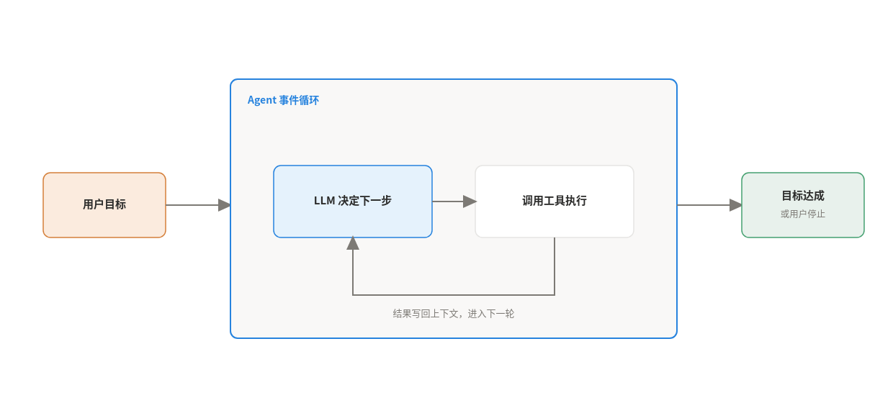

围绕这个循环，开发者真正需要构建的只有四个部分：

- 一段引导 LLM 开工的提示词
- 一个可供调用的工具库
- 一套把 LLM 的决策转化为具体工具执行的机制
- 一套在每轮循环后更新 LLM 输入的机制

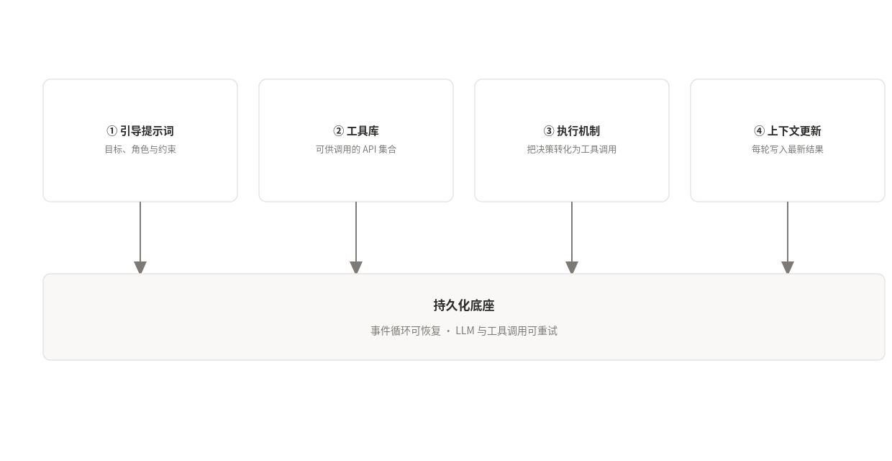

工具对 LLM 而言就是附带自然语言描述的 API。每个工具需要用自然语言写清楚整体功能、每个输入参数的含义、每个输出参数的含义，LLM 才能把用户目标里的措辞和正确的工具对应起来，MCP 目前已经成为这类工具描述事实上的标准。

还有两个容易忽略的工程要求。第一，调用 LLM 和工具都是外部调用，限流、断网、接口抖动都可能发生，这些调用需要具备持久化能力。第二，Agent 应用自身也可能宕机，状态和进度必须保存下来，恢复后才能从断点继续。想清楚这两件事，Agent 才从玩具变成系统。

## 二、动手之前：先定义需求

选模式之前，先回答四个问题：

- **任务特征**：任务能否拆成预先定义的固定步骤，还是开放式的？是否需要模型来编排流程？
- **延迟和性能**：优先保证快速响应，还是可以接受延迟来换取更准确的结果？
- **成本**：推理预算有多少？能否承受单次请求多次调用模型的模式？
- **人工参与**：任务是否涉及高风险决策、安全关键操作，或需要人来判断的主观审批？

如果任务可预测、高度结构化，单次调用模型就能完成，比如总结文档、翻译文本、给客户反馈分类，那根本不需要 Agent，直接调模型更便宜也更稳定。Agent 的价值在于开放式问题：需要自主决策、多步推进、调用外部数据的任务。

## 三、起点：单 Agent 系统

单 Agent 系统只包含三样东西：一个 AI 模型，一组定义好的工具，一份完善的系统提示词。模型负责理解请求、规划步骤、挑选工具，系统提示词负责定义它的核心任务、人设、操作方式，以及每个工具的使用条件。

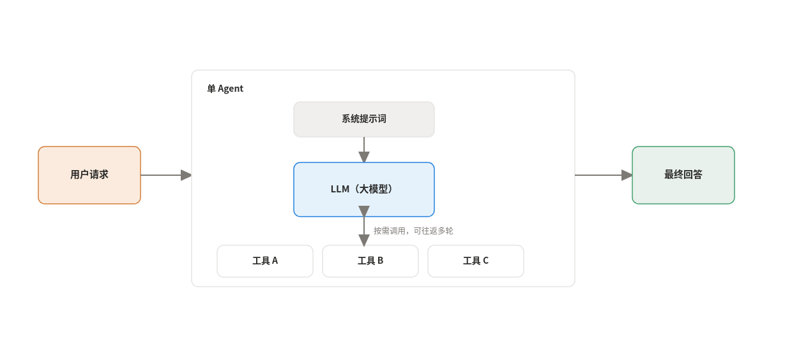

它适合需要多步推进并访问外部数据的任务：客服 Agent 查数据库找订单状态，研究助手调 API 汇总近期新闻。非 Agent 系统做不了这些事，因为它不能自主使用工具，也无法执行多步计划再综合出最终答案。

刚起步时建议从单 Agent 开始，把核心逻辑、提示词和工具定义打磨好，再考虑更复杂的架构。当接入的工具变多、任务复杂度上升，单 Agent 会开始退化，表现为延迟增加、选错工具、任务做不完。这类问题可以先靠改进推理流程来缓解，下面要说的 ReAct 就是经典做法。

### 经典推理循环：ReAct

ReAct 让模型把思考过程和行动组织成思考、行动、观察的循环。每一轮里，模型先推理任务进展并决定下一步：任务未完成就选一个工具去收集信息，任务完成就组织最终答案并结束循环。工具返回的观察会被写入记忆，避免重复劳动和上下文丢失。

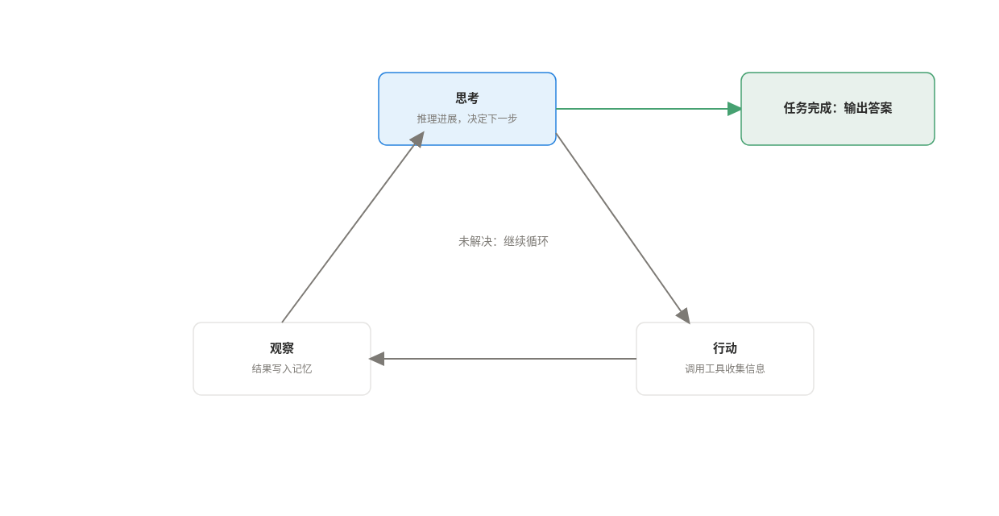

以机器人路径规划为例：模型思考从当前位置到目标的最优路径，沿规划的路段移动一步，再观察新位置和周围环境的变化，然后基于新观察更新计划，避开新出现的障碍物，如此循环直到抵达目标。

ReAct 实现简单、容易调试，模型的推理过程有完整记录。代价是每一步都要调用一次模型，端到端延迟比单次查询高，而且效果高度依赖模型的推理质量，某一步拿到错误的工具结果，错误会一路传播到最终答案。

## 四、什么时候走向多 Agent

当工作流需要同时管理多项不同的职责，优化单个 Agent 的推理就不够用了。多 Agent 系统的核心思想是把大目标拆成小任务，每个任务交给具备特定技能的专职 Agent，再通过协作或层级的方式组织起来。相比一个塞满提示词的单 Agent，模块化设计让系统更容易扩展、维护和排错。

多 Agent 系统里有一个关键概念叫上下文工程。每个专职 Agent 都需要特定的上下文才能干好活，包括文档、历史偏好、相关链接、对话历史、操作约束。上下文工程就是管理这些信息流的策略：为每个 Agent 隔离上下文，跨步骤持久化信息，压缩大量数据以提升效率。

代价也要提前说清楚：每个专职 Agent 需要精确的访问控制，Agent 之间的通信需要可靠的编排系统，多个 Agent 同时运行的计算开销会直接推高成本。多 Agent 是手段，别把它当目的。

## 五、固定流程编排：不需要模型指挥的多 Agent

如果流程的每一步都预先可知，就不必在编排上浪费模型调用，用固定逻辑把专职 Agent 串起来即可。这类模式延迟低、成本可控，是生产环境里最常用的一类。

### 1. 顺序模式

多个专职 Agent 按固定的线性顺序执行，前一个的输出直接作为后一个的输入。

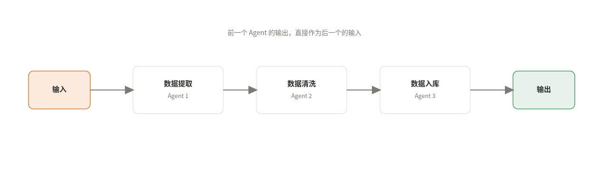

典型例子是数据处理流水线：数据提取 Agent 拉取原始数据，数据清洗 Agent 负责格式化，数据加载 Agent 把干净数据存入数据库。优点是延迟和成本都低，缺点是结构僵化，遇到动态条件无法跳过不需要的步骤，某个用不到的步骤如果很慢，还会拉高整体延迟。

### 2. 并行模式

多个子 Agent 同时独立执行各自的子任务，最后由一个角色把所有输出汇总成最终结果。

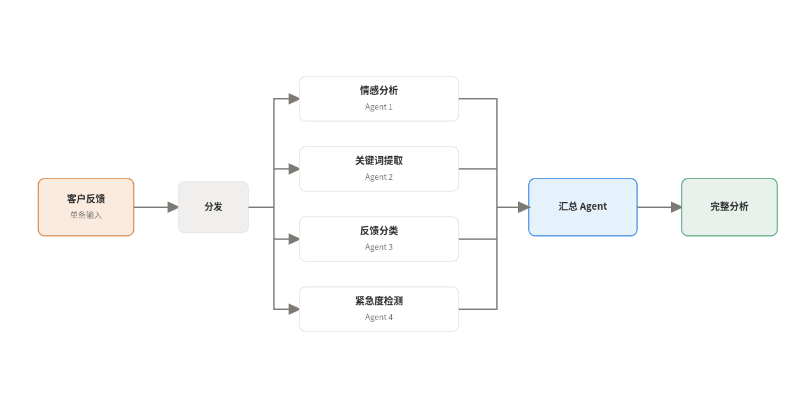

分析客户反馈时可以这样用：情感分析、关键词提取、反馈分类、紧急程度检测四个 Agent 同时开工，最后一个 Agent 把四份输出汇总成完整分析。并行能显著降低整体延迟，代价是资源占用和 token 消耗成倍增加，汇总步骤还需要处理多个结果之间可能存在的冲突。

### 3. 循环模式

一组专职子 Agent 反复执行，直到满足退出条件。条件可以是最大迭代次数，也可以是某个自定义状态。

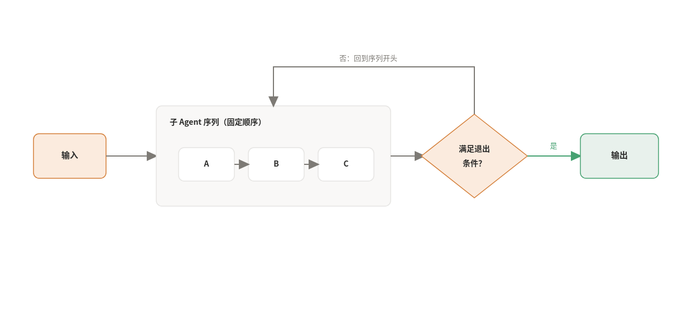

它适合需要反复打磨的任务，比如生成内容后让评审 Agent 审查到达标为止。最大的风险是死循环：退出条件定义不当，或者子 Agent 始终无法产生停止所需的状态，循环就会无限运行，带来失控的成本和资源消耗。

### 4. 审查与批评模式

这个模式的核心是给产出设一道独立的验收关。里面有两个固定角色：生成者负责写，批评者负责查。批评者不参与创作，手里只有一份预定义的验收标准和一项否决权，标准通常是硬指标，比如事实是否准确、格式是否合规、代码有无安全漏洞。批评者看完只做一道判断题：通过就放行，不通过就打回，并附上具体哪里不合格。整个流程的主路径是一条直线，生成、验收、放行，循环只在打回时才发生。

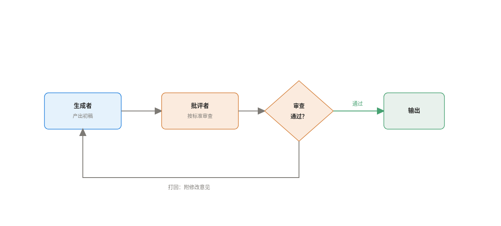

代码生成是典型场景：生成者写完函数，批评者充当安全审计员，扫描漏洞、验证单元测试，全部通过才放行，任何一项不过就打回重写。验收的代价是每次审查至少多一次模型调用，打回时延迟和成本还会逐轮累积。这个模式的效果上限取决于批评者靠不靠谱，下面三种结构展示了批评者水平的三次升级。

第一级是最简单的反思结构：一个生成器直接回答用户，一个反思器扮演老师给出建设性批评，两者交替固定轮数后输出最终结果。

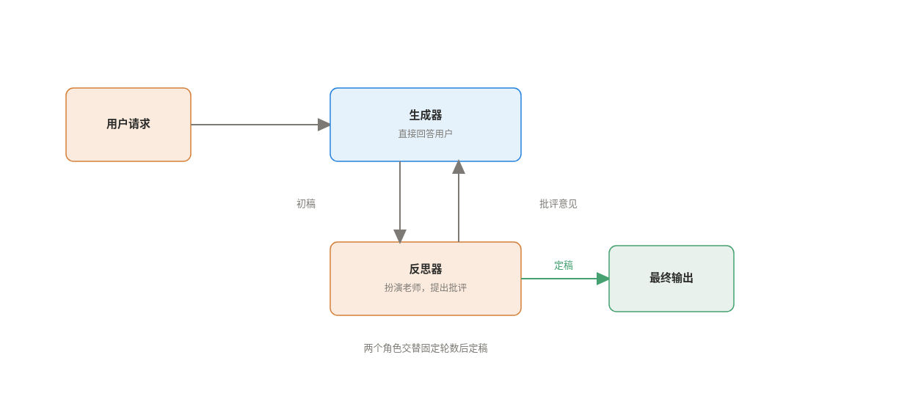

第一级的短板是反思没有任何外部依据，提升有限。第二级让批评落地到外部数据上：强制 Agent 生成搜索查询、给出引用，并明确列举回答里冗余和缺失的部分，批评因此更有建设性。这里注意修订者是一个合并角色，同时干批评和改写两件事；循环发生在它和工具之间。

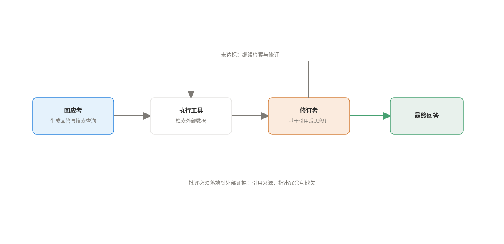

第二级还有一个致命弱点：整条轨迹只有一条，一步走错，后面步步错。第三级（LATS，语言 Agent 树搜索）的思路就是不再押注单一路径，同时保留多条候选分支去试探未来，它借用的是下棋 AI 里的蒙特卡洛树搜索。

假设让 Agent 写一个函数，并通过它自己准备的单元测试。起点是根节点，第一轮先并行展开三个候选实现思路，分别模拟执行并跑一遍测试，然后反思打分：思路 A 通过了五分之二的用例，得 0.4 分，思路 B 通过了五分之四，得 0.8 分，思路 C 全部失败，得 0 分。第一轮结束，每个节点都有了自己的分数，这些分数会沿着分支反向传回根节点，让整条路径都积累起评价。

第二轮不从头开始，而是先做选择：挑出累积分数最高的节点，也就是思路 B，从它这里继续展开两个改进版本 B1、B2，再模拟、再打分、再回传分数。思路 C 因为分数垫底，之后基本不会再被选中，相当于整根树枝被剪掉。如此循环，直到某个节点通过全部测试，或者达到预设的搜索深度。

对照配图，每一轮就是右侧四步的循环：选择分数最高的节点，并行扩展多个候选并模拟执行，观察结果并反思打分，把分数反向传播回路径。选择这一步还会留一点余地给探索，除了挑当前最好的，也偶尔试试被走得少的分支，避免过早锁死在一条看似不错、实则一般的路上。

这套结构正好治了第二级的病：走错的分支会被低分自然淘汰，不会拖累其他分支。搜索结束后，得分最高的那条轨迹就是答案，它还能存进外部记忆或者当作微调数据，让模型下次遇到类似任务时直接变强。代价是，一次回答变成了一棵搜索树，模型调用量比单轨迹高出一个量级，所以 LATS 一般只用在代码生成、复杂推理这类值得投入算力的困难任务上。

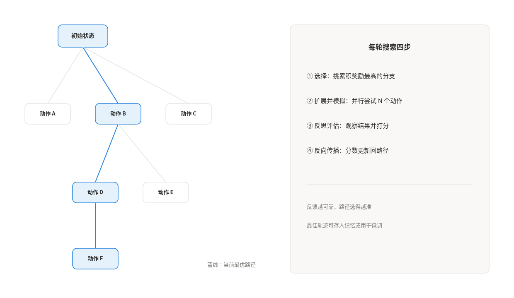

### 5. 迭代优化模式

这个模式的核心是让同一份产出在循环里一轮比一轮好。这里没有独立的验收角色，也没有合格与不合格的二元判断：同一个 Agent（或者几个 Agent 协作）每一轮都在前一轮的稿子上继续修改，评价标准是相对的质量目标，比如更流畅、更完整、更贴近需求。和审查与批评模式不同，循环在这里就是主流程本身，每一轮必然发生改写，直到达到质量阈值或者预先设定的迭代上限。

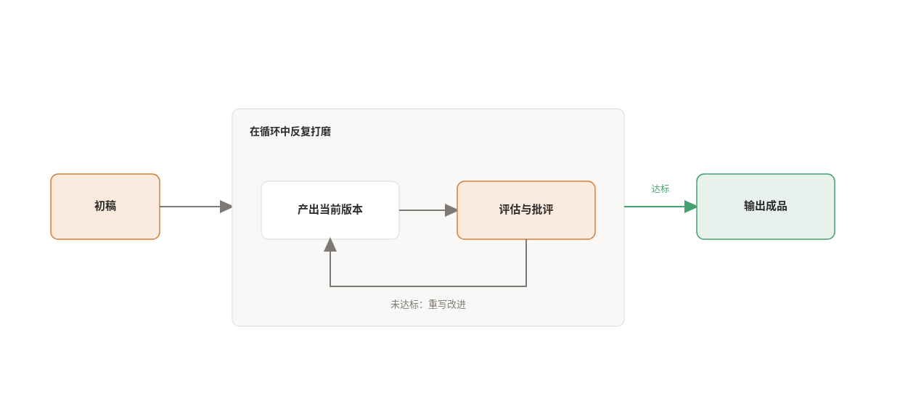

创意写作是最直观的例子：Agent 先生成一篇初稿，再从流畅度和语气的角度自我批评，基于批评重写，如此循环，每一轮的稿子都比上一轮更好一点。它适合单步难以一步到位的复杂生成任务，比如调试一段代码、拆解一个多步骤的方案、打磨一篇长文档。代价也很直接：每多一轮循环就多一轮延迟和成本，退出条件必须提前设计好。

到这里可以把这两种循环类模式放在一起对比。

审查与批评的关键动作是验收，批评者手握否决权，回答的问题是这份产出合不合格，循环只在打回时发生。迭代优化的关键动作是打磨，每轮都在前一轮的基础上改进，回答的问题是这份产出还能不能更好，循环本身就是主流程。

## 六、动态编排：让模型决定怎么分工

固定流程处理不了输入多变的任务。当每一步该找谁做无法预先写死时，需要让模型来编排。

### 6. 协调者模式

一个中心 Agent 负责分析用户请求并拆成子任务，再动态路由给对应的专职 Agent，每个专职 Agent 都是某个职能的专家，比如查数据库或调 API。

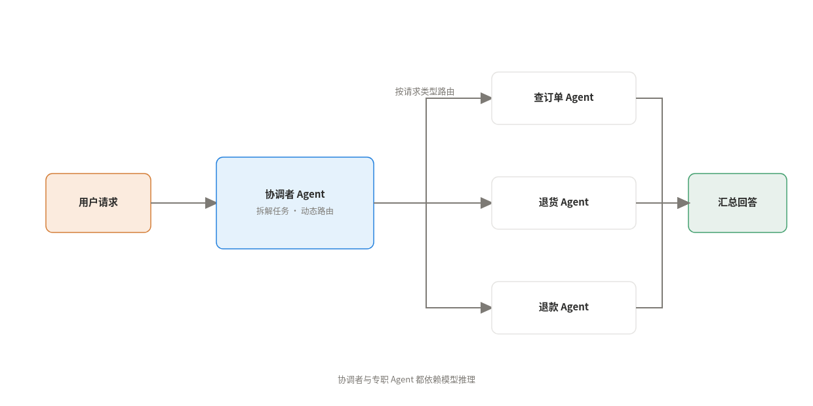

客服系统是典型场景：协调者先判断请求是查订单、退货还是退款，再分派给对应的专职 Agent。它能处理丰富的输入并在运行时调整流程，但协调者和每个专职 Agent 都依赖模型推理，调用次数、token 消耗和整体延迟都高于单 Agent。

### 7. 层级任务分解模式

协调者模式的强化版，把 Agent 组织成多层结构。根 Agent 把复杂任务拆小并委派给下层，下层还能继续拆解，直到任务简单到最底层的执行者可以直接完成。

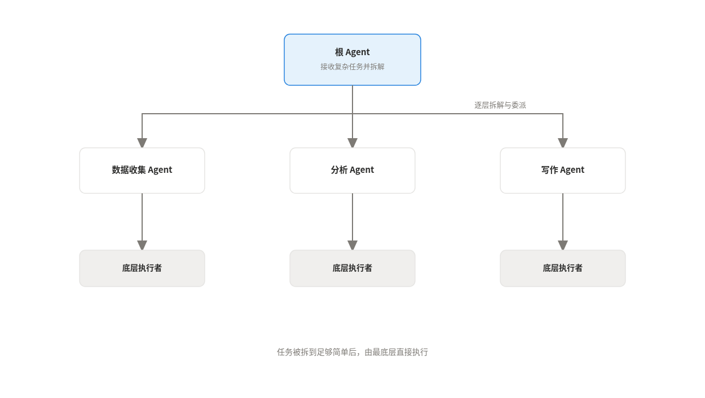

复杂研究项目适合用它：根 Agent 把目标拆成收集信息、分析发现、撰写报告，再分派给数据收集、分析、写作等专职 Agent，各自执行或继续拆解。它能把高度模糊的问题系统地拆成可管理的子任务，结果更全面，但多层结构显著增加架构复杂度，调试和维护都更难，模型调用量也更大。

### 8. 蜂群模式

最自由也最昂贵的模式。调度 Agent 只负责把请求引进来，蜂群里的专职 Agent 两两之间都能通信，分享发现、互相批评、在彼此的成果上继续构建，任何 Agent 都可以把任务交接给更合适的同伴。

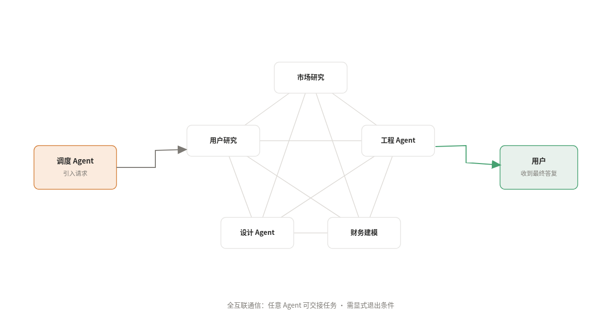

它像一个专家团队在辩论：设计新产品时，市场研究、工程、财务建模三个 Agent 分享初步想法，就功能和成本的权衡展开辩论，最终收敛出一份平衡各方需求的设计规格。蜂群能产出极有创造力的方案，但缺少中央指挥，可能陷入无效循环或无法收敛，必须显式定义退出条件，比如最大轮数、时间限制或者达成共识。

## 七、规划与执行分离：固定与动态之间的混合路线

前面两类模式的分界线是编排时要不要问模型：固定流程靠预定义逻辑，动态编排靠模型临场决策。还有一族思路哪边都归不进去：规划阶段用模型一次性想清楚整个计划，执行阶段再按固定流程走完，规划是动态的，执行是确定的。它把两种方式各自的优势拼在了一起，所以单独成章来讲。

相比每一步都问一次大模型的做法，它带来三个改进：

- 执行更快，子任务不必经过大模型；
- 成本更低，子任务可以交给更小的领域模型，大模型只在规划和重新规划时出现；
- 全局观更好，规划器被迫把整个任务完整想了一遍。

最基础的 Plan-and-Execute 由规划器和执行器两部分组成：规划器生成多步计划，执行器逐步调用工具完成，执行完毕后带着最新状态重新规划，决定直接收尾还是生成后续计划。它仍受限于串行执行，且不支持变量赋值，每个任务都要过一遍模型。

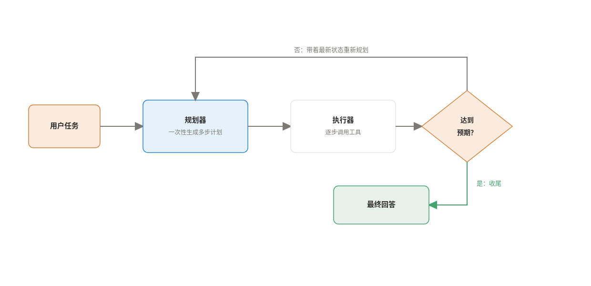

ReWOO 的全称是 Reasoning WithOut Observations，意思是规划器在做计划时看不到任何工具的返回结果。听起来是个缺点，但它靠一个小设计绕了过去：变量占位。

用一个具体例子走一遍。用户问：今年超级碗争冠球队的四分卫数据如何？规划器一次性输出这样的计划：

- 计划：我需要知道今年哪两队进了决赛
- E1：搜索\[今年超级碗对阵双方\]
- 计划：我需要知道这两队的四分卫是谁
- E2：LLM\[从 #E1 中找出第一队的四分卫\]
- E3：LLM\[从 #E1 中找出第二队的四分卫\]
- 计划：我需要查这两位四分卫的数据
- E4：搜索\[#E2 的本赛季数据\]
- E5：搜索\[#E3 的本赛季数据\]

注意 E2 到 E5 里面 #E1 这种写法。规划器写计划时并不知道 E1 会搜出什么，但它可以先留一个占位符，相当于和后面的步骤约定好：这个位置到时候填 E1 的结果。于是整个计划一次写完，中间不需要回头再问规划器，这就是不需要观察也能规划的关键。

计划写完，轮到工作器出场。工作器按计划顺序逐条执行：先跑 E1 的搜索，把结果存进变量 E1；执行到 E2 时，把 #E1 替换成真实内容再去问模型；依次类推，每执行完一条就把结果回填到对应的变量里。最后求解器登场，把所有变量的值收拢起来，组织成给用户的最终答案。

这样做有两个好处。一是省钱，规划器只调用一次，不像 Plan-and-Execute 那样每个任务都要过一遍模型。二是每个任务的上下文很干净，执行 E4 的搜索时只需要知道 #E2 的值，不用背负整段对话历史。

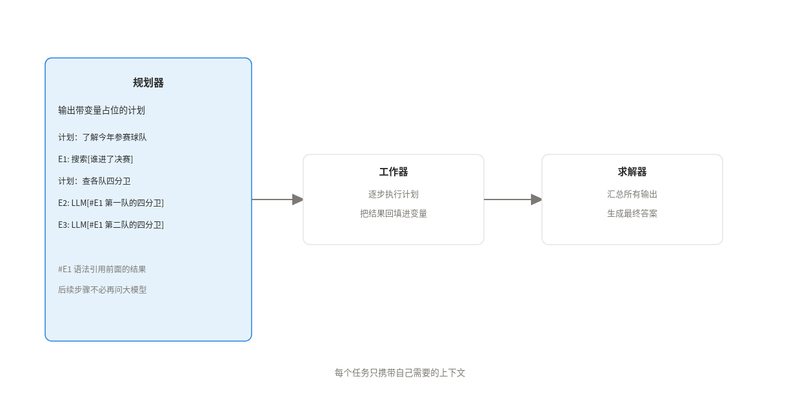

ReWOO 的瓶颈在串行：计划里明明有些步骤互不依赖，却只能一个接一个跑。LLMCompiler 就是冲着这个瓶颈来的，它的核心想法是把计划组织成一张有向无环图（DAG），让互不依赖的任务同时开跑。

先说 DAG 是什么。计划里的每个任务是一个节点，任务之间的依赖关系是带方向的边，并且图里不允许绕回起点。用一个例子对照上图：用户想让 Agent 对比两位球员并写出评价，规划器可能输出五个任务。任务 1 搜索 A 队本赛季战绩，任务 2 搜索 B 队本赛季战绩，这两个任务不依赖任何人，立刻就能并行开跑。任务 3 分析 A 队球员的表现，依赖任务 1。任务 4 对比两位球员的数据，依赖任务 1 和任务 2。任务 5 把前面的分析和对比组织成最终评价，依赖任务 3 和任务 4。

围绕这张图，LLMCompiler 有三个角色分工。规划器负责输出这张图，而且是流式输出：计划不用全部写完，每解析出一个任务和它的依赖，就立刻交给下游。任务获取单元是调度中枢，它只盯一件事，就是每个任务的依赖是否满足，满足的瞬间立刻调度执行，其他任务还没结束也不等。任务参数同样可以引用前面任务的输出，比如任务 3 的参数写作 \$1，意思是使用任务 1 的输出。汇合器在任务全部完成后看一遍完整历史，决定是直接组织最终答案，还是把进展交还给规划器再跑一轮。

这套设计快在两处。一是调度只看依赖不看顺序，任务 1 完成的瞬间任务 3 就开工，哪怕任务 2 还在跑。二是流式输出让执行和规划重叠进行，图还没画完，先出来的任务已经开始执行了。

LLMCompiler 对于任务之间依赖复杂、有并行空间的任务收益最大；如果任务天然就是一条直线串到底，用它不会比 ReWOO 更快，反而要多承担一层调度的实现成本。

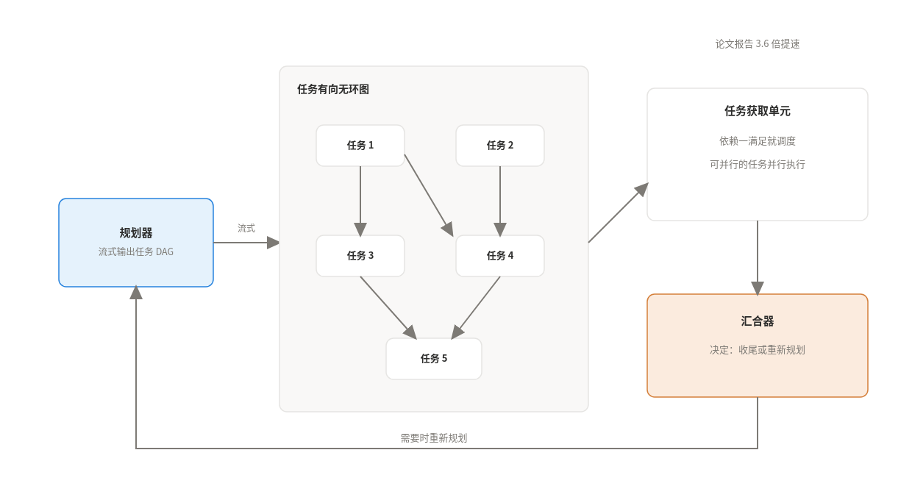

## 八、特殊场景的两种模式

### 9. 人在回路模式

在关键节点暂停执行，调用外部系统等人审批、纠错或补充输入，然后再继续。

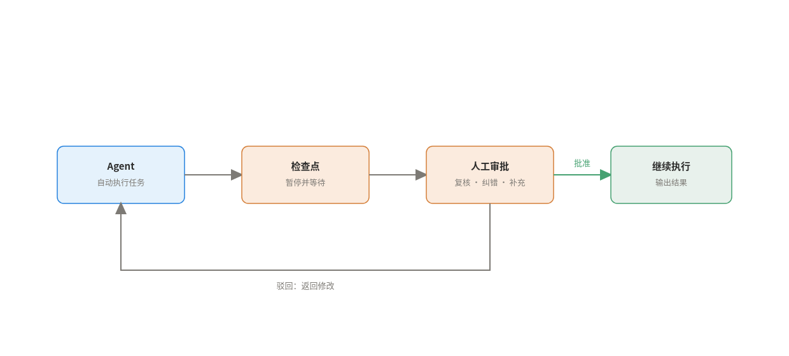

批准大额金融交易、发布前复核脱敏后的患者数据集、对创意内容做主观评价，都是典型场景。它把人的判断力插进自动化流程的关键决策点，提升了安全性和可靠性，代价是需要额外构建一套供人交互的外部系统。

### 10. 自定义逻辑模式

当工作流既有并行检查，又有条件分支，还路由到完全不同的下游流程时，直接用代码写编排逻辑。

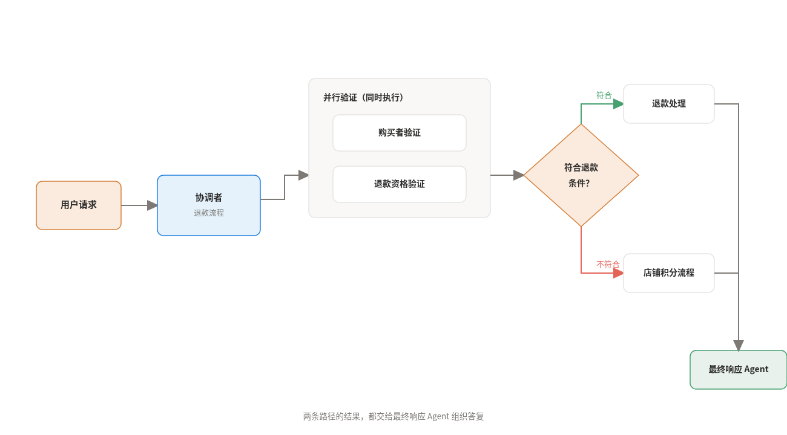

以退款流程为例：协调者先并行验证购买者身份和退款资格，收集结果后检查是否符合退款条件，符合就路由给退款处理 Agent 调用退款工具，不符合就走店铺积分的顺序流程，两条路径的结果最后都交给最终响应 Agent 组织答复。这种模式灵活度最高，但整个编排流程的设计、实现和调试都由你负责，比使用框架预定义的模式更容易出错。

## 九、工程落地的三个要点

第一，提示词、上下文工程是核心工作。可以把每轮喂给 LLM 的输入拆成五块：目标、工具描述、示例对话、上下文指令、对话历史。目标和工具在启动时就位并全程保留，每轮循环主要更新的是上下文指令和对话历史，比如把工具执行结果写进去，让 LLM 对照目标评估进度、选出下一步。

第二，用什么编程语言写引擎都行，灵活性才是关键。Agent 的很大一部分逻辑装在提示词里，但驱动循环的引擎仍然要由你自己实现。引擎握在自己手里，你就能完全掌控循环中的每一步逻辑，比如在调用工具之前插入安全和合规检查，或者在执行前后加审计日志。

第三，持久化决定系统能不能上生产。Agent 对 LLM 和工具的下游调用量比传统应用高一个数量级，限流、断网、服务抖动都会成为日常。外部调用要可重试，Agent 自身的状态和执行进度要可恢复，系统才能在不可靠的基础设施上可靠运行。

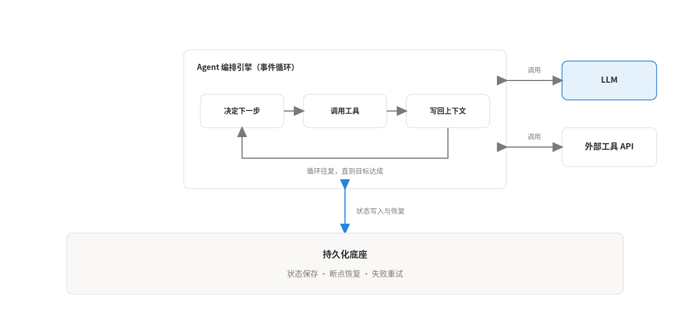

## 参考文献

\[1\] Davis, C. (2025, June 4). *Making friends with agents: A mental model for agentic AI applications*. Temporal Blog. https://temporal.io/blog/a-mental-model-for-agentic-ai-applications

\[2\] Gola, A. (2024, February 21). *Reflection agents*. LangChain Blog. https://www.langchain.com/blog/reflection-agents

\[3\] He, S. (n.d.). *Choose a design pattern for your agentic AI system*. Google Cloud Architecture Center. Retrieved August 6, 2026, from https://docs.cloud.google.com/architecture/choose-design-pattern-agentic-ai-system

\[4\] The LangChain Team. (2024, February 13). *Plan-and-execute agents*. LangChain Blog. https://www.langchain.com/blog/planning-agents
