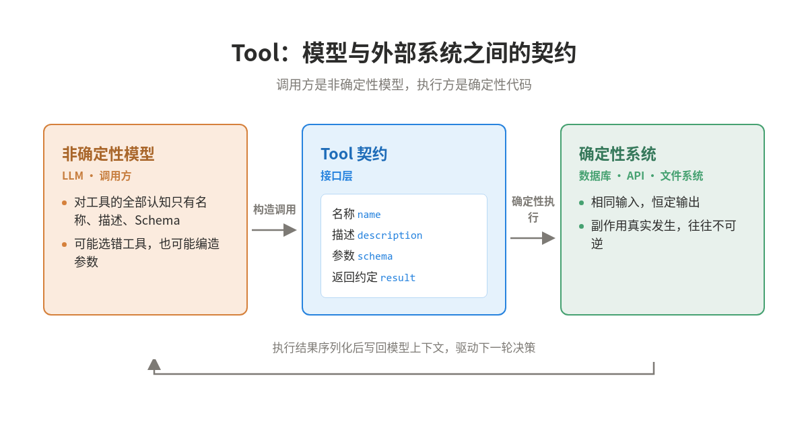
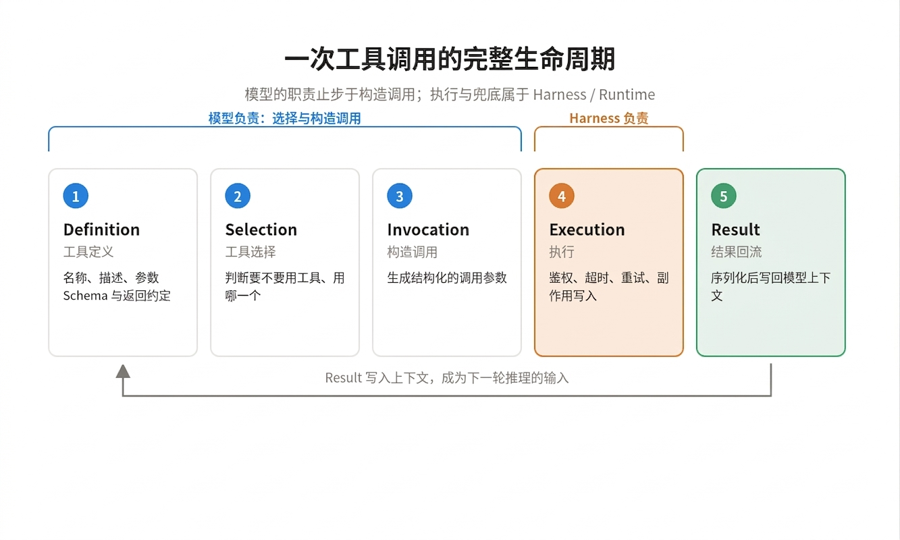
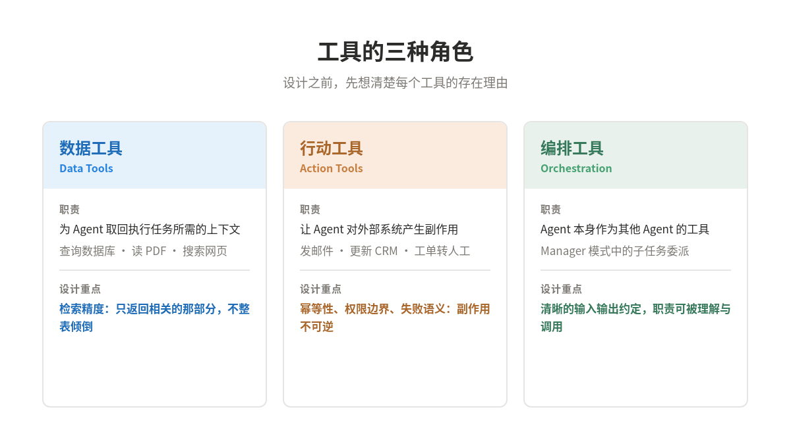
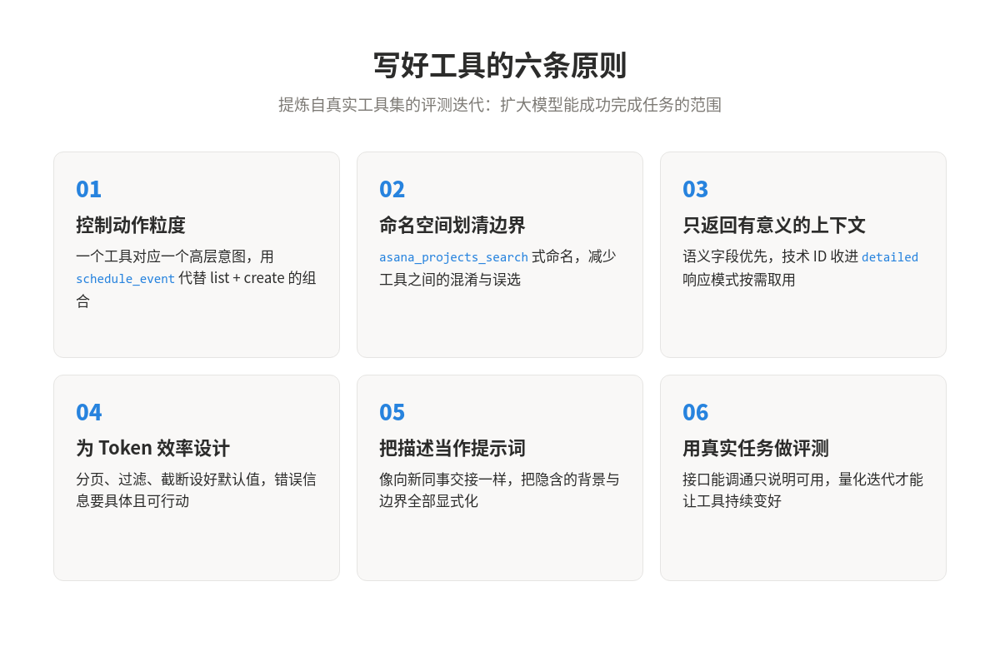
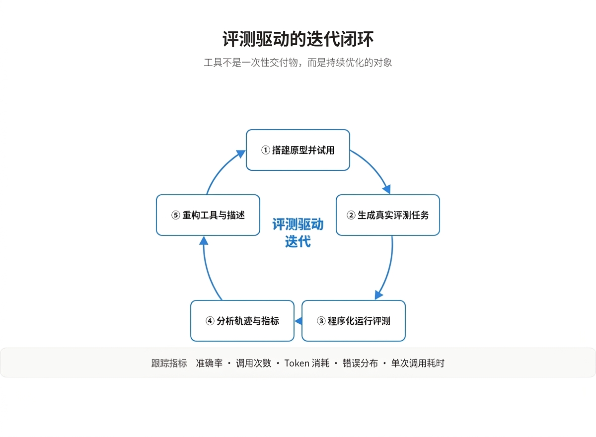
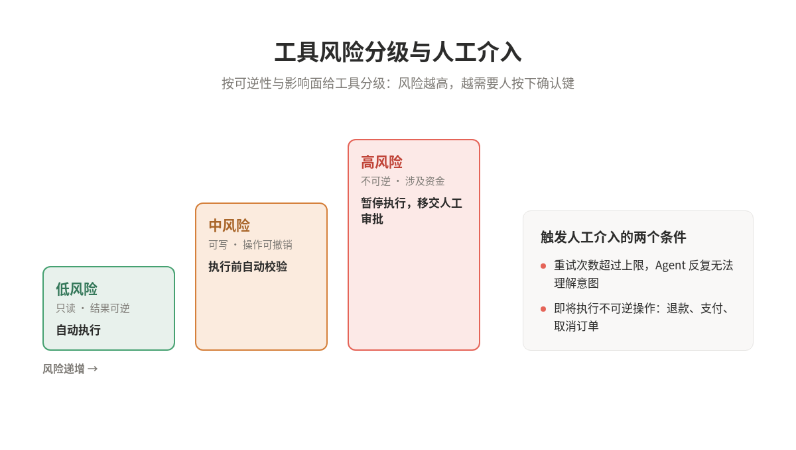

模型本身不能读数据库、不能发邮件、不能改任何一条记录，它对世界的全部影响都经由工具发生。换句话说，Tool 决定了 Agent 能够对外部世界做什么，工具层的设计质量，就是 Agent 能力边界的实际位置。

### 一、Tool 是一种新型契约

传统软件是确定性系统之间的契约。调用 `getWeather("NYC")`，每次都会以完全相同的方式返回纽约的天气，接口双方都是可预测的程序。

工具改变了一侧的性质。它是确定性系统与非确定性模型之间的契约：执行的那一侧仍然是普通代码，但调用方变成了一个可能用不同方式理解接口、可能选错工具、可能编造参数的模型。面对今天出门要不要带伞这类提问，模型可能调用天气工具，可能凭常识直接回答，也可能先反问用户所在的城市。

这意味着写工具的思维方式必须切换。面向其他开发者写 API 时，你可以假设调用方读过文档、理解约定、会正确处理异常。面向模型写工具时，调用方对工具的全部认知就只有名称、描述和 Schema 这几百个 token。工具的一切行为边界，都要在这有限的上下文里讲清楚。实践经验表明，对模型最顺手的工具，往往对人类也出奇地直观，因为两者都依赖语义清晰的接口。

### 二、一次工具调用的完整生命周期

讨论 Tool Design 之前，先把一次调用拆成五个阶段，因为很多设计错误源于把这些阶段的职责混为一谈。

1. Tool Definition：工具的名称、描述、参数 Schema、返回值约定。这是模型决策时唯一能看到的部分。

2. Tool Selection：模型根据任务和上下文，决定是否需要工具、用哪一个。

3. Tool Invocation：模型构造具体的参数，发出一次结构化调用。

4. Tool Execution：代码真正运行，包括鉴权、超时、重试、副作用写入。

5. Tool Result：结果被序列化回模型的上下文，影响下一步推理。

模型的职责止步于第三阶段，它只负责选择和构造调用。第四阶段属于 Harness 或 Runtime：执行环境要处理权限校验、网络超时、失败重试、并发控制，以及最关键的副作用管理。一个工具调用会不会重复扣款、会不会发出无法撤回的邮件，这些保障无法交给模型的自觉，必须在执行层用确定性逻辑兜底。

第五阶段常被低估。Tool Result 不是执行的副产品，它是下一轮决策的输入。返回内容的信噪比、错误信息的可行动性，直接决定模型能否从失败中恢复。把生命周期切开看，工具设计要优化的其实是三个接口：**给模型看的 Definition**、**给执行层的契约**、**给下一轮推理的 Result**。

### 三、工具的三种角色

工具可以归为三类，这个分类有助于在设计前想清楚每个工具的存在理由。

- 数据工具：为 Agent 取回执行任务所需的上下文，比如查询交易数据库、读 PDF、搜索网页。设计重点是检索精度，只返回相关的那部分，而不是整表倾倒。

- 行动工具：让 Agent 对外部系统产生副作用，比如发邮件、更新 CRM 记录、把工单转给人工。设计重点是幂等性、权限边界和失败语义，因为副作用通常不可逆。

- 编排工具：Agent 本身作为其他 Agent 的工具，对应多 Agent 系统里的 Manager 模式。设计重点是子任务的输入输出约定，让一个 Agent 的职责可以被另一个 Agent 理解和调用。

值得强调的是，无论哪一类，工具都应有标准化的定义：文档完整、经过测试、可复用。这听起来是基础的软件工程纪律，但在工具生态里被频繁违反，因为工具往往是在原型阶段随手写出来，之后再也没有回头整理。

### 四、写好工具的六条原则

这些原则提炼自大规模内部工具集（如 Slack、Asana 工具集）的评测迭代实践。它们共同指向一个目标：扩大模型能够成功完成任务的范围。

#### 1. 选对工具，控制动作粒度

更多工具不带来更好的结果。常见错误是把现有 API 端点逐一包装成工具，无视模型与传统软件的差异：计算机内存便宜且充足，模型的上下文有限且昂贵。比如在地址簿的场景里，`list_contacts` 迫使模型逐条读完所有联系人，`search_contacts` 让它直接跳到相关结果，后者才符合模型的感知方式。

工具可以也应该在内部聚合多个离散操作：

- 与其提供 `list_users`、`list_events`、`create_event` 三个工具，不如提供一个 `schedule_event`，把查空档和建会议合成一次调用。

- 与其提供 `read_logs`，不如提供 `search_logs`，只返回匹配的日志行和周边上下文。

每个工具应对应一个清晰的高层意图，替模型把中间步骤消化在执行层。

#### 2. 用命名空间划清边界

Agent 可能接入几十上百个工具，功能重叠或用途模糊时模型就会选错。按服务和资源加前缀（`asana_projects_search`、`jira_users_search` 这类命名）能显著降低混淆。前缀还是后缀对评测成绩有非平凡影响，具体方案应靠自己的评测来定，没有普适答案。

#### 3. 只返回有意义的上下文

工具实现要克制返回内容，优先考虑上下文相关性。`uuid`、`256px_image_url`、`mime_type` 这类低层标识对模型的下一步行动几乎没有信息量，`name`、`image_url`、`file_type` 这样的语义字段才真正有用。

把无意义的字母数字 ID 解析成自然语言名称，能显著降低模型在检索任务中的幻觉率。响应结构（XML、JSON 还是 Markdown）也会影响表现，最优格式因任务和模型而异，这些都需要依靠评测选择。

#### 4. 为 Token 效率而设计

上下文质量重要，数量同样重要。任何可能产生大量输出的工具都应内置分页、范围选择、过滤或截断，并给出合理默认值。截断时要给模型明确的指引，比如提示它改用多次小范围搜索。

错误响应也值得下同样的功夫：清晰说明哪里错了、正确的参数长什么样，而不是抛一个不透明的错误码。好的错误信息是模型自我恢复的前提。

#### 5. 把工具描述当作提示词来写

工具描述和参数说明会进入模型的上下文，集体引导着模型的调用行为，这是提升工具性能性价比最高的手段。写作标准很简单：想象你在向一位新同事介绍这个工具，把你默认知道的背景全部显式化，包括特殊的查询格式、术语定义、资源之间的关系。参数命名要无歧义，用 `user_id` 而不是 `user`。

#### 6. 用真实任务做评测，迭代优化

接口能调通只说明工具可用，不说明工具好用。想验证好不好用，要走一个完整的评测循环：

1. 快速搭原型，亲自试用，收集直觉反馈。

2. 生成大量贴近真实场景的评测任务，每个任务配一个可验证的答案。

3. 用简单的 agentic loop 程序化运行整套评测。

4. 分析准确率、调用次数、token 消耗和错误分布，定位问题再改。

评测任务要有真实复杂度，理想情况下需要多次甚至几十次工具调用。对比两个例子就能看出差别：

- 好任务：给 Jane 安排下周会议，附上上次项目会的纪要，并预订会议室。

- 弱任务：搜索日志里包含某字符串的行。一步就能完成，测不出任何东西。

数字之外还要读原始轨迹，它会直接告诉你问题出在哪里：大量冗余调用，说明分页默认值不合理；频繁的参数错误，说明描述或示例不清楚。甚至可以把整批轨迹交给 Claude Code 这类 Agent，让它批量重构工具实现与描述。评测驱动让工具从一次性交付物变成持续优化的对象。

### 五、六个常见的设计错误

把上面的原则反过来读，就是一份反面清单，每一条都对应真实的失败模式。

1. 参数过多：参数越多，模型构造正确调用的概率越低，Schema 也越占上下文。优先合并参数、提供默认值、把低频配置挪出主接口。

2. 动作语义重叠：两个工具都能完成相似的事，模型就会在两者之间摇摆甚至选错。合并或命名空间隔离，让每个意图只有一个出口。

3. 返回整块原始数据：把 API 响应原样塞回上下文，信噪比极低且烧 token。返回前过滤、截断、字段语义化。

4. 错误信息无法指导恢复：一条 `Invalid input` 对模型等于没有信息。错误要说明哪个字段错了、期望的格式是什么、最好附一个正确示例。

5. 一个工具携带多个副作用：既发邮件又改数据库又写日志的工具，失败时无法界定状态，重试也不安全。副作用应当单一、可幂等重试，组合逻辑交给编排层。

6. Schema 精确但描述模糊：JSON Schema 约束得再严，模型不知道这个工具该在什么场景用、和其他工具有何分工，照样会误用。Schema 管语法，描述管语义，两者缺一不可。

### 六、权限与可观测性：工具设计的隐性维度

粒度和返回信息之外，还有两个维度在原型阶段容易被忽略，上线时却变成事故源头。

权限上，建议按风险给工具分级：只读还是可写、操作可否撤销、需要什么账户权限、涉及多大金额。低风险工具自动执行，高风险工具触发额外校验或升级给人工。退款审批、订单取消、支付这类不可逆操作，在 Agent 可靠性被充分验证之前都应保留人工介入的通道。

可观测性上，评测体系给出的指标（每次任务的调用次数、token 消耗、错误率、单次调用耗时）同时也是线上监控的起点。工具调用日志是理解 Agent 真实行为的一手材料：它告诉你模型实际在用什么策略、在哪里反复失败、哪些工具从来没人用。没有这层观测，工具的迭代只能凭感觉。

把视角拉回开头。模型、工具、指令是 Agent 的三块基石，其中工具和指令几乎完全是工程问题。模型的选择决定推理上限，工具的设计决定能力边界，而边界之内的一切可靠性，最终都要靠契约清晰的工具、兜底的执行层和持续的评测来兑现。

### 参考文章

\[1\] Anthropic. (2025). Writing effective tools for agents: With agents. Anthropic Engineering Blog. https://www.anthropic.com/engineering/writing-tools-for-agents

\[2\] OpenAI. (2025). A practical guide to building agents. OpenAI for Business. https://openai.com/business/guides-and-resources/a-practical-guide-to-building-ai-agents/
