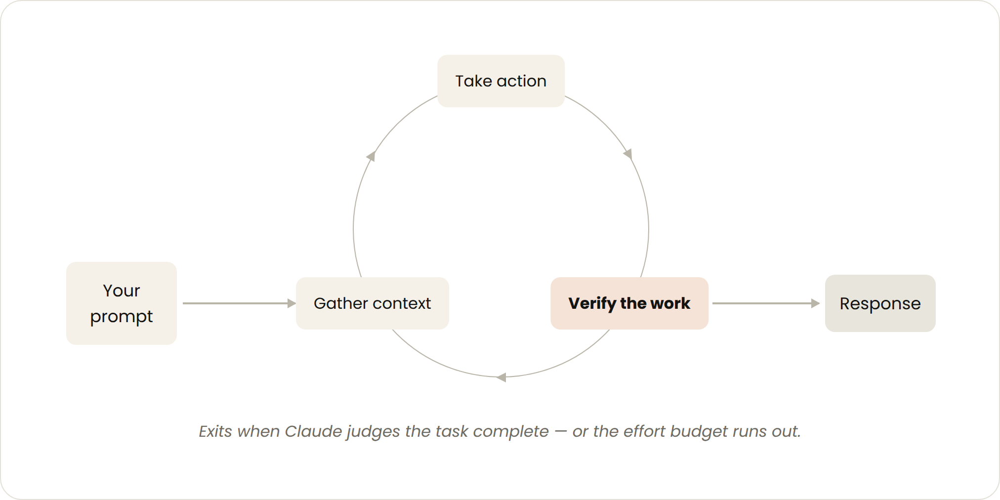
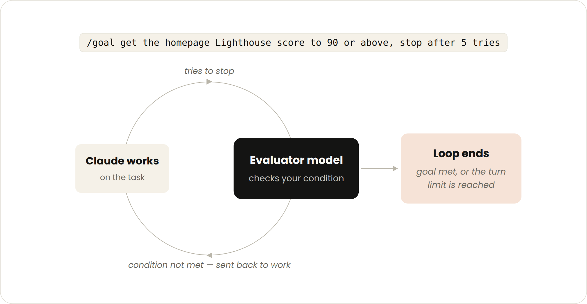
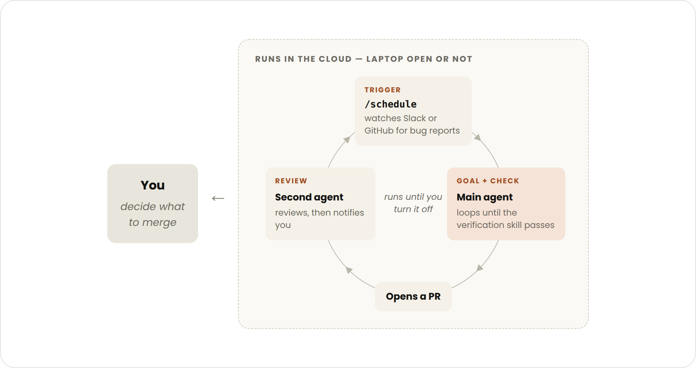

2026 年 6 月 30 日，Claude Code 团队发表博客《Getting started with loops》，介绍他们如何定义 agentic 循环，以及从回合循环逐步过渡到目标循环、定时循环和主动循环的路径。

循环（loop）指 agent 重复执行工作周期，直到满足某个停止条件。团队按四个维度给循环分类：如何触发、如何停止、用到哪个 Claude Code 原语（primitive）、适合哪类任务。

四种循环之间有一条主线：从回合循环走到主动循环，是把循环里的控制权一环一环交给 agent。先交出检查，再交出停止条件，然后交出触发，最后交出提示词本身。


### 回合循环



- **触发：** 一次用户提示。
- **停止：** Claude 判断任务已完成，或者需要更多上下文时停下来问你。
- **适合：** 较短的、不属于固定流程的一次性任务。
- **用量管理：** 用具体的提示，用技能做验证。

一个回合的周期是：你发提示，Claude 收集上下文、执行操作、检查自己的工作，需要就再来一轮，然后回复。这个手动的循环就是所谓的 agentic loop。

举例，让 Claude 加一个点赞按钮：它读代码、改代码、跑测试，然后把结果交回来等你手动验证。

优化的办法是把这一步手动验证写成一个 SKILL.md 文件，让 Claude 端到端地自己验证。文件里要给它能看到、测量或操作结果的工具或连接器（connector）。

下面是一个前端改动验证的 SKILL.md 例子：

```
---
name: verify-frontend-change
description: 在宣布完成前，端到端验证任何 UI 改动。
---

# 验证前端改动

不要只凭一次成功的编辑就把 UI 改动报告为完成。像人工评审那样验证它：

1. 启动开发服务器，在浏览器里打开改过的页面。
2. 直接操作这个改动。对新加的控件（按钮、输入框、开关）：点击它，确认状态如预期变化，并截图对比前后。
3. 检查浏览器控制台：没有新的报错或警告。
4. 用 Chrome DevTools MCP 跑一次性能追踪，审计 Core Web Vitals。

任何一步失败，就修复问题并从第 1 步重跑，不要交回只验证了一半的工作。
```

这一环交出去的是**检查**。原本由你做的验证，现在写进技能，让 Claude 自己做。


### 目标循环（/goal）



- **触发：** 实时的手动提示。
- **停止：** 达成目标，或者到达最大回合数。
- **适合：** 有可验证退出标准的任务。
- **用量管理：** 设定明确的完成标准和回合上限。

回合循环和目标循环的区别就在这一步。回合循环里，什么时候算做完是 Claude 自己拍板的，也没有预先定好的达标线，你只能在它交回结果后人工复查。目标循环把这个判断权拿走：你一上来就给出一条可验证的标准，之后每次 Claude 想停下，一个**评估模型**都会拿这条标准去核对，不满足就打回去继续做，直到达标或者用完回合数。Claude 自己觉得"差不多了"不算数。

确定性的标准配合这套机制效果好：像通过多少个测试、清过某个分数阈值，评估模型能直接核对，不用去判断"差不多行了没有"。

命令形式：

```
/goal 把首页 Lighthouse 分数做到 90 以上，最多试 5 次。
```

这一环交出去的是**停止条件**。判断做完没有，从你手里交给了评估模型。


### 定时循环（/loop 和 /schedule）

- **触发：** 设定的时间间隔。
- **停止：** 你取消它，或者工作本身完成，比如 PR 被合并、队列被清空。
- **适合：** 周期性工作，或者需要和外部系统、环境打交道的场景。
- **用量管理：** 把间隔设长一些，或者基于事件而非时间来触发。

典型用例：每天早上汇总 Slack 消息；持续盯着 PR，做代码评审或修复 CI 失败。

/loop 在你本地机器上按间隔重复跑一个提示，你关掉它才停。命令形式：

```
/loop 每 5 分钟检查 PR，处理评审意见，修复失败的 CI。
```

/schedule 把循环搬到云端，创建一个例程（routine），不再依赖你的本地机器。

这一环交出去的是**触发**。什么时候开始跑，从你手动发起交给了时间或事件。


### 主动循环



- **触发：** 事件或计划，实时过程里没有人参与。
- **停止：** 每个任务在达成目标时退出，整个例程会一直运行，直到你手动停用。
- **适合：** 周期性、定义清晰的工作流，比如 bug 报告、issue 分诊、迁移、依赖升级。
- **用量管理：** 把例程路由到更小更快的模型，把需要判断的环节留给更强的模型。

主动循环是把前面的原语组合起来：/schedule、/goal、技能、动态工作流（dynamic workflows）、auto 模式。

一个例子：

```
/schedule 每小时检查 #project-feedback 频道的 bug 报告；/goal: 本轮发现的每一条报告都被分诊、处理、回复完才停止；修 bug 时用一个工作流在三个并行的 worktree 里探索三种方案，再让一个评判 agent 对抗性地审查它们。
```

拆开看，这个提示里有四层：

- /schedule（目前是研究预览）负责按计划反复检查新报告。
- /goal 定义什么算"做完"，技能记录如何验证。
- 动态工作流负责调度多个 agent，对每条报告分诊、修复、评审。
- auto 模式让例程运行时不再请求授权。

到这一步，交出去的是**提示词**本身。连"该做什么"都不再实时由你给出，而是由事件或计划触发。


### 维护代码质量

- 保持代码库整洁。Claude 会跟随已有的模式和约定，代码库越干净，产出越可控。
- 用SKILL沉淀自我验证。把质量标准写成SKILL，让 Claude 每次都按同一套标准自查。
- 让文档随手可查。把框架、库的文档和当前最佳实践放在 Claude 拿得到的地方。
- 用第二个 agent 做评审。它从干净的上下文出发，比原来那个 agent 更少偏向自己的产出。可以用内置的 /code-review 技能，或者 GitHub 上的 Code Review。
- 还有一条迭代原则：当单次结果没达到标准，不要只修这一次的问题，而是把它编码进系统，让之后每一轮迭代都受益。


### 管理 token 用量

- 选对原语和模型。小任务不需要多个 agent 或循环；有些任务用更便宜更快的模型就够。
- 把成功和停止标准写清楚。对"做完"说得越具体，Claude 越早到位，但不要早到没做完。
- 大规模跑之前先试点。动态工作流可能一次派出上百个 agent，先拿一小块工作估算用量。
- 确定性的工作交给脚本。跑一个脚本比一步步推理便宜。比如 PDF 技能自带一个填表脚本，Claude 每次直接跑，而不是每次重新推导代码。
- 不要把例程排得太密。间隔要匹配被监控对象实际变化的频率。
- 复盘用量。/usage 按技能、子代理、MCP 拆分最近的用量；不带参数的 /goal 显示目前的回合数和 token 用量；/workflows 显示每个 agent 的 token 用量，也可以随时停掉某个 agent。


### 从哪里开始

四种循环对应四个可以交出去的环节：

- 回合循环，交出检查，适合还在探索或做决定时，靠自定义的验证技能。
- 目标循环，交出停止条件，适合你已经知道"做完"长什么样时，靠 /goal。
- 定时循环，交出触发，适合工作在项目之外按计划发生时，靠 /loop 和 /schedule。
- 主动循环，交出提示词，适合工作周期性且定义清晰时，靠上面全部再加动态工作流。

具体做法：从你已经在做的工作里，挑一个你正好是瓶颈的任务，看哪一环可以交出去。能写出那条验证检查，就从检查开始；目标已经清楚，就用目标循环；工作本来就按计划到来，就交给定时循环。

跑起来，观察它在哪里停滞或越界，再调整。

