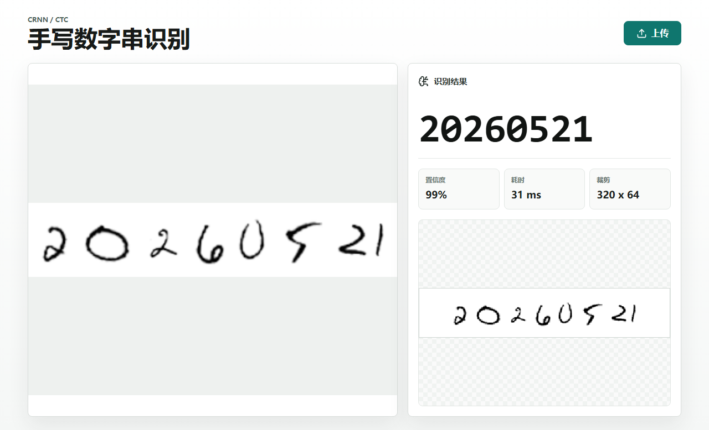
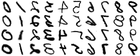
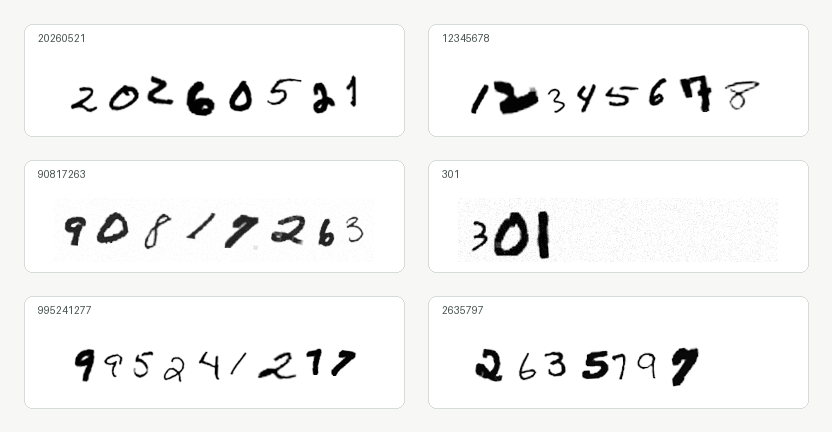
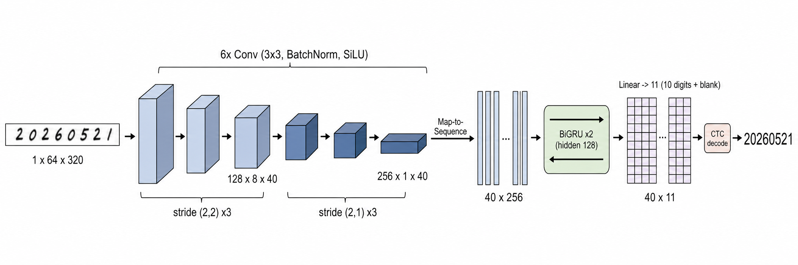
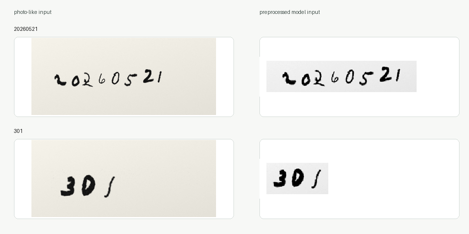
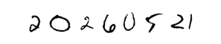
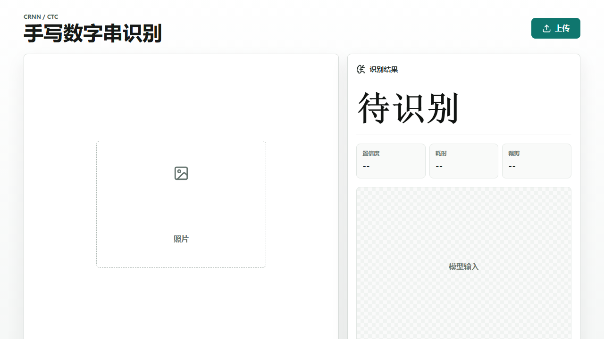
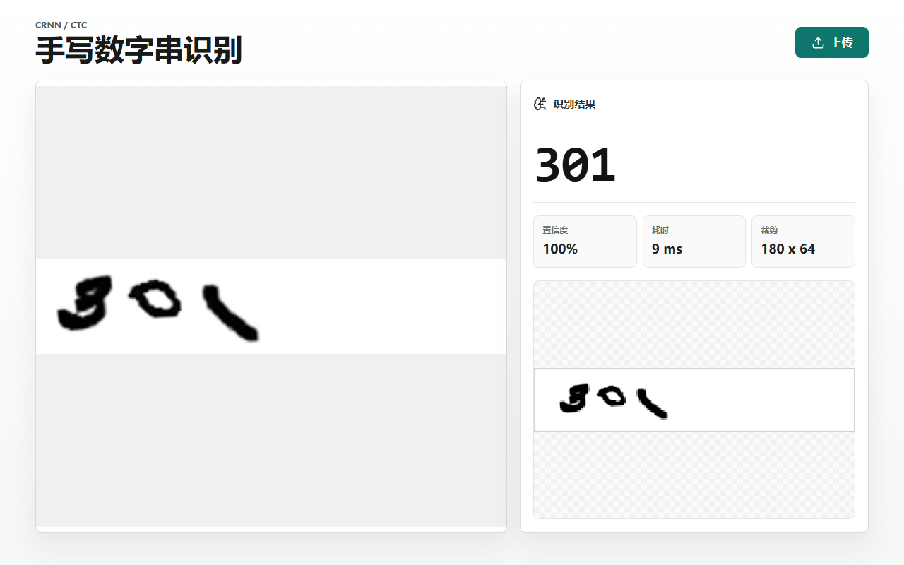
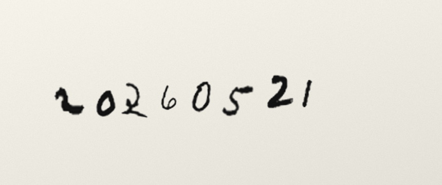

应老师要求，我要做一个0-10的手写数字识别，但是我觉得可能太基础了，想做复杂一些。

于是我做了一个模型去识别1-10位的数字字符串：拍一张写着数字串的纸，比如 `20260521`，网页直接读出这串数字。

我提了一个硬约束：**不要后端**。照片不传服务器，模型也不放服务器，用户打开网页、上传照片、浏览器本地完成识别。

最后在我自己构建的小样本常规10位数字串验证集中有个70%的正确率。地址在 https://yoryon.com/digit-ocr/



整条链路是这样：

- PyTorch 训练一个轻量 CRNN/CTC 模型；
- 导出成约 `6.9MB` 的 ONNX；
- 前端用 Canvas 把照片预处理成单通道 ink map；
- ONNX Runtime Web 在浏览器里推理；
- CTC 解码得到数字串。

这篇想讲的是技术选型怎么被约束一步步逼出来：任务是什么、数据有什么、不能接受什么代价、要部署到哪里，每个选择背后都有一个被排除的替代方案。

定下路线只是开头。后面两件事花掉我大部分时间：把长数字串的整串准确率抬上去，让合成数据训出来的小模型扛住真实照片。两件都不顺，最后没完全达标，但把下一步问清楚了。

### 任务不是 MNIST 分类

MNIST 是单数字分类：一张图一个数字，输出 `0-9` 一类，答案空间固定。

我要做的是数字串识别：输入可能是 `7`、`301`、`20260521`，长度不固定，而且我没有每个数字的坐标标注。这带出四个约束：

1. **输出不定长**：输出层不能写死成固定类别。
2. **没有逐字符位置标注**：只知道整串是什么，不知道每个数字在哪段横坐标。
3. **真实输入是照片**：亮度、阴影、倾斜、对焦、笔画粗细都在变。
4. **要在浏览器里跑**：模型不能大，链路不能依赖 Python 服务。

方向就被框定了：一个图像到序列的模型，不依赖切割，不要求逐字符框，能导出成浏览器格式。很多方案从这里被排除。

### 排除一：切割再逐个分类

最直觉的方案分四步：找数字区域，切成单数字，每块送进 MNIST 分类器，拼起来。

它诱人，因为单数字分类成熟、训练简单。但**切割是最脆弱的一环**：

- 真实手写间距不均，有人挤有人散；
- `1` 窄 `0` 宽，笔画有断有粘；
- 很难写一条稳定规则决定哪里该切。

切错还无法挽回。`20260521` 一旦被切成 `20|260|5|21`，后面每块都不再是干净数字，错误发生在模型之前。这条路把最难的事，压在了一条最难写稳的前置规则上。

### 排除二：检测、通用 OCR、Transformer

剩下几条路各有硬伤：

- **目标检测**：要给每个数字标框。整串标签已经够麻烦，再加数字级框，数据成本爆炸；细长笔画的小目标还容易受模糊倾斜影响。
- **通用 OCR**：Tesseract 擅长印刷体；大型 OCR 模型体积大，太重了。我要的是轻量、能塞进静态网页的模型。
- **Transformer / attention seq2seq**：表达力更强，但这个任务只有 10 个字符、方向固定、最多十位，上 Transformer 的数据需求、训练复杂度、模型体积都更高，像用吊车搬椅子。

路线清楚了：一个轻量序列识别模型，不要框，不要切割。

### 落点：CRNN 加 CTC

CRNN 拆成两半：

- **CNN** 看图，抽出笔画、形状、弯折、粗细这些视觉特征；
- **RNN** 读序列，把图像从左到右理解成一串符号。

让这条路成立的是 **CTC**（Connectionist Temporal Classification）。它对付的约束是：训练时我只有整串标签 `20260521`，不知道每个数字落在图像哪一段。

CTC 引入 blank 符号，允许模型输出比标签更长的时间步，再折叠成文本。折叠两步：先合并连续重复，再去掉 blank。下面几条路径都折叠成 `20`：

```text
2, 2, blank, 0, 0
blank, 2, blank, 0, blank
2, blank, blank, 0, 0
```

`2,2,blank,0,0` 合并重复成 `2,blank,0`，去 blank 成 `20`。训练时不用指定第几步是第几个数字，CTC 把所有能折叠成正确标签的路径概率加起来一起最大化，对齐问题藏进了动态规划。损失就一行：

```python
criterion = nn.CTCLoss(blank=BLANK_INDEX, zero_infinity=True)
```

blank 还负责分隔重复数字。标签 `11` 不能输出 `1,1,1`（会折叠成一个 `1`），得输出 `1, blank, 1`。

选 CRNN 加 CTC，就是图它避开这个任务最麻烦的两件事：**切割**和**对齐标注**。车牌、验证码、手写数字串、场景文字这类顺序明确、边界未知的任务都适合它。

### 数据：造训练分布

我没有现成的多位手写数字串照片数据集。一开始就拍几百张再清洗标注，会把项目卡在数据收集上。所以用三层数据：

- **MNIST**：干净、下载小、授权清晰，先让模型学会 `0-9` 的基本形状。缺点是太规整、数字居中、风格单一。
- **EMNIST Digits**：来自 NIST，样本更多、风格更杂，补 MNIST 的单一。接入后训练数字来源是 MNIST 加 EMNIST，训练约 `300,000` 个数字样本，验证约 `50,000`。



第三层是关键：**数字串动态合成**。从单数字池随机抽数字，训练时拼成一整行，尽量覆盖真实书写的变化：

- 随机长度，让模型见过 1 到 10 位；
- 按串长自适应缩放，长串写得更小；
- 每个数字随机旋转，模拟倾斜；
- 随机间距，允许轻微重叠，模拟挤在一起的笔迹；
- 随机加粗、模糊、噪声、亮度抖动，模拟笔、纸、拍照差异。



一个重要设计：**每个 epoch 换随机种子，重新生成一批**。训练集是一个不断吐新样本的生成器，模型记不住具体样本，只能学“什么笔画组合对应什么数字序列”。

为什么不用字体渲染或一开始就拍真照片？

- 字体太干净，离手写远；
- 真照片最好，但收集成本高，早期更需要快速验证路线对不对。

合成数据让项目先跑起来，再用少量真照片补 gap。这是整个项目最重要的想法之一：**先用合成把任务造出来，别等完美数据集**。

合成里还有一套专门“做脏”的增强：尺度变化、失焦模糊、低对比、纸纹噪声、阴影梯度、JPEG 量化感、纸边亮带。目的是让合成图逼近真实手机照片。这套增强后面会反复出现，也会在真实照片面前露出极限。

训练分两阶段，用 PyTorch（CRNN/CTC 实现直接、好调试、能吃 CUDA，我的机器有一块 RTX 4060 Laptop）：

1. **MNIST 预训练**：用 MNIST 合成数字串，学会基础形状和 CTC 对齐；
2. **EMNIST 微调**：加载上一阶段，加 EMNIST Digits，用更低学习率（`8e-5`）补风格。

优化器用 `AdamW`（动态合成增强多，自适应步长省心，weight decay 给小模型正则），学习率 cosine annealing，CTC 早期会波动所以加梯度裁剪。

### 模型架构：宽度是时间轴

模型很小，核心是 `DigitStringCRNN`，第一版输入 `1×64×320` 单通道。



6 个卷积块，每块是 `Conv3×3 + BatchNorm + SiLU`，通道走 `1→32→64→128→128→256→256`（第三块后插一个轻 `Dropout2d`）。关键在 stride：

- 前 2 块用 `(2,2)`，高宽一起下采样；
- 后 4 块用 `(2,1)`，只压高度，保住宽度。

宽度方向就是序列方向。CTC 要一串时间步来读数字，宽度压没了就没有读字位置。`64×320` 卷积后变成 `256×1×80`：高度压到 1，宽度保留 80，转成 80 个时间步、每步一个 `256` 维特征。

```python
def forward(self, image):
    x = self.features(image)          # (B, 256, 1, T)
    x = x.squeeze(2).transpose(1, 2)  # (B, T, 256)
    x, _ = self.sequence(x)           # 双向 GRU
    return self.classifier(x)         # (B, T, 11)
```

后面接 2 层双向 GRU，hidden size `128`，最后线性层映射到 11 类（`0-9` 加一个 blank）。两个选择：

- **用 GRU 不用 LSTM**：序列只有一百来步、任务简单，GRU 参数更少够用；
- **用双向**：识别一位数字常要看左右邻居，两个数字挨太近时，左右文帮模型判断笔画归属。

还有个细节：训练和前端都把数字串**靠左放置**，让训练和推理分布一致。CTC 从左到右读，左侧起点稳，模型更好学。整个架构是为“一行短数字串”定制的小模型，表达力够用，参数和推理成本压得住。

### 预处理：另一半模型

只看神经网络容易低估预处理。

训练时模型吃的是干净输入：白底黑字，归一化成单通道 ink map，背景近 0、笔迹近 1。用户上传的照片里却有纸张颜色、环境光、阴影、透视、相机压缩、背景杂物。一个用合成灰度图训出来的小模型，直接吃原图不会稳。



前端预处理把真实照片拉回训练分布，步骤是：

1. 最长边限制到 `1600`，避免大图拖慢浏览器；
2. 估计纸面背景亮度；
3. 找暗色笔迹区域，取包围盒；
4. 裁剪并留边距，避免切掉笔画；
5. 等比缩放进模型画布，靠左对齐；
6. 转成 `0-1` 的 ink map。

`20260521` 最后吃进模型的就是这张：



这里有个容易忽略的工程点：没有检测网络，纯前端怎么定位数字。我用连通域分析，把触边的、面积超大的、细长条的连通块当桌面或纸边干扰剔掉，剩下的算笔迹。照片里有纸边或桌面线条，也不容易被当成数字。

为什么不用固定阈值？因为每张照片光照不同（晴天窗边、晚上台灯、偏黄纸、不同曝光），固定阈值会把阴影当笔迹或吃掉浅笔画。网页端用背景估计加相对亮度差：

```text
background = percentile(luminance, 92)        // 估计这张纸有多亮
ink = clamp((background - luminance) / max(background - 0.16, 0.28), 0, 1)
```

先估“纸有多亮”，再看某像素比纸暗多少，比“小于某个值就算黑字”鲁棒得多。训练增强把模型见过的世界撑大，推理预处理把真照片拉回这个世界中间，两边配合，小模型才能工作。

### 导出 ONNX：变成纯静态网页

模型在 PyTorch 里训练，浏览器跑不了 PyTorch。两个选择：

1. 后端开 Python 服务，前端传图上去；
2. 模型导出成浏览器格式，前端本地推理。

第一个违背“不要后端”，还带来隐私、部署、并发、服务器成本：照片要上传、服务要维护、模型更新要管。所以走第二个，导出 ONNX。

ONNX 是中间格式：训练用 PyTorch，部署不绑 PyTorch。导出脚本把 checkpoint 转成 `digit-string-crnn.onnx`，再写一个 JSON 记录输入输出名、尺寸、blank index、字符集。导出后对比 PyTorch 和 ONNX Runtime 的输出，`maxDiff` 约 `5.7e-06`，没有明显数值偏差。模型文件约 `6.9MB`，网页扛得住，后端也就没必要。

前端栈保持轻：

- **React** 管界面状态：上传、预览、结果；
- **TypeScript** 写清模型元信息、预处理、识别结果的结构；
- **Vite** 负责快开发、快构建、静态输出；
- **Canvas** 做图片读取、裁剪、缩放、张量转换；
- **ONNX Runtime Web** 用 WASM 在浏览器里推理。



几个没选的：

- **Flask/FastAPI**：会变成前后端项目，部署成本上来，也破坏“照片不上传”；
- **TensorFlow.js**：训练侧已在 PyTorch，`PyTorch → ONNX → ONNX Runtime Web` 更顺，浏览器端不用重写模型；
- **WebGPU**：模型太小，WASM 已是几十毫秒级，WebGPU 的兼容和调试成本不划算。

最后整个项目是纯静态应用：构建后就是一组 HTML、JS、WASM、ONNX，丢到静态托管就能跑。

### 第一版跑通

链路齐了。推理时模型输出 `T×11` 概率矩阵，最简单的解码是贪心：每步取概率最大的类别，再按 CTC 折叠。

```python
def greedy_decode_class_ids(class_ids):
    collapsed, prev = [], None
    for idx in class_ids:
        if idx != prev and idx != BLANK_INDEX:
            collapsed.append(idx)
        prev = idx
    return decode_indices(collapsed)
```

内置样例 `20260521`、`301` 都能正确识别，前端生产构建也通过。从照片预处理、ONNX 推理、CTC 解码到网页展示整条都打通了。



但这版只在干净短串上好看。它证明了 `CRNN/CTC + ONNX Web` 链路成立，还没碰两件真正难的事：**长串的整串准确率**，和**真实照片**。后面的活几乎全围着这两件转。

### 更硬的目标：十位以内 90%

第一版跑通后，我加了一个目标：**10 位以内不定长数字串，整串准确率至少 90%**。

这比听起来难。整串准确率会放大逐字符错误：10 位每位都 98% 准，整串也只有 `0.98^10 ≈ 81.7%`；要整串 90%，逐字符得接近 99%。两个指标得分清：

- **字符准确率**：逐位看，单字符对的比例；
- **整串准确率**：整条一位不差才算对。

后者随长度放大错误，所以我只认整串。用户要的是整串对不对，“八位对七位”不算。优化第一步是加一个固定长度评测：1 到 10 位各自生成一批，分别算两个指标，看清模型是整体不行，还是只在 8、9、10 位掉。

### 把训练数据变难

第一版合成虽有随机长度，但短串自然占多数。要冲长串得显式加难度，增强分三类，后面又补了字体分支：

- **长串增强**：显式提高 8 到 10 位的比例。长串字小、间距紧、CTC 对齐更难，光靠随机长度出不来。
- **易混数字增强**：标签不再均匀采样，提高 `2、3、5、6、8、9` 的概率，混入少量 `0、1、4、7`，让模型多看易错形状（`3`/`8` 的弧、`5`/`6` 的收口、`9`/`8` 的上半）。
- **照片增强**：随机缩放、模糊、噪声、阴影、降墨迹强度、上下边缘亮带、轻微色阶量化，把样本往真实手机照片推。
- **字体分支**：用 Windows 手写感字体渲染整串，补一个维度，整串的连贯排布、字间距、整体倾斜、笔画粗细。

这里踩了个典型 bug：合成器的“易混数字”分支原本只生成到 6 位左右，短串训练没事，固定测 7 到 10 位就和目标长度冲突。修掉后，我让长串比例参数也作用到易混分支，困难样本从 `589`、`2689` 这种短串，变成 8、9、10 位的长易混串。**模型学不会没见过的分布**：困难样本都是短串，模型就只在短串困难上变强。

### 一路加宽：320 到 480

我从一个强化过照片和易混增强的基线往上推。它在“强干扰”评测上很惨：强干扰平均整串 `71.88%`，10 位整串 `47.2%`，10 位字符 `82.24%`。（强干扰是高比例照片加易混增强，故意造模糊、阴影、亮带、低对比、笔画挤压，比常规合成狠一档。）短串还行，长串完全不够。

往上推分三步：

1. **继续强化长串、照片、易混**：强干扰 10 位 `47.2% → 55.6%`。方向对，离 90% 还远。
2. **输入宽度 320 扩到 480**：长串错得多，多半是横向信息压太紧。加宽后卷积时间步从 80 增到 120，CTC 有更多位置分配数字，参数量基本不变（加宽只加时间步）。强干扰 10 位涨到 `63.2%`；再用 7 到 10 位长串专项微调，到 `64.6%`。
3. **训一个更平衡的版本**：兼顾常规照片分布。常规固定长度从 1 位 `96.25%` 一路往下掉，5 位 `86.5%`、8 位 `80.25%`、10 位只剩 `72.75%`，平均 `85.05%`。

比第一版强很多，但还不是 90%。它也暴露了目标的真实难度：模型会读长串，只是每多一位就继续吃逐字符错误的亏。

### 错误剖析：长串错在看错数字

我拆了 10 位样本的错误。直觉上 CTC 长串会漏位或多位，但统计下来长度错误只占一小部分，大头是替换错误：长度对，某一位看错。典型：

```text
3276529380 -> 3276529580
1536450576 -> 1736450576
0844415907 -> 0844418907
2867648472 -> 2867648972
```

混淆集中在 `3/8`、`5/6/9`、`1/7` 这几组，都是人也会犹豫的地方。单调解码救不了这种问题。

我把贪心换成 beam search 验证，它保留多条候选路径。beam width 从 1、4、8、16 扫到 32，提升小到几乎看不见。错的是数字本身，beam search 能救一点 CTC 对齐，救不了视觉判断。网页端最后用 beam width 16，当它是个便宜的稳定器。（以后要识别日期、手机号这类有格式约束的内容，beam search 加规则先验会更值，比如日期不可能是 `20269999`，可以在候选里重排。）

### 撞墙：更大不一定更好

瓶颈不在解码，我就去试结构容量和分辨率，两次都没赢：

- **GRU hidden 从 128 提到 256**：卷积视觉权重全继承，只重学 GRU 和分类头。256 维在 1 到 4 位略好，9、10 位反而更弱，10 位常规只有 `69.5%`。变大了没变聪明。
- **输入宽度推到 640**：理论上更宽给长串更多细节，实际 10 位常规只有 `68.5%`，没超过 480。多半是分布变了，同串数字放进更宽画布后尺度间距都变，模型要重新适配，收益抵不过代价。

两次失败说明瓶颈在数据分布和困难字形覆盖，不在模型表达力。该补的是数据。

### 真实照片的反扑

前面优化都在合成评测上打转，项目最终要面对真实照片。

我没有真实标注数据，手拍几百张再标注又会卡死项目。这里有整个项目我最满意的设计：**用生图工具批量造纸面手写照片，文件名直接当标签**。`imagegen-5903148267.png` 的标签就是末尾的 `5903148267`，零手工标注。



拿那个平衡版本导出 ONNX，用一批生图照片测，结果很难看：41 张只对 `16` 张。

这是小模型项目最常见的反转：**合成评测涨了，真实照片退化了**。前面那套“做脏”增强到这里露了极限。生图照片有更具体的视觉风格：照片质感、纸边、低对比、生成模型特有的笔迹形态，合成器再努力也覆盖不全。

### rescue：更像产品的版本

于是做一次 rescue 微调：从平衡版本出发，把生图照片当“真实感困难数据”混进训练集。每张图先走和前端类似的预处理（灰度、自动对比度、背景估计、找 ink box、裁剪、缩放），训练时再随机做亮度、对比度、旋转、模糊、缩放、噪声。

不能只喂这 41 张，否则模型会背下来再忘掉长串。所以 rescue 是混合分布：一部分生图照片，一部分长串合成。真实照片比例调高，但保留长串、字体、照片增强、易混合成，别把长串能力洗掉。

结果是一笔明确的取舍：

| 评测 | 平衡版 | rescue 版 |
|---|---|---|
| 生图照片 | 16/41 | 38/41 |
| confusion 留出 | 1/5 | 4/5 |
| blurry 留出 | 2/4 | 3/4 |
| final 留出 | 3/3 | 3/3 |
| 常规 1-10 平均 | 85.05% | 83.98% |
| 常规 10 位 | 72.75% | 72.0% |
| 强干扰 10 位 | 64.6% | 62.8% |

生图照片和难样本留出集都涨，代价是合成固定长度小幅回落。最后部署的就是 rescue 版：它牺牲一点合成分数，换真实照片鲁棒性。这轮最大的教训是**别只信一个评测集**。只看合成 1 到 10 位，平衡版更漂亮；只看那几十张生图照片，又容易过拟合。能部署的版本要在多个分布间折中。

### 目标没到，但问题更清楚了

这次没把 10 位以内整串推到 90%，但把问题从“感觉还能优化”变成几个具体判断：

- 长串错的是替换，不是漏位；
- `480` 宽是目前最好的平衡点；
- 更大 GRU、`640` 宽都没带来收益，堆容量没用；
- 生图、照片风格数据对部署效果很重要；
- 冲 90% 要靠更高质量的真实长串数据，继续合成已经不够。

下一步很清楚：先收一批真手写、真拍照、覆盖 1 到 10 位的验证集，每个长度几十张，多拍 `2、3、5、6、8、9` 这些混淆数字，再围着失败样本做主动学习式微调。到那步才值得换结构，比如更强的 CNN backbone、轻量 Transformer encoder，或 CTC 之外的 attention decoder。

但是因为比较麻烦，我就先不做了。

最后是一个 `6.9MB` 的小模型，在纯静态网页里本地识别手写数字串。第一版跑通了链路，rescue 版把输入扩到 `64×480`，生图照片识别率从 `16/41` 拉到 `38/41`，10 位常规保住约 `72%`。
