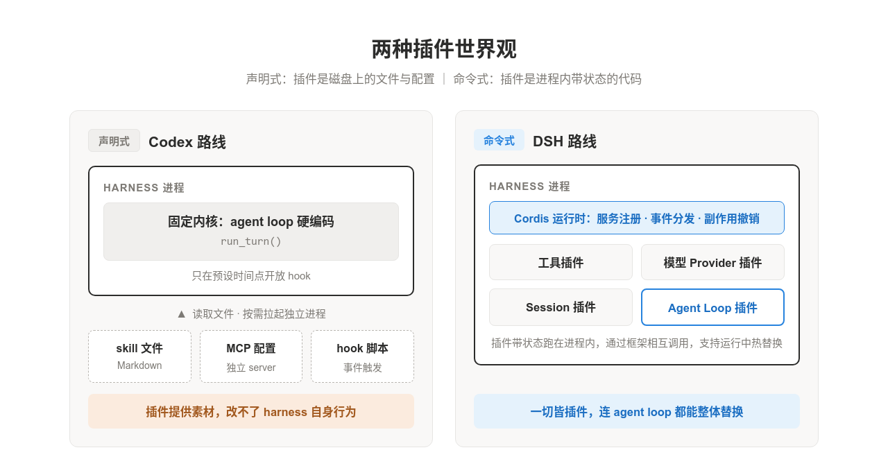
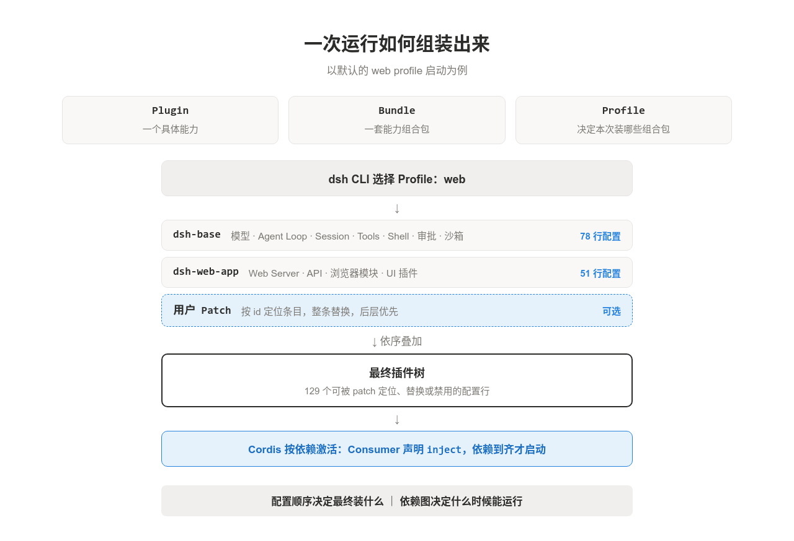
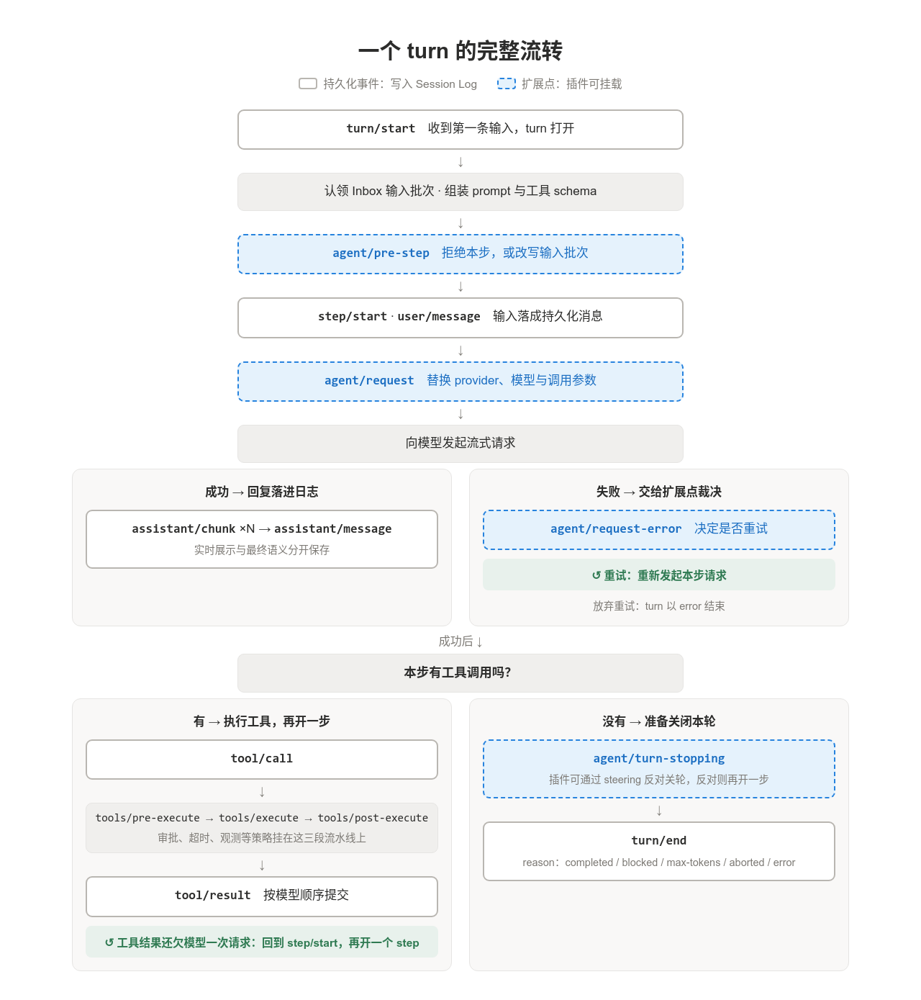
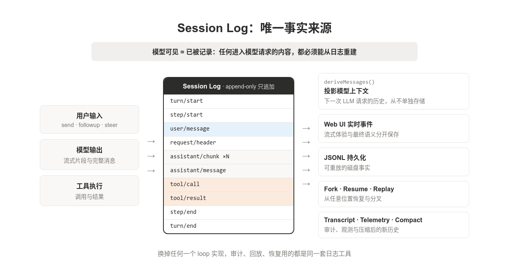
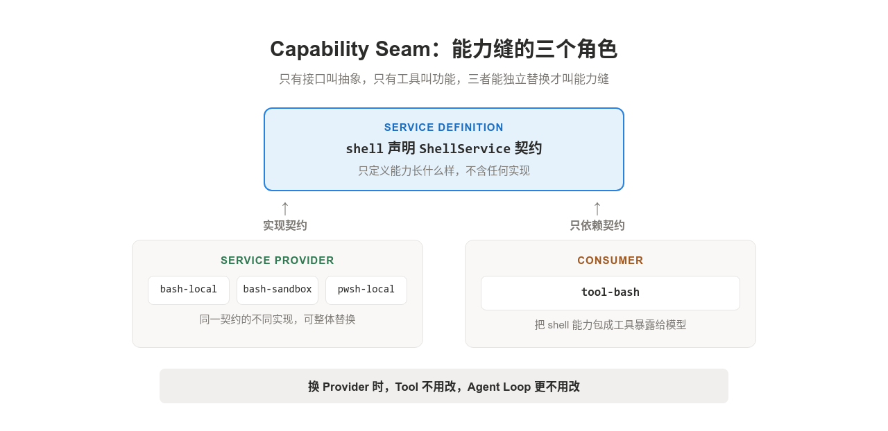
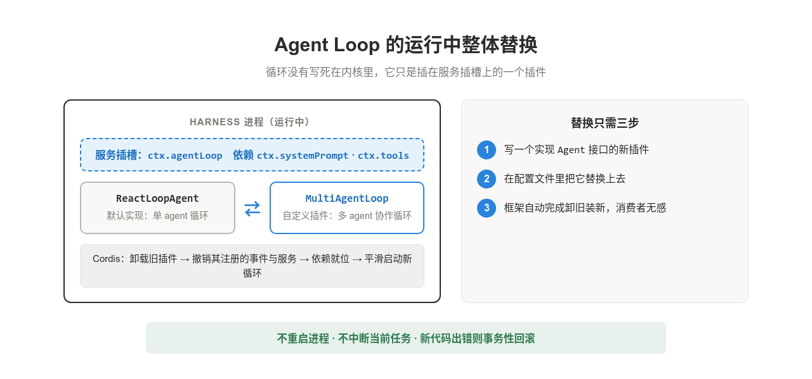

2026 年 8 月 13 日，DeepSeek 发布了自己的第一个 agent harness，名字就叫 DSH（DeepSeek Harness），代码开源。配套论文里满是范畴论符号，第一眼很容易让人怀疑：这会不会又是理论上很优美、工程里没人用的设计？但翻开代码就会发现，DSH 与 Codex、Claude Code 这些主流 harness 的差异是结构性的：其他 harness 把 agent loop 写死在内核里，DSH 把它做成了一个可以在运行中整体替换的插件，这个选择的后果延伸到了架构的每个角落。

这篇博客循序渐进地回答四个问题：DSH 是什么？一次运行如何组装出来？运行起来之后，循环与日志如何协作？以及这套架构究竟适合谁？

### 一、DSH 是什么：没有内核的 harness

先看熟悉的结构。Codex、Claude Code 这类主流 harness 都有一个稳定的核心：一段硬编码的控制流负责组装上下文、请求模型、执行工具，扩展从边上挂进来。skill 是 Markdown 文件，MCP 是一段配置，hook 是事件触发的脚本。这种设计很稳，扩展也够用，但主干改不了，想换掉核心逻辑只有 fork 源码重新编译一条路。

DSH 可以压缩成一句话：**一个基于 Cordis 运行时的插件化 harness，一切皆插件**。工具是插件，模型 provider 是插件，session 是插件，连 agent loop 本身也是一个插件。这个 harness 没有特权内核，别的框架里要动内核才能做的事，在这里改一行配置就行。

两条路线的差异，本质上是两种插件模型：

- **声明式插件**，Codex 的路线。插件是磁盘上的一个文件夹，装着声明性资源，插件本身不在 harness 进程里跑代码，harness 读取文件、按需拉起独立进程。好处是简单，进程的生死交给操作系统管，插件之间也不需要知道彼此存在；代价是插件只能给 harness 提供素材，注册不了有状态的服务，监听不了内部事件，也改不了 harness 自身的行为。

- **命令式插件**，DSH 的路线。插件直接跑在 harness 进程里，带着自己的状态。装载时向框架注册自己提供什么能力，需要什么能力就声明依赖，框架把两边接上，插件之间通过框架相互调用。能力边界被彻底打开，但立刻出现一个声明式世界不存在的难题：一个插件被替换时，正握着它引用的其他插件怎么办？

这个难题正是 Cordis 存在的意义。它替每个插件记住装载时做过的每一件事，卸载时逐件撤销；它盯着依赖关系，依赖到位通知启动，依赖离开通知停下；热更新失败时事务性回滚，永远不会卡在半新半旧的中间态。Cordis 在生产环境里支撑过 4000 多个插件的生态，这套机制是 DSH 后面一切设计的地基。

### 二、一次运行如何组装出来

DSH 启动时没有固定的功能清单，最终跑起来是什么样，完全由配置组合决定。

组合涉及三个概念，粒度从小到大：

- **Plugin**：最小的功能单元，一个插件对应一个具体能力，比如一个工具、一个模型 provider、一个 session 实现；

- **Bundle**：一份插件清单，把某类场景需要的一组插件配置打包成一层，方便整体引用；

- **Profile**：一次启动的组合方案，声明本次启动要叠加哪些 bundle。

组装的全过程：Profile 挑选 Bundle，Bundle 圈定 Plugin，最终在进程里运行的只有 Plugin。

#### 2.1 启动：三层配置按顺序叠加

以默认的 web profile 为例，这份 profile 声明了 `dsh-base` 和 `dsh-web-app` 两个 bundle。dsh CLI 从一棵空的插件配置树开始，依次叠上三层：

1. `dsh-base`：基础 bundle，带来模型、agent loop、session、工具、shell、审批、沙箱等基础能力的插件配置；

2. `dsh-web-app`：界面 bundle，带来 Web Server、API 和 UI 等 web-app 插件配置；

3. 用户 patch：本地覆盖层，按 `id` 定位前两层的任意条目，整条替换它的配置。

叠加规则只有一条：后叠的层优先。树上每个条目对应一个插件的配置，所以两个 bundle 装进来的任何插件，都可以被 patch 定位、替换或禁用。

配置树定下来之后，插件还不会立刻运行：每个插件用 `inject` 声明自己需要的服务，缺依赖就等待，依赖到齐才激活。分工因此很清楚：装什么，归配置顺序管；何时运行，归依赖图管。

#### 2.2 运行：插件只做三类事

装载之后，一个插件与框架的全部交互可以归成三类：

- **注册 Service**：向共享 context 挂出稳定的能力接口，比如 `ctx.tools`、`ctx.llm`、`ctx.sessions`；

- **监听 Event**：通过带类型的事件参与流程中的某一段；

- **登记 Effect**：把每个副作用登记成可撤销的操作，插件卸载时由框架逐一撤掉，现场恢复干净。

Service 对外提供能力，Event 参与流程，Effect 保证卸载干净。三件套合在一起，一切皆插件才没有退化成一堆全局回调。

### 三、Agent Loop：turn、step 与四个扩展点

#### 3.1 两个层次与一台状态机

默认的 loop 实现叫 `ReactLoopAgent`。它实现 `core/agent` 定义的 `Agent` 接口，其他插件只依赖这个接口，从不依赖具体实现，这是循环可以整体换掉的前提。

循环把工作组织成两个嵌套层次：

- **turn**：一轮完整的工作，包含零个或多个 step。收到第一条输入时打开，没有挂起的输入、也没有待处理的工具结果时关闭；

- **step**：一次模型请求，加上这次请求发起的工具调用。

step 数量不固定的原因很直接：模型第一次请求可能只返回工具调用，工具结果落进日志后，模型要在下一次请求里看到它，才能继续推理或给出最终答案。每多一轮工具调用，就多一个 step。

驱动器由一台小状态机门控，只有 `idle`、`maintenance`、`running` 三个相位。状态切换会发出 `agent/status` 事件，任何插件都能旁观循环的生命周期。

#### 3.2 一个 turn 的完整流转

一轮流转切成三个阶段看，逻辑就很清楚。

**阶段一：接收输入，组装上下文**

1. 输入通过 `send`、`followup`、`steer`、`inject` 进入 Inbox 队列，唤醒驱动器，写入 `turn/start`；

2. 驱动器认领本步的输入批次，`systemPrompt.assemble()` 组装 prompt 段落、变量和工具 schema；

3. `agent/pre-step` 给插件第一次介入机会：拒绝本步，或改写输入批次。

**阶段二：发起一次流式的模型请求**

1. 写入 `step/start`，认领的输入此刻才落成持久化的 `user/message`；

2. `agent/request` 允许插件替换 provider、模型与调用参数，历史消息从会话日志投影而来；

3. 响应逐段写成 `assistant/chunk`，完成后再写一条完整的 `assistant/message`，实时展示与最终语义分开保存；请求失败时由 `agent/request-error` 决定是否重试。

**阶段三：决定继续还是结束**

1. 有工具调用：执行工具，`tool/result` 落进日志，开下一个 step；

2. 没有工具调用：`agent/turn-stopping` 给插件最后一次反对机会，没人反对就写入 `turn/end`，本轮结束。

#### 3.3 工具执行的流水线

工具调度按执行模式分组：

- **互斥调用**：独占执行窗口，一次只跑一个；

- **并行调用**：进入有界池，由 `maxParallelToolCalls` 控制并发上限。

每个调用都经过 `tools/pre-execute`、`tools/execute`、`tools/post-execute` 三段流水线，超时、审批、限流、观测这类策略全部挂在这三段上。

还有一个容易忽略的细节：结果按模型发起调用的顺序提交，先完成的调用要等前面的槽位就绪，保证模型看到的世界始终一致。

#### 3.4 两类构件：持久化事件与扩展点

纵观整个循环，其实只有两类构件：

- **持久化事件**：`turn/start`、`user/message`、`assistant/message`、`tool/call` 这些边界全部写进会话日志，负责记录事实；

- **扩展点**：`agent/pre-step`、`agent/request`、`agent/request-error`、`agent/turn-stopping` 四个接缝，负责让插件介入。

Loop 只维护状态机和持久化顺序，策略全部住在接缝上。是否批准工具、如何改请求、prompt 里多加一段什么内容，都由事件或 Service 插件完成。大多数定制根本不需要碰循环本身。

### 四、两条不变量：Session Log 与 Capability Seam

#### 4.1 Session Log：模型可见即已记录

很多 agent 原型在内存里维护一个 `messages` 数组，再顺手渲染到 UI。DSH 把方向倒了过来：先把事实写进追记式的 Session Log，再为不同用途生成投影。

模型可见的历史从不单独存储，每次请求前由 `deriveMessages()` 从日志现算出来。同一份日志派生出所有下游视图：

- 下一次模型请求的上下文；

- 持久化的 JSONL 文件；

- Web UI 的实时事件流；

- Fork、Resume 与 Replay；

- Transcript、Telemetry 与压缩后的新历史。

这条不变量可以概括成：**任何进入模型请求的内容，都必须能从日志重建**。直接的好处是，无论换成哪个 loop 实现，审计、回放、恢复用的都是同一套日志工具。

#### 4.2 Capability Seam：换实现不改调用者

可插拔最容易停留在接口层，DSH 把一项能力拆成三个角色：

- **Service Definition**：只声明能力契约，比如 `shell` 定义 `ShellService`；

- **Service Provider**：提供一种实现，比如 `bash-local`、`bash-sandbox`、`pwsh-local`；

- **Consumer**：使用能力，常见形式是暴露给模型的工具，比如 `tool-bash`。

关键在于 Consumer 注入的只是契约。把 `bash-local` 换成 `bash-sandbox`，工具和 agent loop 一行代码都不用改，也不会出现平台分支。

### 五、适用边界：谁真的需要 DSH

#### 5.1 上限相同，下限不同

先把 agent loop 放到一边，声明式和命令式两条路线的能力上限其实一样，最终取决于业务代码本身的质量。想给 Codex 的常驻 MCP server 加运行时热替换，加一个 reload 端点就能做到，只是撤销、清理、依赖协调这些坑要自己踩。DSH 把这些基础设施全部铺好，单是 `fiber.ts` 一个文件就有 750 行，代价是更高的开发门槛：通过框架接口注册副作用、声明依赖、返回撤销函数，还要理解插件生命周期状态机。

日常场景里，声明式几乎总是够用。搜索服务本来就是短交互，改配置重启一次两三秒；skill 是纯文本，下次读取自动生效。真正配得上运行时热替换的组件要同时满足两个条件：在进程内持有跨 turn 的状态，且这种状态没有持久化到 Session Log。满足条件的组件少之又少，上下文管理器算一个典型，它持有哪些内容保留、哪些压缩的策略状态。

#### 5.2 声明式追不上的一点：loop 可整体替换

不过有一个能力，声明式模型补多少代码都追不上。硬编码的 `run_turn()` 只在预设时间点开放 hook，你没办法在运行时把单 agent 循环换成多 agent 协作循环，也没办法把发起请求、等待响应、执行工具的串行逻辑改成流式解析加并行执行。DSH 里换一套 loop，只需要写一个实现相同 `Agent` 接口的插件，在配置里替换上去，框架自动卸载旧插件，把注册过的事件和服务干净撤销，等依赖就位后平滑启动新循环。

#### 5.3 真正的目标：为 agent 自进化铺路

回头看，Cordis 那整套机制，副作用跟踪、依赖通知、事务性热更新，本质上都在支撑 loop 可替换这一个目标，其余特性更像副产品。这套架构真正铺平的是 agent 自进化的基础设施：agent 在运行中给自己生成一个新工具插件，框架不重启进程、不中断任务就把它热加载进来；生成的代码出了错，事务性回滚退回上一个稳定状态。模型这一侧的条件也已成熟，生成几十行的工具插件早就是日常操作，生成几百行、能处理状态与调度的完整 loop 也踩在顶尖模型的能力边界之内。DSH 的 loop 本身就是可读可改的 TypeScript 插件，接口规范、代码结构、生命周期约束对模型天然可见；反观把 loop 编译进二进制的方案，就算模型写得出新循环，系统里也没有一个插槽能把它装上去。

如果日常用 Codex 或 Claude Code 写码，DSH 不会让体验变好：声明式模型足够简单，重启两三秒完全可以接受，Cordis 的机制对你更多是额外的复杂度。如果你想让 harness 自我演化，动态切换 loop 策略，一边运行一边长出新能力，DSH 则是目前唯一把底层基础设施搭建完整的方案。

---

### 参考文章

\[1\] DeepSeek. (2026). deepseek-harness \[Source code\]. GitHub. [https://github.com/deepseek-ai/deepseek-harness](https://github.com/deepseek-ai/deepseek-harness)

\[2\] Cordiverse. (2026). A programming paradigm for spatiotemporal composability \[Source code\]. GitHub. [https://github.com/cordiverse/paper](https://github.com/cordiverse/paper)

\[3\] Yage. (2026). 深度剖析 DeepSeek 最新的 Harness DSH：为了自进化这盘醋包了一整盘饺子. [yage.ai](http://yage.ai). [https://yage.ai/share/dsh-deep-analysis-20260813.html](https://yage.ai/share/dsh-deep-analysis-20260813.html)

\[4\] 【图解】DeepSeek Harness 架构解析. (2026). CSDN. [https://deepseek.csdn.net/6a7f254310ee7a33f29b0548.html](https://deepseek.csdn.net/6a7f254310ee7a33f29b0548.html)

\[5\] sing1ee. (2026). DeepSeek Harness Agent Loop 2026：驱动每一轮对话的可替换插件内部解析. 博客园. [https://www.cnblogs.com/sing1ee/p/22479295](https://www.cnblogs.com/sing1ee/p/22479295)
