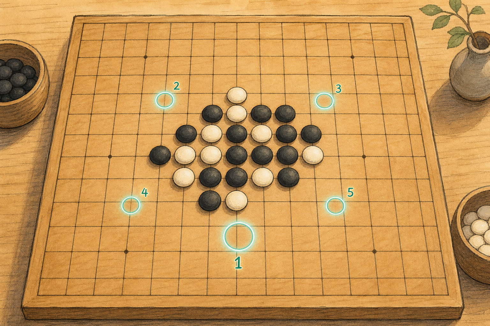
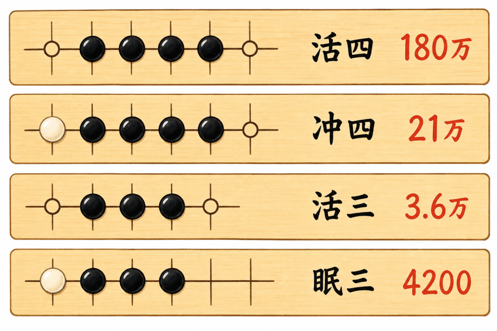
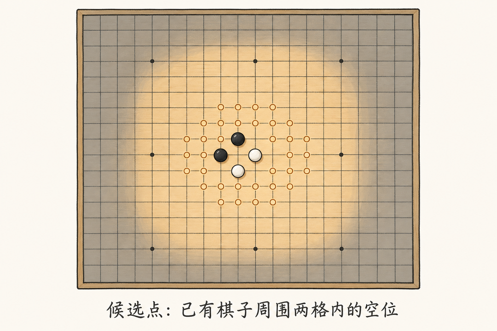
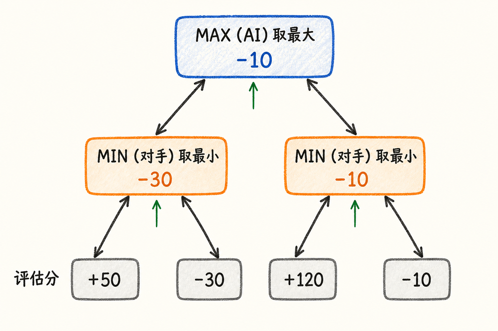
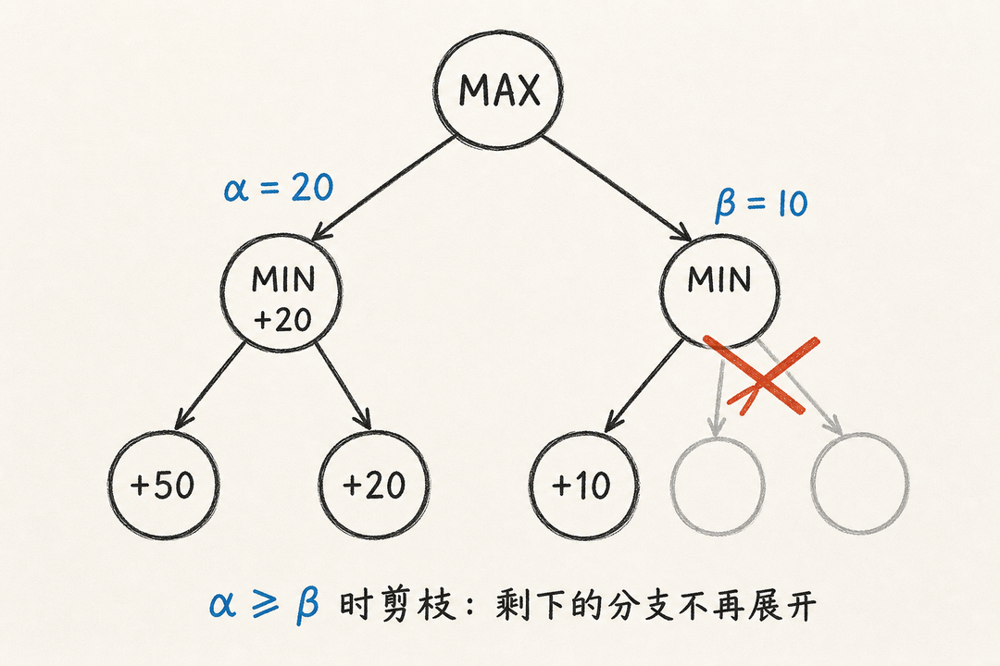

应老师要求，我写了个纯前端的五子棋。没有后端，没有数据库，AI 完全在浏览器里思考：你落一子，它在你的设备上算一会儿，然后回一手。地址在 https://yoryon.com/gomoku

它用的不是神经网络，是经典的博弈搜索：**Minimax 加 Alpha-Beta 剪枝**，再配一个手写的棋型评估函数。整套东西几百行 TypeScript，跑在一个 Web Worker 里。

这篇文章我想把一件事讲清楚：**当你落下一子，博弈算法是怎么决定下一步该下哪里的**。它不是在 225 个交叉点里随便挑一个，中间有四层逻辑：怎么给一个局面打分、只看哪些点、怎么往后预判、怎么在预判里少算一些。



### 先看清楚问题有多大

棋盘是 15×15，225 个交叉点。

如果让 AI "想得远一点"，最朴素的做法是穷举：我下这里，对手会下哪，我再下哪……把所有可能的对局都展开成一棵树，看哪条路通向我赢。

问题是这棵树大得离谱。开局第一手有 225 种选择，第二手 224 种，第三手 223 种。只往后看 4 步，分支就接近 `225 × 224 × 223 × 222`，约 25 亿个局面。看 6 步是百万亿级别。根本算不完。

所以一个能用的五子棋 AI，绕不开三件事：

1. 得有办法**快速判断一个局面对谁有利**，不然展开了树也不知道哪条路好；
2. 不能每一步都考虑 225 个点，得**只看真正有威胁的地方**；
3. 往后预判时，得有办法**跳过那些明显不可能更好的分支**。

下面这三件事，分别对应评估函数、候选点筛选、Alpha-Beta 剪枝。

---

### 评估函数：怎么给一个局面打分

这是整个 AI 的地基。给它任意一个棋盘，它要返回一个分数：正数表示对 AI 有利，负数表示对人有利，绝对值越大优势越明显。

五子棋的胜负只看一件事：**谁先连成五子**。所以一个局面好不好，本质是看**双方各自连子的"势"有多强**。代码里用两个互补的信号来度量这个势。

**第一个信号是连子（run）：盘面上已经实际连在一起的同色棋子。**

光看连了几个还不够，关键要看**两端堵没堵**。一个三连，如果两端都空着，那是"活三"，下一手就能变活四，很危险；如果一端被对方堵死，那是"眠三"，威胁小得多。代码里用"连子长度 + 开放端数量"来查一张分值表：

```ts
const RUN_SCORES = {
  1: { 0: 0, 1: 4,       2: 16 },
  2: { 0: 0, 1: 96,      2: 720 },
  3: { 0: 0, 1: 4_200,   2: 36_000 },
  4: { 0: 0, 1: 210_000, 2: 1_800_000 },
  5: WIN_SCORE  // 1 亿，连成五子直接判胜
};
```

横着读这张表能看出威胁的等级：活四（4 连、两端空）值 180 万，冲四（4 连、一端被堵）只值 21 万；活三 3.6 万，眠三 4200。两端是否都开放，往往让同样长度的棋型差出一个数量级。两端都被堵死（开放端为 0）则直接计 0 分，因为那条线已经不可能连成五子。



**第二个信号是窗口（window）：盘面上每一段长度为 5 的直线。**

连子只看已经挨在一起的棋子，但五子棋里很多威胁是带空隙的。比如 `●●_●●` 这种跳着的形状，连子算法会把它看成两段二连，可严重程度其实接近活四。窗口信号就是来补这个的：把棋盘上每一条 5 格直线都扫一遍，只要这条线里**没有对方的棋子**（说明它还有连成五子的可能），就按里面自己的棋子数量给分。

```ts
if (own === 5)                  score += WIN_SCORE;   // 五子已成
else if (own === 4 && empty === 1) score += 120_000; // 差一子
else if (own === 3 && empty === 2) score += 9_000;
else if (own === 2 && empty === 3) score += 700;
else if (own === 1 && empty === 4) score += 8;
```

一旦窗口里混进了对方一颗子，这条线就废了（永远连不成五），直接跳过不计分。

这个信号衡量的是**潜力**：哪怕棋子没挨在一起，只要还在同一条没被污染的线上，就算势力。

把全盘的连子分和窗口分加起来，就是某一方在这个局面下的总势力 `evaluateForPlayer`。最终一个局面的分数，是双方势力的差：

```ts
function evaluateBoard(board, player) {
  return evaluateForPlayer(board, player)
       - evaluateForPlayer(board, opponent) * 1.12;
}
```

注意那个 **1.12**。它给对手的势力加了 12% 的权重，意思是：同样大小的威胁，AI 会觉得"对手的"比"自己的"更值得在意。这是一点刻意的防守偏向，让 AI 不至于只顾自己冲杀、对对方的活三视而不见。

---

### 候选点：不看满盘，只看战场附近

有了评分，下一个问题是：每一步该考虑哪些落点。

考虑全部空格显然浪费。

开局阶段棋盘大片是空的，在角落落子既不进攻也不防守，纯属白算。真正有意义的落点，几乎都在**已有棋子的附近**。

所以候选点的生成规则很简单：以每一颗已落的棋子为中心，取它周围 5×5 范围（横竖斜各两格）内的所有空格，去重后作为候选。

```ts
const radius = 2;
// 遍历每颗已落子，把它周围 radius 范围内的空格收进候选集
```

这一步把分支数从 225 砍到通常几十个，是整个搜索能在浏览器里跑起来的前提。

代价是 AI 不会考虑离战场很远的"飞"手，但在五子棋里，远离所有棋子的落点本来也极少是好棋。



---

### 候选点排序：先看最像好棋的那几个

筛出几十个候选点后，还要给它们排个序，把最有希望的排在前面。这一步有两个作用，第二个在后面讲剪枝时才会显出威力。

排序的打分方式，是把"进攻价值"和"防守价值"加在一起：

```ts
board[move.row][move.col] = player;          // 假设我下在这
const attack = evaluateBoard(board, player); // 这一手让我多强
board[move.row][move.col] = opponent;        // 假设对手下在这
const defense = evaluateBoard(board, opponent); // 这点对对手多重要
board[move.row][move.col] = EMPTY;           // 撤销，恢复棋盘

score = attack + defense * 0.92 + centerBias(board, move);
```

对每个候选点，先假设自己下在那里、算一次全盘分（这是进攻价值），再假设对手下在那里、算一次分（这是防守价值，因为对手很想要的点，我提前占掉也很值），最后加一个**中心偏好**：越靠近天元的点给一点额外加分，因为棋盘中心的延展方向最多。

排完序，按难度取前 10 到 18 个，扔给后面的搜索。排在最前面的，通常就是那种"一眼看上去就该下"的点。

---

### Minimax：假设对手永远下最优解

到这里 AI 还只是"看一步"——它能判断每个候选点当下的好坏，但看不到对手的反击。真正的预判，要靠 Minimax。

Minimax 的核心假设是：**对手不会犯错，永远会选对自己最有利、对我最不利的那一手。** 于是整个对局被展开成一棵交替的树：

- 轮到 AI 的层，AI 会挑分数**最大**的走法（Max 层）；
- 轮到人的层，假设人会挑让 AI 分数**最小**的走法（Min 层）；
- 一层 Max 一层 Min 交替向下，直到看到设定的深度，或者某一方已经连成五子。



到达底层时，用前面那个评估函数给局面打分，然后这个分数自底向上回传：每个 Max 节点取子节点里的最大值，每个 Min 节点取最小值。回传到根节点，AI 就知道每个候选点在"对手全力反击"的假设下，最终能得到多少分，挑最高的那个下。

代码里就是一个递归函数，Max 和 Min 两段几乎对称：

```ts
function minimax(board, depth, alpha, beta, currentPlayer, maximizing, ...) {
  if (findWin(board))        return /* 有人连成五子，提前定胜负 */;
  if (depth === 0)           return evaluateBoard(board, rootPlayer);

  const candidates = rankCandidates(board, currentPlayer, ...);

  if (maximizing) {
    let value = -Infinity;
    for (const move of candidates) {
      board[move.row][move.col] = currentPlayer;        // 落子
      value = Math.max(value, minimax(board, depth - 1, ... , false));
      board[move.row][move.col] = EMPTY;                // 撤销
      // ……剪枝判断（下一节）
    }
    return value;
  }
  // minimizing 分支：把 Math.max 换成 Math.min，对称
}
```

这里有个值得注意的细节：判出胜负时，返回的不是固定的 `WIN_SCORE`，而是 `WIN_SCORE + depth`。

`depth` 是剩余的搜索深度，越早赢到（离根越近）剩余深度越大，分数越高。这让 AI 在"反正都能赢"的几条路里，**优先选最快取胜的那条**；反过来，要输的时候它会选最晚输的那条，尽量拖。

---

### Alpha-Beta 剪枝：跳过不可能更好的分支

Minimax 是对的，但它把整棵树都算了一遍，还是太慢。Alpha-Beta 剪枝是一个不损失正确性的加速：它能证明某些分支**算下去也不可能影响最终结果**，于是直接跳过。

直觉是这样。假设轮到我（Max），我已经试过一个走法、确定它至少能拿 50 分。现在我开始试第二个走法，往下一层轮到对手（Min），对手第一个反击就把分数压到了 30。因为对手在这一层只会越选越低，这个走法最终顶多 30 分。**既然已经比我手里的 50 差了，对手剩下的反击我根本不用再算**——这个走法已经出局了。

代码用两个数 `alpha` 和 `beta` 追踪这件事：`alpha` 是 Max 方目前能保证的下界，`beta` 是 Min 方目前能保证的上界。一旦 `alpha >= beta`，说明当前分支再算也翻不了盘，立即跳出循环：

```ts
alpha = Math.max(alpha, value);
if (alpha >= beta) break;   // 剪枝：剩下的兄弟节点不必再看
```



剪枝能砍掉多少，**极度依赖候选点的排序**。如果每一层都先试最好的走法，对手的最优反击会很快把界压到触发剪枝的程度，后面一大片分支瞬间被砍掉；如果顺序是乱的，最好的走法排在最后才试到，前面就白算了。这就是上一节那个排序的第二个作用：它不只是为了让 AI 下得好，更是为了让剪枝尽可能早地发生。理想排序下，Alpha-Beta 能把需要搜索的节点数从 `O(b^d)` 降到接近 `O(b^{d/2})`，等于在同样时间里把预判深度翻倍。

---

### 几个搜索之前的快捷判断

在展开整棵树之前，AI 先做两个一眼就能定的判断，省下大量计算：

**能赢就直接赢。** 遍历候选点，如果有哪一手下完自己立刻连成五子，不用搜索，直接下。

**对方要赢就先堵。** 如果没有自己的制胜手，就换位思考：假设对手下在某个候选点会立刻连成五子，那这个点必须现在就堵掉。

```ts
const winningMove = findImmediateMove(board, player, candidates);
if (winningMove) return winningMove;                       // 我能赢

const blockMove = findImmediateMove(board, opponent, candidates);
if (blockMove) return blockMove;                           // 先堵对方
```

这两步既是性能优化，也是正确性兜底——它保证 AI 永远不会在能赢的时候手软，也不会眼睁睁看着对方连五子。只有当这两种"必下手"都不存在时，才真正进入 Minimax 搜索。

---

### 难度：本质是搜索深度、候选宽度和时间预算

游戏里三个难度（轻量、稳健、深算），改的就是搜索的三个参数：

```ts
const DIFFICULTY_OPTIONS = {
  calm:  { depth: 1, maxCandidates: 10, timeLimitMs: 350 },
  sharp: { depth: 2, maxCandidates: 14, timeLimitMs: 750 },
  deep:  { depth: 3, maxCandidates: 18, timeLimitMs: 1_350 }
};
```

- **depth** 是往后预判几层。轻量基本只看当下一步，深算会预判到第三层（我下、你反击、我再应）。
- **maxCandidates** 是每一层考虑多少个候选点。越多越不容易漏掉好棋，但分支也越宽。
- **timeLimitMs** 是硬性时间上限。一旦超时，搜索立即中断、用当前已知的最好结果应手，保证 AI 不会让你等太久。

难度越高，AI 看得越深、越宽，但也越慢。这三个参数共同决定了它在"棋力"和"响应速度"之间站在哪。

---

### Web Worker：别把界面冻住

最后一个工程问题：哪怕深算只要一秒多，这一秒里如果占着浏览器主线程，整个页面会卡死——动画停住、点击没反应。

所以 AI 整个搜索过程被放进一个 **Web Worker**（浏览器的后台线程）。主线程只负责发一条消息（"这是当前棋盘，该你算了"），然后照常响应界面；Worker 在后台算完，再把结果发回来。

Worker 还会分两次回消息：先回一批排好序的候选点（`preview`），再回最终决定（`result`）。前面那批候选点，就是界面上能看到的"思考轨迹"——AI 落子前，棋盘上会浮出几个带排名的圈，那是它正在权衡的几个点。搜索的中间状态被画了出来，AI 不再是一个黑盒。

---

### 这套算法的边界

它能下，但它不是 AlphaGo。诚实地说清楚它的局限：

**预判很浅。** 最高难度也只往后看 3 层。靠的是评估函数足够会看棋型，加上"能赢就赢、该堵就堵"的兜底，而不是真的算得深。遇到需要五六步连续弃子做杀的复杂杀法，它看不到。

**评估函数是手调的启发式。** 那些分值（180 万、3.6 万、1.12）是人为定的，不是学出来的。它能识别标准棋型，但对一些非标准的复合威胁（比如同时形成的双活三）没有专门加权，只能靠连子和窗口两个信号的叠加间接体现。

**没有记忆。** 它没有开局库，也没有置换表（transposition table）——同一个局面如果从不同顺序走到，会被重复计算。每一步都是从当前棋盘从头算起。

**超时是硬切断，不是渐进加深。** 时间到了就用当前最好的结果应手，而不是像专业引擎那样先算浅一层、有空再加深（iterative deepening）。
