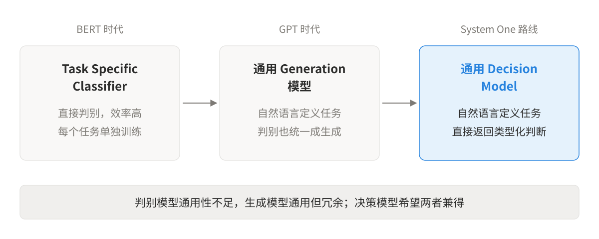
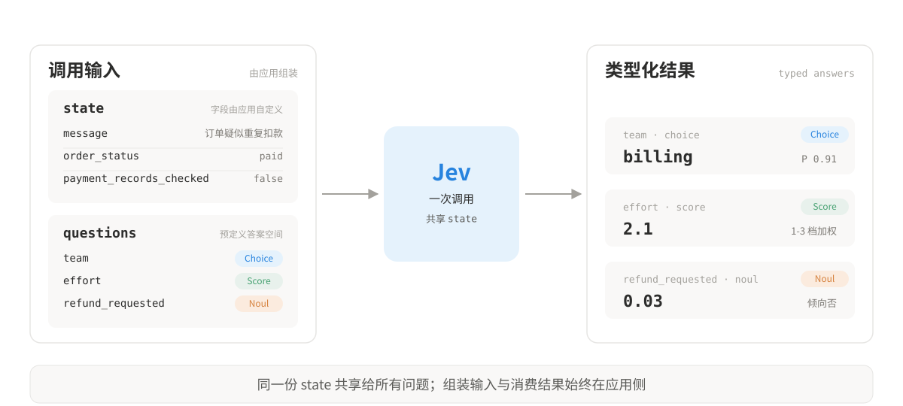
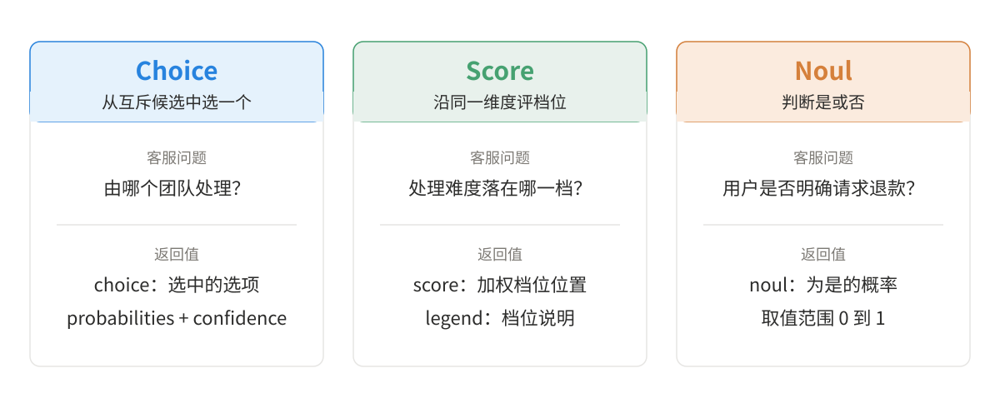
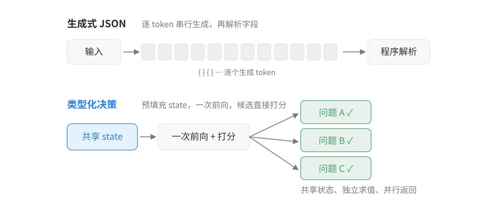
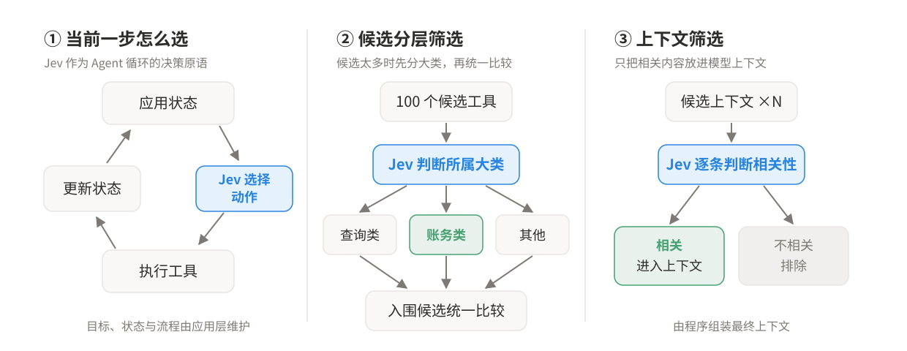

**Jev 最近很火。它是 TypeSafe AI 推出的一类决策模型，专门处理这类“需要理解，但不需要生成”的任务。**

很多 AI 任务都需要模型理解复杂的自然语言，但真正需要返回给程序的结果，可能只有一个类别、一个分数，或者一个明确的真假判断。

传统 LLM 通常会把这类问题也转化成生成任务：读取上下文，生成一段文本或 JSON，再由程序解析结果。TypeSafe AI 最近发布的 Jev 走了另一条路线。它不负责生成文本，而是接收当前状态和一组预先定义的问题，直接返回类型化的答案、概率和置信度。TypeSafe 将这一类模型称为 System One Model，希望把模型从面向人的文本生成器，变成可以直接嵌入软件控制流的决策组件。

## 一、通用的决策模型

BERT 时代已经存在大量分类模型。输入一段文本，模型将它编码成 representation，再接一个分类头输出类别。它们执行效率很高，但通常围绕具体任务训练。情感分类、意图识别、文本匹配往往需要分别准备数据和微调模型。

随后 GPT 代表的 decoder only 模型逐渐把这些任务统一成了 generation。分类可以写成 prompt，信息抽取可以生成 JSON，判断问题可以输出 Yes 或 No。随着 instruction tuning 和上下文学习能力提升，自然语言逐渐成为了一种通用任务接口。

这带来了巨大的灵活性。与此同时，很多原本很简单的判别任务，也被统一包装成了文本生成。虽然这解决了分类模型的通用性问题，却也带来了新的计算冗余。

很多任务本质上只需要从几个候选答案中做出选择，模型却仍然按照生成模型的方式逐 token 解码。输入可能有几千个 token，最终真正需要的信息只有一个类别、一个分数或者一个布尔值。

这类任务可以概括成一个特点：**输入复杂，输出熵很低。**

传统 LLM 可以完成这些判断，但自回归的 generation 并不总是必要。对于一个已经被程序明确拆分出来的 decision node，如果判断所需的信息能够完整表示为显式 state，完全可以进一步将 generation 直接转化为对有限答案空间的直接判别。

Jev 所代表的就是这种思路。它在尝试重新探索一个长期缺失的位置：**通用判别模型。**

BERT 时代的 classifier 很快，却缺乏任务通用性；GPT 时代的模型非常通用，却把判别任务也统一成了生成。Jev 希望保留自然语言定义任务和答案空间的能力，同时让模型直接完成 decision，从而把通用性与判别效率结合起来。



## 二、Jev 的调用方式：State + Questions → Typed Answers

Jev 是一个通用分类器，它把这一步组织成 `state + questions → typed answers`：调用方提前定义问题和答案空间，直接消费分类、评分和概率。

每次 Jev 调用主要包含两部分：`state` 和 `questions`。

`state` 表示模型当前需要理解的状态，可以包含用户消息、订单信息、业务规则、工具执行结果以及其他上下文。

`questions` 表示需要模型完成的一组判断。每个问题通过 `instructions` 描述判断目标，再通过 `criteria` 定义允许的答案及含义。

例如，一个客服系统可以这样组织一次调用：

```python
result = client.system_one(
    state={
        "message": "订单 C-204 好像扣了两次款，请帮我处理。",
        "payment_records_checked": False,
        "order_status": "paid",
    },
    questions={
        "team": Choice(
            instructions="这个请求应该由哪个团队处理？",
            criteria={
                "billing": "付款、账单或退款问题",
                "technical": "软件故障或接口问题",
                "other": "无法归入以上类别",
            },
        ),
        "effort": Score(
            instructions="处理这个请求需要多少核对工作？",
            criteria=[
                "标准查询",
                "需要核对多项事实",
                "需要人工介入",
            ],
        ),
        "refund_requested": Noul(
            instructions="用户是否明确要求退款？",
        ),
    },
)
```

这里的 `message`、`payment_records_checked` 和 `order_status` 都是应用自行定义的业务状态，并非 Jev 预设字段。你也可以换成 `user_plan`、`account_balance`、`risk_level` 等任何当前判断需要的信息。三个问题共享同一份 `state`，分别从中读取自己需要的信息完成判断。



## 三、Jev的三个原语

Jev 提供三种基本原语，对应三类判断任务：

- **Choice 用于互斥分类。** 预先给出若干候选项，模型必须从中选择一个。例如判断请求应由账务、技术还是其他团队处理。返回 `choice` 表示最终选择，`probabilities` 表示各选项的概率分布，`confidence` 表示模型对选择的置信度。Choice 只适用于互斥类别；如果多个标签可以同时成立，应拆成多个独立问题判断。
- **Score 用于有序评分。** 各档位必须沿同一维度递进，例如将处理难度定义为 1 档标准查询、2 档多项核对、3 档人工介入。模型会为每个档位分配概率，并计算加权得分，例如 `1×0.2 + 2×0.5 + 3×0.3 = 2.1`。返回的 `score` 可以直接参与规则判断，例如超过 2.5 时转人工，`legend` 用于说明各档位含义。Score 也会返回 `confidence`。
- **Noul 用于是非判断。** 它只判断某个命题是否成立，例如用户是否明确提出退款请求，返回 `noul` 表示“是”的概率，范围为 0 到 1。数值越接近 1 越倾向“是”，越接近 0 越倾向“否”，接近 0.5 则表示难以判断。如果问题表达的是程度高低，应改用 Score。

因此，选择原语时只需要看答案空间：几个互斥类别用 Choice，连续尺度用 Score，只判断一个命题是否成立用 Noul。



真正影响效果的往往不是原语本身，而是答案空间如何设计。Choice 如果只提供业务相关选项，那么遇到无关请求时，模型仍然必须二选一。因此实际设计中通常需要保留 `other`、`unknown` 或类似兜底项，并明确它们的适用条件，让应用能够识别输入是否超出了当前分类范围。

## 四、Jev为什么速度这么快

Jev 的内部架构目前没有完整公开，一些想法是：

生成式模型即使通过 constrained decoding 强制输出合法 JSON，本质上仍然要一个 token 一个 token 地生成结果。对于分类这类任务，最终可能只需要返回几个标签，但模型仍然要把整段 JSON 生成出来，JSON 序列化本身会引入额外的 latency。

更直接的做法是让模型不再生成完整答案，而是直接比较几个候选项。例如把 `billing`、`technical`、`other` 分别映射成固定的 token。在模型 prompt prefill 完成后直接读取下一 token 的 logits，再对候选 token 的分数归一化得到概率分布。最终的标签和 JSON 结构由业务代码负责组装。

这样一来，原本的“生成一段答案”，就变成了“在几个候选项之间做一次选择”。模型省去了后续的文本生成过程，因此对于分类、评分这类输出很短的任务，通常可以获得更低的延迟。

如果一次需要做多个相互独立的判断，还可以进一步并行处理。例如同一条用户消息既要判断所属团队，又要判断处理难度，还要判断用户是否明确提出退款请求。这几个问题读取的是同一份上下文，彼此之间又没有依赖关系，因此可以共享输入处理结果，并在同一轮中一起计算。

Jev 的接口设计也体现了这一点。同一次请求里可以提交多个问题，它们共享同一个 `state`，但分别独立得到答案。



## 五、Jev 如何嵌入 Agent  

Jev 在 Agent 中更适合作为局部决策器，负责对当前状态做快速、结构化判断。任务状态、流程推进和长期目标仍由 Agent 应用层维护。

第一，**Jev 可以嵌入 Agent Loop，负责决定当前一步怎么走。** Agent 应用维护目标、已确认事实和当前进度，再把一个边界明确的决策交给 Jev。工具执行后，应用更新状态，再进行下一轮判断。整个过程可以表示为：：`State → Jev 选择 Action → 执行 Tool → 更新 State → 再次选择`

第二，**候选空间较大时，可以使用分层决策逐步缩小范围。** 例如系统拥有上百个工具时，可以先判断当前请求属于支付、账户、内容处理等哪个工具域，再从对应工具域中筛选具体工具。这样可以避免每一步都把全部工具暴露给决策模型，也让路由逻辑更加稳定。

第三，**Jev 还可以参与 Context Selection。** 当 Agent 持有大量历史消息、记忆、文档片段或工具结果时，可以先让 Jev 判断哪些信息与当前子任务相关，再由应用层读取并组装真正需要的上下文。例如先对若干记忆片段进行相关性判断，只把高相关内容加入下一轮模型输入。



## 参考文献

\[1\] TypeSafe AI. Introducing System One Models and Jev. https://typesafe.ai/blog/introducing-system-one-models-and-jev

\[2\] Goedecke, S. Jev Means Structured Output Is Interesting Again. https://www.seangoedecke.com/jev-means-structured-output-is-interesting-again/

\[3\] Goedecke, S. Two Techniques for Working with System One Models. https://www.seangoedecke.com/two-techniques-for-working-with-system-one-models/

\[4\] Valyu. How to Use Jev: A Practical Guide to TypeSafe's System One Model. https://dev.to/valyuai/how-to-use-jev-a-practical-guide-to-typesafes-system-one-model-g5e

\[5\] Latent.Space. Here Are 6 Clones of Jev in 2 Days. https://www.latent.space/p/ainews-here-are-6-clones-of-jev-in

\[6\] TypeSafe AI. TypeSafe Skill 说明. https://github.com/typesafe-ai/skills/blob/main/skills/typesafe-ai/SKILL.md

\[7\] TypeSafe AI. TypeSafe Python SDK. https://github.com/typesafe-ai/typesafe-sdk-python

\[8\] Lee, T. SemIf. https://github.com/TheoLeeCJ/SemIf

\[9\] Palmer, J. Kev. https://github.com/jaredpalmer/kev

\[10\] Bespoke Labs. Nimble. https://github.com/bespokelabsai/nimble
