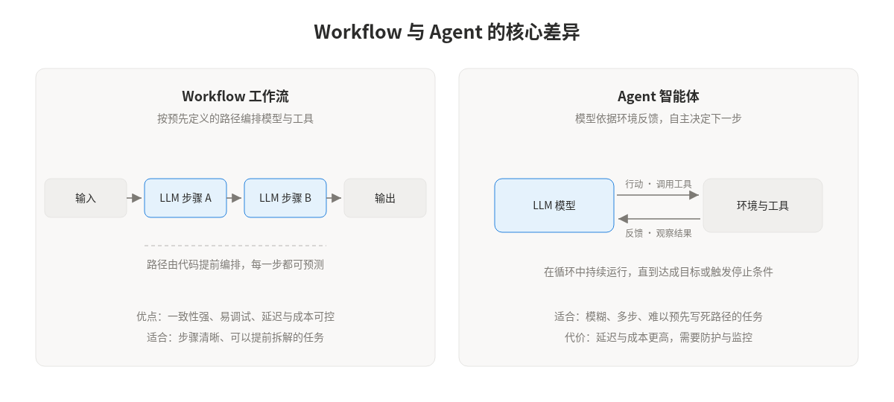
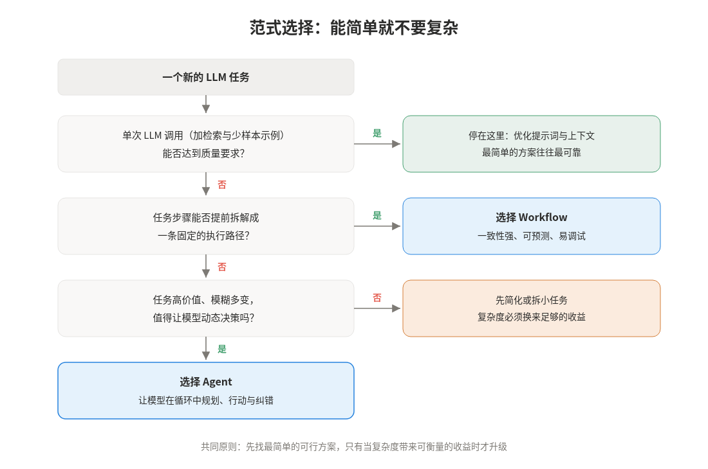
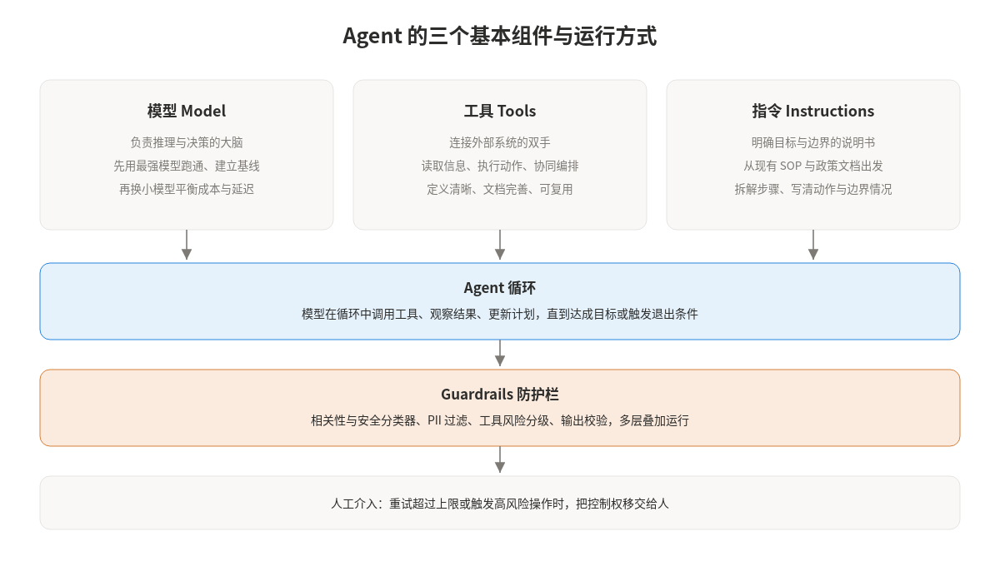
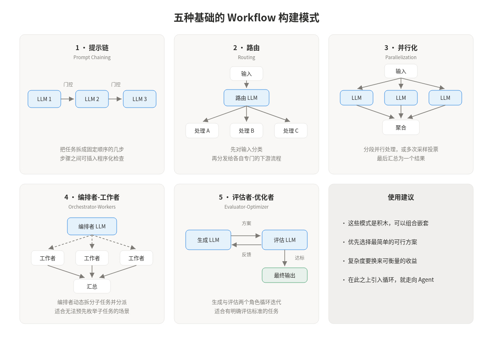
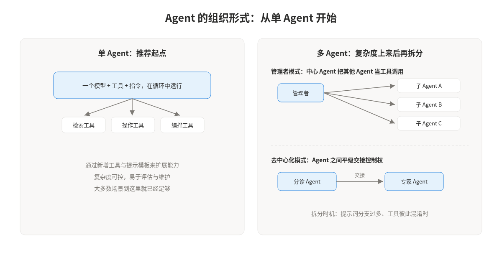

构建 LLM 应用时，最常见的困惑往往出现在动手之前：这个任务到底应该写成一条固定的流水线，还是交给模型自主决策？这篇博客循序渐进地回答四个问题：Workflow 与 Agent 是什么、为什么以及何时需要它们、构建的基本块与常见形式，以及落地时还必须掌握的防护与迭代方法。

## 一、Workflow 与 Agent 是什么

这类系统统称为 agentic system，内部有一个关键区分：

- **Workflow（工作流）**：由代码预先编排 LLM 与工具的执行路径。每一步做什么、下一步走向哪里，在开发阶段就已经确定，模型只在固定的节点上被调用。
- **Agent（智能体）**：由模型自己指挥执行过程。模型在循环中调用工具、观察环境返回的真实结果，再据此动态决定下一步行动，直到达成目标或触发停止条件。

判断一个系统属于哪一类，看控制权在谁手里即可：<strong>路径写死在代码里的是 Workflow，路径由模型在运行时决定的是 Agent。</strong>还有一个更工程化的判据：能在关键决策点上自主选择工具、自主纠错，必要时把控制权交还给用户的系统，才算得上 Agent；只是简单封装了一次 LLM 调用的聊天机器人或分类器不算。

## 二、为什么需要 Agent 或 Workflow：范式选择原则

选择范式时只有一条总原则：**先寻找最简单的可行方案**。很多看起来需要 Agent 的任务，用一次精心设计的 LLM 调用（配合检索和少样本示例）就能解决；Agentic system 用延迟和成本换取更好的任务表现，这笔交易是否划算需要认真评估。

展开来说，选择时可以依据三条原则：

1. **可预测性优先选 Workflow**。当任务能被拆解成清晰、固定的步骤时，Workflow 提供更强的一致性，更容易调试、评估和控制成本。
2. **灵活性和规模化才需要 Agent**。Agent 适合模糊、多步、无法预先写死路径的任务，典型的有三类场景：涉及微妙判断的复杂决策（如退款审批）、难以维护的庞大规则库（如供应商安全审查），以及重度依赖非结构化数据的流程（如理赔处理）。
3. **复杂度必须换来收益**。如果传统自动化或简单方案已经够用，就不要引入 Agent。每增加一层编排，都要能在评估中看到可衡量的提升。

## 三、构建的基本块与常见形式

### 3.1 基本块：模型、工具、指令

所有 agentic system 的原子单元是增强型 LLM（augmented LLM）：一个具备检索、工具和记忆能力的模型。把它拆开看，就是三个组件：模型负责推理与决策，工具连接外部系统，指令定义目标、步骤与边界。

几个实践要点值得记住：

- 模型选型上先用最强的模型跑通流程、建立性能基线，再逐步替换成小模型来优化成本与延迟；
- 工具要定义清晰、文档完善、可复用，按用途可以分为读取信息的数据工具、执行动作的操作工具和调用其他 Agent 的编排工具；
- 指令最好从现有的操作手册和政策文档出发，把每一步拆成明确的动作，并覆盖边界情况。

### 3.2 Workflow 的五种形式

Workflow 有五种基础的构建模式，它们像积木一样可以组合与嵌套：

- **提示链（Prompt Chaining）**：把任务拆成固定顺序的多步，每步处理上一步的输出，步骤之间可以插入程序化检查。适合能干净拆解的任务，用延迟换准确率。
- **路由（Routing）**：先对输入分类，再分发给专门的下游流程。让不同类型的输入各自获得最优的提示词与模型，避免互相干扰。
- **并行化（Parallelization）**：分段并行处理独立的子任务，或对同一任务多次采样投票，最后汇总。适合需要多视角或高置信度的场景。
- **编排者-工作者（Orchestrator-Workers）**：由一个编排者模型动态拆分子任务并分派给工作者模型，最后汇总结果。与并行化的区别在于子任务无法预先枚举。
- **评估者-优化者（Evaluator-Optimizer）**：一个模型生成方案，另一个模型给出评估反馈，循环迭代直到达标。适合有明确评估标准、且迭代确实能带来提升的任务。

### 3.3 Agent 的形式：从单 Agent 到多 Agent

Agent 本身的实现出乎意料地简单：就是基本块在循环中运行，依据环境反馈决定下一步，直到完成任务或触发退出条件（如最大迭代次数）。真正的设计工作在于工具集与文档的打磨。

构建 Agent 应从单 Agent 起步：一个模型带一组工具，通过新增工具和提示模板来扩展能力，复杂度可控且易于评估。

只有当提示词里的条件分支多到难以维护、或工具彼此混淆时，才考虑拆分成多 Agent。拆分后有两种组织方式：

- 管理者模式由一个中心 Agent 把其他 Agent 当工具调用，适合需要统一对外出口的场景；
- 去中心化模式让 Agent 之间平级交接控制权，适合分诊类流程。

## 四、其他重点：让 Agent 能被信任地运行

从原型走向生产，还有几个环节决定 Agent 能否被信任地运行。

- **Guardrails 防护栏**：不要依赖单一防线，而应分层叠加。相关性分类器过滤跑题请求，安全分类器拦截越狱与注入，PII 过滤器保护隐私，输出校验确保回复符合品牌与政策。
- **工具风险分级与人工介入**：给每个工具标注风险等级，高风险操作（如退款、写库）设置额外检查。当重试次数超过上限，或即将执行不可逆操作时，把控制权移交给人。这是早期部署阶段发现隐藏失败模式的重要机制。
- **工具与文档的打磨（ACI）**：agent-computer interface 值得像设计人机界面一样投入。工具的参数格式要贴近模型在训练数据中常见的形式，文档要包含示例与边界说明，格式设计要让模型难以犯错。
- **透明与可评估**：显式展示 Agent 的规划步骤，为每一环建立评估，在沙箱中充分测试后再扩大权限。成功的实现用的都是简单、可组合的模式，而它们的共同起点是可测量。

---

## 参考文章

1. Anthropic, *Building Effective Agents*：[原文](https://www.anthropic.com/engineering/building-effective-agents)
2. OpenAI, *A Practical Guide to Building Agents*：[原文](https://openai.com/business/guides-and-resources/a-practical-guide-to-building-ai-agents/)
